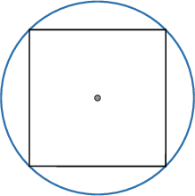
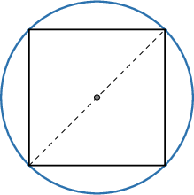
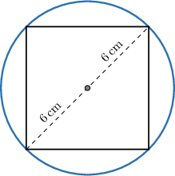
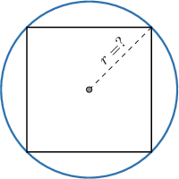
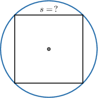
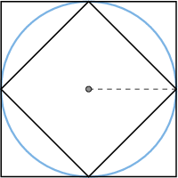
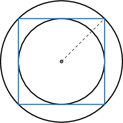

# Squares Inscribed in Circles

Source: https://www.mathacademy.com/topics/6202?courseId=132
Topic ID: 6202

## Prerequisites

- [Circles Inscribed in Squares](../geometry/479-circles-inscribed-in-squares.md)

## Lesson

### Introduction

When a square is drawn inside a circle, and all four vertices touch the circle, the square is said to be **inscribed** in the circle. An example of a square inscribed in a circle is shown below.

Whenever a square is inscribed in a circle, the length of the square's *diagonal* equals the length of a *diameter* of the circle.

Whenever we're given information about a circle, we can use this to determine characteristics of a square inscribed within it. Conversely, whenever we're given information about a square, we can use this to determine characteristics of the circle that inscribes it.

Let's see some examples.

### A Worked Example

Suppose a square is inscribed in a circle of radius $r=6\:\textrm{cm},$ as shown above.

A diagonal of the square coincides with a diameter, and the length of the diameter equals twice the radius. Therefore, the length of the diagonal is

$$

d = 2r = 2(6) = 12\,\textrm{cm}.

$$

In a previous lesson, we saw that the area of the square in terms of its diagonal length is given by

$$

\mathcal A = \dfrac12 d^2.

$$

Therefore, we have

$$

\begin{aligned}A & =\frac{1}{2}⋅12^{2} \\ & =\frac{1}{2}⋅144 \\ & =72\,cm^{2}.\end{aligned}

$$

Let's see another example.

### Example: Solving for a Circle's Parameters

#### Question

Given that the area of a square inscribed in a circle is $162\,\mathrm{cm}^2,$ what is the circle's radius?

#### Explanation

If $d$ is a diagonal of a square, then the area of the square is given by $\mathcal{A} = \dfrac{1}{2}d^2.$ Substituting the known area and solving for $d,$ we get the following:

$$

\begin{aligned}A & =\frac{1}{2}𝑑^{2} \\ 162 & =\frac{1}{2}𝑑^{2} \\ 324 & =𝑑^{2} \\ 𝑑 & =18\end{aligned}

$$

The diagonal of the square inscribed in the circle equals the circle's diameter, and the diameter is twice the radius. Therefore, the radius is

$$

r = \dfrac{d}{2} = \dfrac{18}{2} = 9\,\mathrm{cm}.

$$

### Example: Solving for a Square's Parameters

#### Question

Determine the length of the side of a square inscribed in a circle, given that the circle's area is $4\pi.$

#### Explanation

If $r$ is the circle's radius, then the circle's area is given by $\mathcal{A} = \pi r^2.$ Substituting the known area and solving for $r,$ we get the following:

$$

\begin{aligned}A & =𝜋𝑟^{2} \\ 4𝜋 & =𝜋𝑟^{2} \\ 4 & =𝑟^{2} \\ 𝑟 & =2\end{aligned}

$$

The diagonal of the square inscribed in the circle equals the circle's diameter, and the diameter is twice the radius. Therefore, the diagonal is

$$

d = 2r = 2(2) = 4.

$$

Finally, if $s$ is the length of the side of the square, then $2s^2 = d^2.$ Substituting $d=4$ and solving for $s,$ we get

$$

\begin{aligned}2𝑠^{2} & =𝑑^{2} \\ 2𝑠^{2} & =4^{2} \\ 2𝑠^{2} & =16 \\ 𝑠^{2} & =8 \\ 𝑠 & =2\sqrt{√2}.\end{aligned}

$$

### Example: Solving Problems Involving Two Squares and a Circle

#### Question

A square is inscribed in a circle, and the same circle is inscribed in a larger square. If the area of the inner square is $3 \,\mathrm{m}^2,$ what is the area of the outer square?

#### Explanation

The diagram below shows the described situation.

Notice that the diagonal of the inner square equals the diameter of the circle.

Now, if $d$ is a diagonal of a square, then the area of the square is given by $\mathcal{A} = \dfrac{1}{2}d^2.$ Substituting the known area of the inner square, and solving for $d,$ we get the following:

$$

\begin{aligned}A_{𝐼} & =\frac{1}{2}𝑑^{2} \\ 3 & =\frac{1}{2}𝑑^{2} \\ 6 & =𝑑^{2} \\ 𝑑 & =\sqrt{√6}\,m\end{aligned}

$$

The side of the outer square equals the diameter of the inscribed circle. Therefore, the area of the outer square is

$$

\mathcal{A}_O = d^2 = \left(\sqrt{6}\right)^2 = 6 \: \textrm{m}^2.

$$

### Example: Solving Problems Involving Two Circles and a Square

#### Question

In the diagram above, the square is inscribed in the circle, and the smaller circle is inscribed in the square. If the area of the outer circle is $18\pi\,\mathrm{in}^2,$ what is the circumference of the inner circle?

#### Explanation

Since the area of a circle is $\mathcal{A} = \pi r^2$, where $r$ is the radius, we can find the radius of the outer circle as follows:

$$

\begin{aligned}A_{𝑂} & =𝜋𝑟^{2} \\ 18𝜋 & =𝜋𝑟^{2} \\ 18 & =𝑟^{2} \\ 𝑟 & =3\sqrt{√2}\,in\end{aligned}

$$

The diagonal of the square $d$ is twice the radius of the outer circle. Therefore, we have

$$

d=2r= 6\sqrt{2} \,\mathrm{in}.

$$

If $d$ and $s$ are the lengths of the diagonal and the side of the square, respectively, then $2s^2 = d^2.$ So, we can find the side of the square in the following way:

$$

\begin{aligned}2𝑠^{2} & =𝑑^{2} \\ 2𝑠^{2} & =(6\sqrt{√2})^{2} \\ 𝑠^{2} & =36 \\ 𝑠 & =6\,in\end{aligned}

$$

Now, the side $s$ of the square is equal to the diameter of the inner circle. Therefore, the circumference of the inner circle is

$$

c_I = \pi s = 6\pi\,\mathrm{in}\,.

$$
