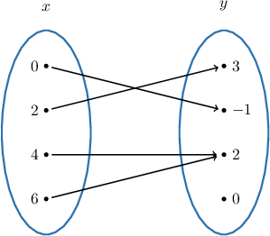
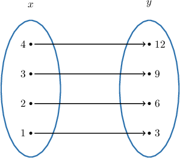
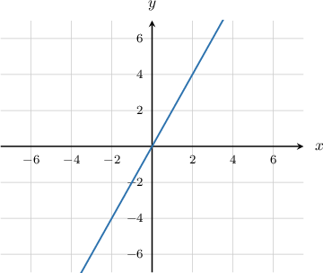
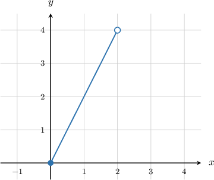
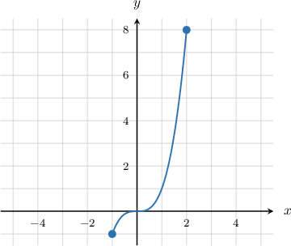

# The Range of a Function

Source: https://www.mathacademy.com/topics/754?courseId=132
Topic ID: 754

## Prerequisites

- [Global Extrema of Functions](../algebra-i/1888-global-extrema-of-functions.md)

## Lesson

### Introduction

The **range** of a function is the collection of numbers (or set) containing all the function's outputs.

Consider the function $f(x),$ defined by the mapping diagram below.

In a mapping diagram, the range consists of all the outputs to which an arrow is drawn. Therefore, the range is

$$

\{ -1,2,3 \}.

$$

The value $y=0$ is not part of the range because there is no $x$-value such that $f(x) = 0.$

### Example: Identifying a Function's Range From a Mapping Diagram

#### Question

What is the range of the function $g$ defined by the mapping diagram shown below?

#### Explanation

The range of $g(x)$ consists of all the outputs that have a corresponding $x$-input.

In a mapping diagram, the range consists of all the outputs to which an arrow is drawn.

Therefore, the range is the set $\{3,6,9,12 \}.$

### Example: Identifying a Function's Range From a Table

#### Question

What is the range of the function $f$ defined by the following table?

#### Explanation

The range of $f(x)$ consists of all the outputs that have a corresponding $x$-input.

In a table, the range consists of all numbers that feature in the row corresponding to $f(x).$

Therefore, the range is the set $\{-1,0,2,3,4 \}.$

### Graphs of Functions

When we graph a function, the range is the set of all $y$-values given by the graph.

For example, consider the linear function $f(x) = 2x,$ graphed below.

The graph covers all $y$-values, so the range of the function is

$$

-\infty < y< \infty,

$$

which we can also write as

$$

-\infty < f(x) < \infty.

$$

Furthermore, we can express the range as $f(x)\in (-\infty,\infty)$ using interval notation.

If we restrict the domain, the range also changes. Let's now consider the function

$$

g(x) = 2x, \quad x \in [0,2).

$$

The graph $y = g(x)$ is shown below.

The $y$ values go from $y=0$ up to (but not including) $y=4,$ including every value in between. Therefore, the range of the function is

$$

0\leq g(x) < 4.

$$

Using interval notation, we can also write the range as $g(x)\in [0,4).$

### Example: Identifying a Function's Range From a Graph

#### Question

What is the range of the function $f(x)$ defined by the graph below?

#### Explanation

First, we find the lowest and highest $y$-values in the graph.

- The lowest $y$-value is $-1.$ This occurs at the point $(-1,-1).$

- The highest $y$-value is $8.$ This occurs at the point $(2,8).$

The function covers all the $y$-values between $-1$ and $8,$ including both $-1$ and $8.$

Therefore, the range is

$$

-1\leq y \leq 8,

$$

which can also be written as

$$

-1\leq f(x) \leq 8.

$$
