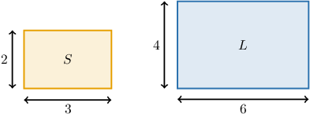
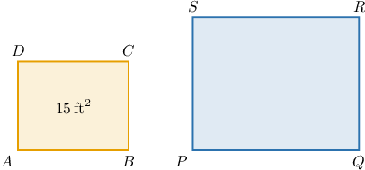
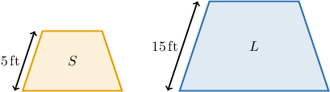
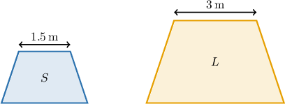
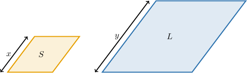

# Areas of Similar Polygons

Source: https://www.mathacademy.com/topics/1197?courseId=128
Topic ID: 1197

## Prerequisites

- [Solving Equations Using the Square Root Method](../algebra-i/430-solving-equations-using-the-square-root-method.md)
- [Side Lengths and Angle Measures of Similar Polygons](../geometry/1367-side-lengths-and-angle-measures-of-similar-polygons.md)
- [Areas of Triangles](../grade-7/1397-areas-of-triangles.md)

## Lesson

### Introduction

The diagram below shows two similar rectangles.

The scale factor between $S$ and $L$ is

$$

k = \dfrac{6}{3} = 2.

$$

This tells us that the sides of $L$ are twice as long as the sides of $S.$

Our question now is, how are the *areas* of these two rectangles related?

Let's start by compute the areas of both rectangles:

- The area of $S$ is $3\times 2 = 6.$

- The area of $L$ is $6 \times 4 = 24.$

So, the ratio of areas is

$$

\begin{aligned}\frac{𝐴_{𝐿}}{𝐴_{𝑆}} & =\frac{24}{6} \\ & =4 \\ & =2^{2} \\ & =𝑘^{2}.\end{aligned}

$$

We see that the ratio of areas is equal to the *square* of the scale factor!

This is a general principle for $2$-dimensional shapes, which we can state more generally as follows:

*If the scale factor between two $2$-dimensional shapes is $k,$ then the ratio of their areas is $k^2.$*

### Example: Computing the Area of a Polygon Given the Area of a Similar Polygon and the Scale Factor

#### Question

The two rectangles shown above are similar with a scale factor $k=3.$ What is the area of the larger rectangle?

**

#### Explanation

If two polygons are similar with scale factor $k,$ then the ratio of the two areas is equal to $k^2.$

Therefore, $k^2 = 3^2 = 9,$ and we have

$$

\dfrac{\mathcal{A}_{PQRS}}{\mathcal{A}_{ABCD}} = 9.

$$

Solving for $\mathcal{A}_{PQRS}$ and substituting $\mathcal{A}_{ABCD} = 15,$ we get

$$

\begin{aligned}A_{𝑃𝑄𝑅𝑆} & =9⋅A_{𝐴𝐵𝐶𝐷} \\ & =9⋅15 \\ & =135\,ft^{2}.\end{aligned}

$$

### Example: Computing the Ratio of Two Areas

#### Question

Consider the two similar trapezoids above (picture not to scale). What is the ratio of the area of the larger trapezoid to the area of the smaller one?

#### Explanation

If two polygons are similar with scale factor $k,$ then the ratio of the two areas is equal to $k^2.$

Here, trapezoid ${L}$ is similar to trapezoid ${S}$ with a scale factor of

$$

k = \dfrac{15}{5} = 3.

$$

Thus, the area of ${L}$ is $k^2=3^2=9$ times larger than the area of ${S}.$

Therefore, the ratio of the larger area to the smaller is $9\mathbin{:}1.$

### Example: Computing the Area of a Polygon Given the Area and Corresponding Dimension of a Similar Polygon

#### Question

The trapezoids shown above are similar. If the area of the smaller trapezoid is $2.1\,\textrm{m}^2$, then what is the area of the larger trapezoid?

**

#### Explanation

If two polygons are similar with scale factor $k,$ then the ratio of the two areas is equal to $k^2.$

Trapezoid ${L}$ is similar to trapezoid ${S}$ with a scale factor of

$$

k = \dfrac{3}{1.5} = 2.

$$

Therefore, $k^2 = 2^2 = 4,$ and we have

$$

\dfrac{\mathcal{A}_L}{\mathcal{A}_S} = 4.

$$

Solving for $\mathcal{A}_L$ and substituting $\mathcal{A}_S = 2.1,$ we get

$$

\begin{aligned}A_{𝐿} & =4⋅A_{𝑆} \\ & =4⋅2.1 \\ & =8.4\,m^{2}.\end{aligned}

$$

### Example: Computing a Scale Factor Using Area

#### Question

Consider the two similar parallelograms above (picture not to scale). If the area of the smaller parallelogram is equal to $5\,\textrm{cm}^2$ and the area of the larger parallelogram is $125\,\textrm{cm}^2$, then what is the value of $\dfrac{x}{y}?$

#### Explanation

If two polygons are similar with scale factor $k,$ then the ratio of the two areas is equal to $k^2.$

By computing the ratio of the two areas, we get

$$

k^2=\dfrac{\mathcal{A}_{L}}{ \mathcal{A}_{S}} = \dfrac{125}{5} = 25.

$$

This means that the parallelograms are similar with a scale factor of

$$

k=\sqrt{25}=5.

$$

Thus, the sides of parallelogram $L$ are $5$ times larger than the corresponding sides of parallelogram $S.$ Therefore,

$$

\dfrac{y}{x}= k = 5 \qquad \Rightarrow\qquad \dfrac x y = \dfrac15.

$$

### The Scale Factor as a Multiplier

Suppose we have two similar shapes, $X$ and $Y.$

We know that if the scale factor between $X$ and $Y$ is $k,$ then the ratio of the areas is the square of the scale factor:

$$

\dfrac{A_Y}{A_X} = k^2.

$$

In other words, if we know the area $A_X,$ then we can *multiply* by the square of the scale factor to get the area $A_Y\mathbin{:}$

$$

A_Y = k^2 \cdot A_X.

$$

So, we have the following general principle:

*If the lengths of a two-dimensional shape are enlarged or reduced by a particular scale factor of $k$, then the area of the new shape will be enlarged or reduced by a factor of $k^2.$*
