# Combining Graph Transformations: Two Operations

Source: https://www.mathacademy.com/topics/1254?courseId=128
Topic ID: 1254

## Prerequisites

- [Vertical Stretches of Functions](../algebra-ii/1252-vertical-stretches-of-functions.md)
- [Horizontal Translations of Functions](../algebra-ii/1584-horizontal-translations-of-functions.md)
- [Horizontal Stretches of Functions](../algebra-ii/1586-horizontal-stretches-of-functions.md)

## Lesson

### Introduction

Now that we're familiar with graph translations, reflections, and stretches, it's time to combine these transformations.

We start by considering a general transformation of the form

$$

y = af\left(b(x+c)\right)+d

$$

Like the order of operations in arithmetic, the order in which transformations are applied matters. In general, the order *must* be as follows:

1. Horizontal stretch

2. Horizontal translation

3. Vertical stretch

4. Vertical translation

If that seems like a lot to take in, we have the following rule of thumb that can help us to remember the order in which to apply the transformations:

- We start by performing the transformations *inside* the argument of $f.$ This means we first deal with the $b(x+c)$ part. So, we *first* carry out the horizontal stretch, *followed by* the horizontal translation.

- Then, we perform the transformations *outside* the argument of $f.$ So, we *first* carry out the vertical stretch, *followed by* the vertical translation.

Finally, note that not every transformation will necessarily be present. In this lesson, we will consider a maximum of two graph transformations.

### Example: Graph Transformations Containing Vertical Translations and Stretches Only

#### Question

The diagram below shows the function $y=f(x).$ Plot the graph of $y=2f(x)+2.$

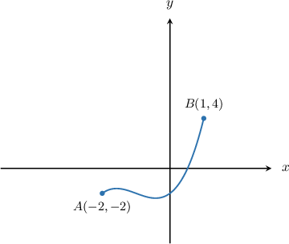

#### Explanation

To perform transformations of functions with multiple operations, we must remember the following rule:

1. First, we perform the transformations ** the argument of $f.$ We first carry out horizontal stretches, followed by horizontal translations.

2. Then, we perform the transformations ** the argument of $f.$ We first carry out vertical stretches, followed by vertical translations.

To plot $y=2f(x)+2,$ we apply the following steps:

- Take the curve $y=f(x).$

- Stretch it by a scale factor of $2$ parallel to the $y$-axis to get the graph of $y=2f(x).$

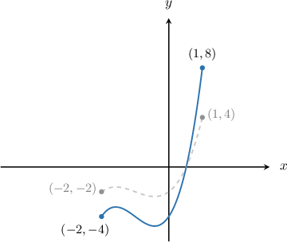

- Then, translate it up by $2$ units to get the graph of $y=2f(x) + 2.$

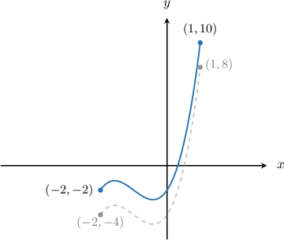

### Example: Graph Transformations Containing Horizontal Translations and Stretches Only

#### Question

The diagram below shows the function $y=f(x).$ Plot the graph of $y=f\left(2x+2\right).$

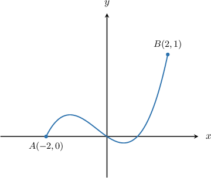

#### Explanation

To perform transformations of functions with multiple operations, we must remember the following rule:

1. First, we perform the transformations ** the argument of $f.$ We first carry out horizontal stretches, followed by horizontal translations.

2. Then, we perform the transformations ** the argument of $f.$ We first carry out vertical stretches, followed by vertical translations.

First, let's factor out the coefficient next to the $x$ inside the parentheses:

$$

\begin{aligned}𝑦 & =𝑓(2𝑥+2)=𝑓(2(𝑥+1))\end{aligned}

$$

To plot $y=f\left(2\left(x+1\right)\right),$ we apply the following steps:

- Take the curve $y=f(x).$

- Stretch it by a scale factor of $\dfrac{1}{\left(2\right)}=\dfrac12$ parallel to the $x$-axis to get the graph of $y=f\left(2x\right).$

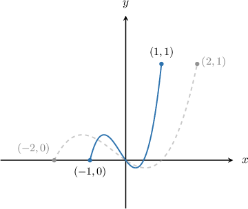

- Then, translate it left by $1$ unit to get the graph of $y=f\left(2\left(x+1\right)\right).$

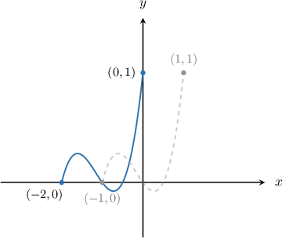

### Example: Graphing Transformations Containing Horizontal and Vertical Stretches Only

#### Question

The diagram below shows the function $y=f(x).$ Find the graph of $y=5f\left(\dfrac{1}{2}x\right)?$

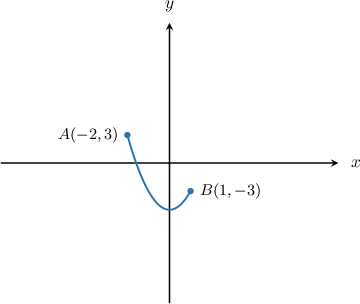

#### Explanation

To perform transformations of functions with multiple operations, we must remember the following rule:

1. First, we perform the transformations ** the argument of $f.$ We first carry out horizontal stretches, followed by horizontal translations.

2. Then, we perform the transformations ** the argument of $f.$ We first carry out vertical stretches, followed by vertical translations.

To plot $y=5f\left(\dfrac12x\right),$ we apply the following steps:

- Take the curve $y=f(x).$

- Stretch it by a scale factor of $\dfrac{1}{\left(\dfrac{1}{2}\right)} = 2$ parallel to the $x$-axis to get the graph of $y=f\left(\dfrac{1}{2}x\right).$

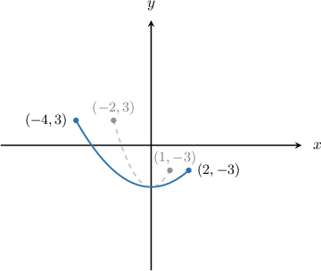

- Then, stretch it by a scale factor of $5$ parallel to the $y$-axis to get the graph of $y=5f\left(\dfrac{1}{2}x\right).$

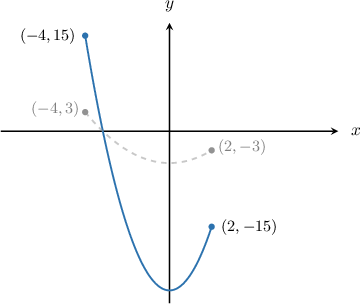

### Example: Other Cases of Graphing Transformations Containing Two Operations

#### Question

The diagram below shows the function $y=f(x).$ Plot the graph of $y=f(3x)+1?$

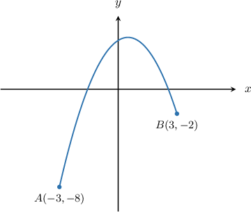

#### Explanation

To perform transformations of functions with multiple operations, we must remember the following rule:

1. First, we perform the transformations ** the argument of $f.$ We first carry out horizontal stretches, followed by horizontal translations.

2. Then, we perform the transformations ** the argument of $f.$ We first carry out vertical stretches, followed by vertical translations.

To plot $y=f(3x)+1,$ we apply the following steps:

- Take the curve $y=f(x).$

- Stretch it by a scale factor of $\dfrac{1}{3}$ parallel to the $x$-axis to get the graph of $y=f(3x).$

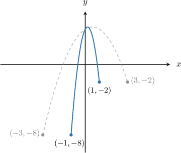

- Then, translate it up by $1$ unit to get the graph of $y=f(3x)+1.$

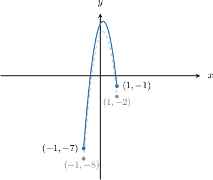
