# Properties of Parallelograms

Source: https://www.mathacademy.com/topics/1354?courseId=128
Topic ID: 1354

## Prerequisites

- [Solving Systems of Equations by Substitution](../grade-7/487-solving-systems-of-equations-by-substitution.md)
- [Segment Bisectors and the Perpendicular Bisector Theorem](../grade-7/521-segment-bisectors-and-the-perpendicular-bisector-theorem.md)
- [The Perimeter of a Polygon](../grade-7/1386-the-perimeter-of-a-polygon.md)
- [Angle Criteria for Parallel Lines](../grade-8/1512-angle-criteria-for-parallel-lines.md)
- [The Segment Addition Postulate](../grade-7/2278-the-segment-addition-postulate.md)
- [Quadrilaterals](../grade-5/2407-quadrilaterals.md)

## Lesson

### Introduction

We'll explore some properties of parallelograms in this lesson. Let's begin by stating the definition of a parallelogram.

*A parallelogram is a quadrilateral where the opposite sides are parallel.*

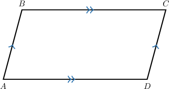

It's possible to prove the following property.

*In a parallelogram, the opposite sides are congruent.*

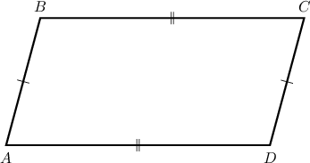

The fact that the opposite sides are congruent is a *consequence* of the definition of a parallelogram, not part of the definition itself. We'll learn how to prove this in future lessons.

### A Worked Example

Consider the parallelogram shown below.

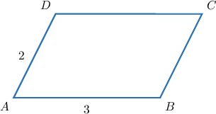

What are the measures of the sides $\overline{CD}$ and $\overline{BC}?$

- Since the sides $AB$ and $CD$ are opposite, we have $CD = AB = 3.$

- Since the sides $AD$ and $BC$ are opposite, we have $BC = AD = 2.$

Let's add these lengths to our diagram.

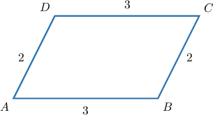

Let's see some more examples.

### Example: Finding Side Lengths of Parallelograms

#### Question

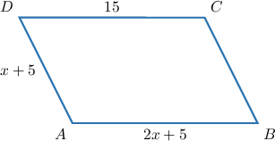

For the parallelogram shown above, find the measure of the side $\overline{BC}.$

#### Explanation

In any parallelogram, the opposite sides are congruent. So, we have

$$

\begin{aligned}𝐴𝐵 & =𝐶𝐷 \\ 2𝑥+5 & =15 \\ 2𝑥 & =10 \\ 𝑥 & =5,\end{aligned}

$$

and therefore,

$$

\begin{aligned}𝐴𝐷 & =𝑥+5 \\ & =5+5 \\ & =10.\end{aligned}

$$

Using again the fact that the opposite sides of a parallelogram are congruent, we get

$$

\begin{aligned}𝐵𝐶 & =𝐴𝐷=10.\end{aligned}

$$

### Angle Properties

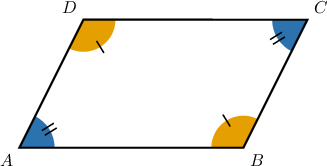

Given any parallelogram, we have the following property.

*The opposite angles of a parallelogram are congruent, whereas adjacent (or consecutive) angles are supplementary.*

We'll learn how to prove these properties in future lessons.

### A Worked Example

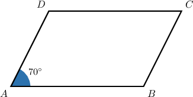

Consider the parallelogram $ABCD$ above, where $m\angle A = 70^\circ.$ Let's find the measures of the other angles.

- First, we know that opposite angles in a parallelogram are congruent. Therefore, $m\angle C = 70^\circ.$

- Next, we know that consecutive angles in a parallelogram are supplementary. Therefore, Let's add this to our diagram.

- Finally, we apply the fact that opposite angles are congruent to conclude that $m\angle D = 110^\circ.$

### Example: Finding Angles Measures of Parallelograms

#### Question

For the parallelogram $ABCD,$ you're given that $m\angle{A} = 80^{\circ}.$ What is the measure of $\angle{D}?$

#### Explanation

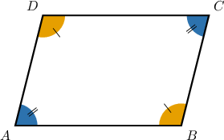

In any parallelogram, the opposite angles are equal, while the adjacent (or consecutive) angles are supplementary.

Since $\angle{A}$ and $\angle{D}$ are adjacent angles of the parallelogram $ABCD,$ we obtain

$$

\begin{aligned}𝑚∠𝐷 & =180^{∘}−𝑚∠𝐴 \\ & =180^{∘}−80^{∘} \\ & =100^{∘}.\end{aligned}

$$

### Diagonal Lengths

All parallelograms have the following property.

*The diagonals of a parallelogram bisect each other.*

In other words, the first diagonal of a parallelogram bisects the second, and the second diagonal bisects the first, as shown below.

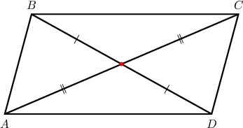

We'll prove this property in a future lesson.

### Example: Finding Diagonal Lengths of Parallelograms

#### Question

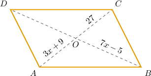

For the parallelogram $ABCD$ shown above, find the length of the diagonal $\overline{BD}.$

#### Explanation

The diagonals of a parallelogram bisect each other. That is, they intersect at their respective midpoints. In our case, this means that

$\qquad BO = DO \quad$ and $\quad CO = AO.$

Now, since $CO = AO,$ we have

$$

\begin{aligned}𝐴𝑂 & =𝐶𝑂 \\ 3𝑥+9 & =27 \\ 3𝑥 & =27−9 \\ 3𝑥 & =18 \\ 𝑥 & =6.\end{aligned}

$$

As a result,

$$

\begin{aligned}𝐵𝑂 & =7𝑥−5 \\ & =7⋅6−5 \\ & =42−5 \\ & =37.\end{aligned}

$$

Finally, since $BO = DO,$ we obtain

$$

\begin{aligned}𝐵𝐷 & =𝐵𝑂+𝐷𝑂 \\ & =𝐵𝑂+𝐵𝑂 \\ & =2𝐵𝑂 \\ & =2⋅37 \\ & =74.\end{aligned}

$$

### The Diagonal Criterion

We've already seen that if a quadrilateral is a parallelogram, its diagonals bisect each other.

The **converse** of this statement is also true.

*If the diagonals of a quadrilateral bisect each other, then it is a parallelogram.*

For example, consider the *quadrilateral* shown below.

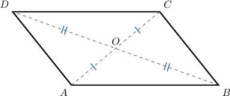

Note that

- the diagonal $\overline{BD}$ bisects the diagonal $\overline{AC},$ and

- the diagonal $\overline{AC}$ bisects the diagonal $\overline{BD}.$

Therefore, this quadrilateral *must* be a parallelogram!

### Example: Using the Diagonal Criterion

#### Question

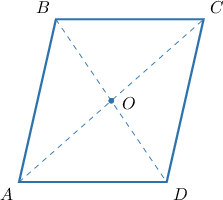

The diagonals $\overline{AC}$ and $\overline{BD}$ of the quadrilateral $ABCD$ above intersect at the point $O.$ If $AO = 4x+3,$ $BO = 5-x,$ $CO = y+2,$ and $DO=y-1,$ find the values ​​of $x$ and $y$ such that $ABCD$ is a parallelogram.

#### Explanation

If the diagonals of a quadrilateral bisect each other, then the quadrilateral is a parallelogram. Thus, $ABCD$ is a parallelogram if $AO=CO$ and $BO=DO.$

- Using the first equality, we have

- Using the second equality, we get

Substituting $y = 4x+1$ from the first equation into the above, we have

$$

\begin{aligned}𝑥 & =6−𝑦 \\ 𝑥 & =6−(4𝑥+1) \\ 𝑥 & =5−4𝑥 \\ 5𝑥 & =5 \\ 𝑥 & =1.\end{aligned}

$$

Finally, substituting $x$ back into the first equation, we get

$$

\begin{aligned}𝑦 & =4𝑥+1 \\ & =4⋅1+1 \\ & =4+1 \\ & =5.\end{aligned}

$$

Therefore, $x=1$ and $y=5.$
