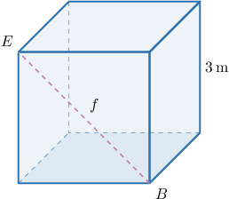
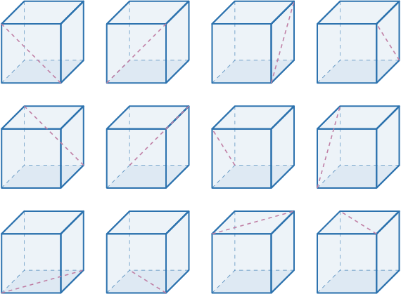
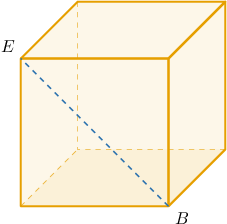
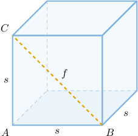

# Face Diagonals of Cubes

Source: https://www.mathacademy.com/topics/1466?courseId=128
Topic ID: 1466

## Prerequisites

- [Faces, Vertices, and Edges of Polyhedrons](../geometry/2484-faces-vertices-and-edges-of-polyhedrons.md)
- [Diagonals of Squares](../geometry/2887-diagonals-of-squares.md)

## Lesson

### Introduction

A **face diagonal** of a cube is any line segment that joins two opposite vertices on one of the cube's faces.

The diagram below shows a cube with side length $s=3\,\textrm{m},$ as well as the face diagonal $\overline{BE}.$ Let's denote the length of the face diagonal as $f.$

The formula that relates the length of a face diagonal and sides is given by

$$

f = s\sqrt{2}.

$$

We'll derive this formula at the end of the lesson.

For the cube above, substituting $s = 3\,\textrm{m}$ into the formula, we get that the length of the diagonal is

$$

f = 3\sqrt{2} \,\textrm{m}.

$$

### Counting the Face Diagonals of a Cube

Every cube contains precisely $12$ face diagonals (two for each of the six faces), and they are all congruent. All twelve face diagonals of a cube are shown below.

### Example: Finding the Length of the Face Diagonals of a Cube

#### Question

The side length of a cube is $25 \, \textrm{mm}.$ What is the length of a face diagonal of the cube?

#### Explanation

The length of a face diagonal $f$ of a cube can be found using the formula

$$

f = s\sqrt{2},

$$

where $s$ is the side length of the cube.

Substituting $s = 25\,\textrm{mm}$ into the formula, we get

$$

f = 25\sqrt{2} \,\textrm{mm}.

$$

### Example: Finding the Side Length of a Cube Given the Length of Its Face Diagonal

#### Question

Given that $BE = 15\sqrt{2} \, \text{cm},$ find the side length of the cube.

#### Explanation

Notice that $\overline{BE}$ is a face diagonal of the cube.

Since the length of a face diagonal $f$ of a cube can be found using the formula

$$

f = s \sqrt{2},

$$

where $s$ is the length of an edge, we can find $s$ as follows:

$$

s = \dfrac{f}{\sqrt{2}} = \dfrac{15\sqrt{2}}{\sqrt{2}} = 15

$$

Therefore, the length of the edges is $15 \, \text{cm}.$

### Deriving the Face Diagonal Length Formula

Here, we will derive the formula $f=s\sqrt{2}$ that we have been using throughout this lesson.

Consider a cube of side length $s$ and face diagonal length $f,$ like the one shown below.

Notice that $\triangle ABC$ is a right triangle with legs $AB$ and $AC$ and hypotenuse $BC.$ Therefore, by the Pythagorean theorem, we have

$$

\begin{aligned}𝑠^{2}+𝑠^{2} & =𝑓^{2} \\ 2𝑠^{2} & =𝑓^{2} \\ 𝑓 & =\sqrt{√2𝑠^{2}} \\ 𝑓 & =\sqrt{√2}⋅\sqrt{√𝑠^{2}} \\ 𝑓 & =\sqrt{√2}⋅𝑠 \\ 𝑓 & =𝑠\sqrt{√2}.\end{aligned}

$$

Notice that we only consider the positive square root since $f$ is a length and therefore must be positive.
