# Conical Frustums

Source: https://www.mathacademy.com/topics/1764?courseId=128
Topic ID: 1764

## Prerequisites

- [Surface Areas of Right Cones](../geometry/1763-surface-areas-of-right-cones.md)

## Lesson

### Introduction

A **right conical frustum** is the part of a right cone that remains after it is cut by a plane parallel to its base and the top part is removed.

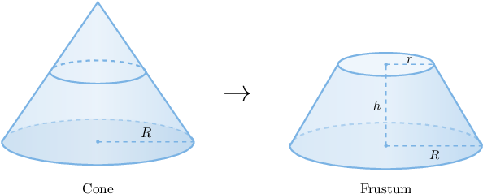

A conical frustum is also referred to as a **truncated cone**.

We can find the volume of a (right) conical frustum using the formula

$$

V = \dfrac{1}{3}\pi h (R^2 + r^2 + R r),

$$

where $r$ and $R$ are the radii of the top and bottom bases, respectively, and $h$ is the height of the frustum.

For example, if

$$

r = 2 \: \textrm{cm}, \qquad R = 5\: \textrm{cm}, \qquad h = 4\: \textrm{cm}

$$

then, by substituting these values into the formula, we obtain

$$

\begin{aligned}𝑉 & =\frac{𝜋}{3}ℎ(𝑅^{2}+𝑟^{2}+𝑅⋅𝑟) \\ & =\frac{𝜋}{3}(4)(5^{2}+2^{2}+5⋅2) \\ & =\frac{𝜋}{3}⋅4⋅39 \\ & =52𝜋 cm^{3}.\end{aligned}

$$

### Example: Finding the Volume of a Conical Frustum

#### Question

Determine the volume of the conical frustum below.

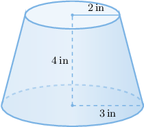

#### Explanation

We can find the volume of a conical frustum using the formula

$$

V = \dfrac{1}{3}\pi h (R^2 + r^2 + R r),

$$

where $r$ and $R$ are the radii of the bases, and $h$ is the height of the frustum.

Substituting

$$

r = 2 \: \textrm{in}, \qquad R = 3 \: \textrm{in}, \qquad h = 4 \: \textrm{in}

$$

into the formula, we obtain

$$

\begin{aligned}𝑉 & =\frac{𝜋}{3}(4)(3^{2}+2^{2}+3⋅2) \\ & =\frac{𝜋}{3}(4)(19) \\ & =\frac{76𝜋}{3} in^{3}.\end{aligned}

$$

### The Lateral Surface Area of a Conical Frustum

A frustum's lateral surface area is the surface area that does not include the area of the bases.

Suppose we want to calculate the lateral surface area of the frustum shown below.

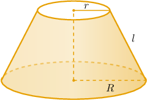

We can show that the frustum's lateral surface area $S_L$ is given by

$$

S_L = \pi(R + r)l

$$

where $r$ and $R$ are the upper and lower radii, respectively, and $l$ is the frustum's slant height.

We can visualize the net of this lateral surface by imagining that we cut the frustum along one of the slight heights and "unfold" the lateral part.

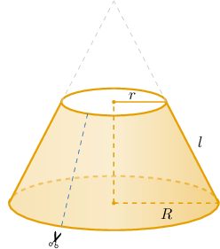

Doing this, we get the following net.

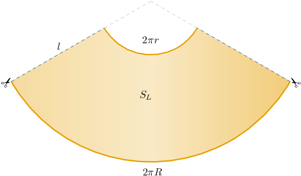

### Example: Finding the Lateral Surface Area of a Conical Frustum

#### Question

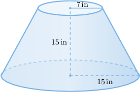

Find the lateral surface area of the conical frustum above.

#### Explanation

We can find the lateral surface area of a conical frustum using the formula

$$

S_L = \pi(R + r)l,

$$

where $r$ and $R$ are the radii of the bases, and $l$ is the slant height of the frustum.

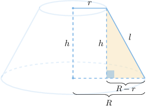

First, we will find the slant height of the frustum using the Pythagorean theorem in the right triangle shown above:

$$

\begin{aligned}𝑙 & =\sqrt{√(𝑅−𝑟)^{2}+ℎ^{2}} \\ & =\sqrt{√(15−7)^{2}+15^{2}} \\ & =\sqrt{√289} \\ & =17\,\,in.\end{aligned}

$$

Now, substituting

$$

r = 7\: \textrm{in}, \qquad R = 15\: \textrm{in}, \qquad l = 17 \: \textrm{in}

$$

into the slant height formula, we obtain

$$

\begin{aligned}𝑆_{𝐿} & =𝜋(𝑅+𝑟)𝑙 \\ & =𝜋(15+7)(17) \\ & =374𝜋\,in^{2}.\end{aligned}

$$

### The Surface Area of a Conical Frustum

Finally, let's consider the conical frustum below.

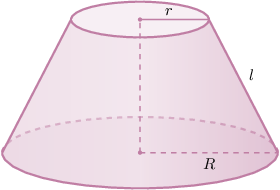

The total surface of a right conical frustum is composed of the curved lateral surface and the two circular bases. Therefore, we can calculate the total surface area $S$ of the conical frustum as

$$

\begin{aligned}𝑆 & =𝑆_{𝐿}+𝑆_{𝑇}+𝑆_{𝐵} \\ & =𝜋(𝑅+𝑟)𝑙+𝜋𝑅^{2}+𝜋𝑟^{2} \\ & =𝜋[(𝑅+𝑟)𝑙+𝑅^{2}+𝑟^{2}].\end{aligned}

$$

where $r$ and $R$ are the radii of the bases, and $l$ is the slant height of the frustum.

### Example: Finding the Surface Area of a Conical Frustum

#### Question

Find the surface area of the conical frustum below.

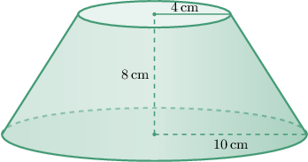

#### Explanation

We can find the surface area of a conical frustum using the formula

$$

S = \pi \big[ (R+r)l + R^2 + r^2 \big],

$$

where $r$ and $R$ are the radii of the bases, and $l$ is the slant height of the frustum.

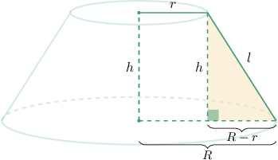

First, we will find the slant height of the frustum using the Pythagorean theorem in the right triangle shown above:

$$

\begin{aligned}𝑙 & =\sqrt{√(𝑅−𝑟)^{2}+ℎ^{2}} \\ & =\sqrt{√(10−4)^{2}+(8)^{2}} \\ & =\sqrt{√36+64} \\ & =\sqrt{√100} \\ & =10\,cm.\end{aligned}

$$

Now, substituting

$$

r = 4 \: \textrm{cm}, \qquad R = 10 \: \textrm{cm}, \qquad l = 10 \: \textrm{cm}

$$

into the formula, we obtain

$$

\begin{aligned}𝑆 & =𝜋[(10+4)(10)+(10)^{2}+(4)^{2}] \\ & =𝜋[140+100+16] \\ & =256𝜋\,cm^{2}.\end{aligned}

$$

### Proof of the Volume Formula

To derive a formula for a conical frustum's volume, we first extend the frustum to form a complete cone.

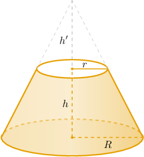

Our frustum is the object that remains when we remove the smaller cone (on top) from the larger cone.

To calculate the volume of the frustum, we subtract the volume of the smaller cone from the volume of the larger cone. This gives

$$

\begin{aligned}𝑉_{𝐿} & =𝑉_{big}−𝑉_{small} \\ & =\frac{1}{3}𝜋𝑅^{2}(ℎ+ℎ^{′})−\frac{1}{3}𝜋𝑟^{2}ℎ^{′} \\ & =\frac{1}{3}𝜋(𝑅^{2}ℎ+𝑅^{2}ℎ^{′}−𝑟^{2}ℎ^{′}) \\ & =\frac{1}{3}𝜋(𝑅^{2}ℎ+ℎ^{′}(𝑅^{2}−𝑟^{2})).\end{aligned}

$$

Now consider the right triangle made by the complete cone, shown below.

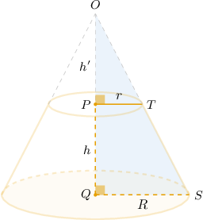

Notice that $\triangle OPT$ and $\triangle OQS$ are similar by the AA criterion. So, we have

$$

\dfrac{h'}{r} = \dfrac{h+h'}{R},

$$

which can be rewritten as

$$

\begin{aligned}ℎ^{′}𝑅 & =(ℎ+ℎ^{′})𝑟 \\ ℎ^{′}𝑅 & =ℎ𝑟+ℎ^{′}𝑟 \\ ℎ^{′}𝑅−ℎ^{′}𝑟 & =ℎ𝑟 \\ ℎ^{′}(𝑅−𝑟) & =ℎ𝑟 \\ ℎ^{′} & =\frac{ℎ𝑟}{𝑅−𝑟}.\end{aligned}

$$

Therefore, the volume of our frustum is

$$

\begin{aligned}𝑉_{𝐿} & =\frac{1}{3}𝜋(𝑅^{2}ℎ+ℎ^{′}(𝑅^{2}−𝑟^{2})) \\ & =\frac{1}{3}𝜋(𝑅^{2}ℎ+\frac{ℎ𝑟}{𝑅−𝑟}(𝑅^{2}−𝑟^{2})) \\ & =\frac{1}{3}𝜋(𝑅^{2}ℎ+\frac{ℎ𝑟}{𝑅−𝑟}(𝑅−𝑟)(𝑅+𝑟)) \\ & =\frac{1}{3}𝜋(𝑅^{2}ℎ+ℎ𝑟(𝑅+𝑟)) \\ & =\frac{1}{3}𝜋ℎ(𝑅^{2}+𝑟𝑅+𝑟^{2}) \\ & =\frac{1}{3}𝜋ℎ(𝑅^{2}+𝑟^{2}+𝑅𝑟).\end{aligned}

$$

### Proof of the Lateral Surface Area Formula

To derive a formula for a conical frustum's lateral surface area, we first extend the frustum to form a complete cone.

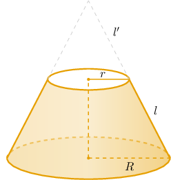

Our frustum is the object that remains when we remove the smaller cone (on top) from the larger cone.

To calculate the lateral surface area of the frustum, we subtract the lateral surface area of the smaller cone from the larger cone. This gives

$$

\begin{aligned}𝑆_{𝐿} & =𝑆_{big}−𝑆_{small} \\ & =𝜋𝑅(𝑙+𝑙^{′})−𝜋𝑟𝑙^{′} \\ & =𝜋𝑙^{′}(𝑅−𝑟)+𝜋𝑙𝑅.\end{aligned}

$$

Now consider the right triangle made by the complete cone, shown below.

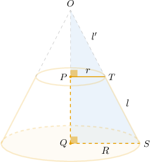

Notice that $\triangle OPT$ and $\triangle OQS$ are similar by the AA criterion. So, we have

$$

\dfrac{r}{l'} = \dfrac{R}{l+l'},

$$

which can be rewritten as

$$

\begin{aligned}𝑅𝑙^{′} & =𝑟(𝑙+𝑙^{′}) \\ 𝑅𝑙^{′} & =𝑟𝑙+𝑟𝑙^{′} \\ 𝑅𝑙^{′}−𝑟𝑙^{′} & =𝑟𝑙 \\ 𝑙^{′}(𝑅−𝑟) & =𝑟𝑙.\end{aligned}

$$

Therefore, the lateral surface area of our frustum is

$$

\begin{aligned}𝑆_{𝐿} & =𝜋𝑙^{′}(𝑅−𝑟)+𝜋𝑙𝑅 \\ & =𝜋𝑟𝑙+𝜋𝑅𝑙 \\ & =𝜋(𝑟+𝑅)𝑙.\end{aligned}

$$
