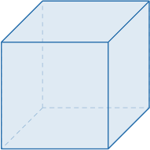
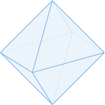
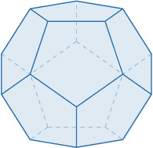
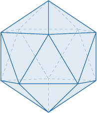
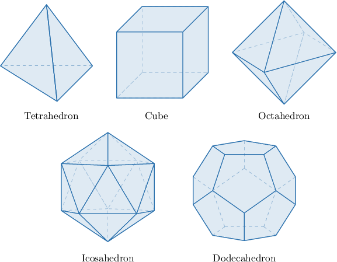
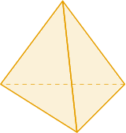
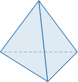
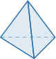
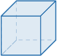

# The Five Platonic Solids

Source: https://www.mathacademy.com/topics/1826?courseId=128
Topic ID: 1826

## Prerequisites

- [Regular Polygons](../grade-8/1322-regular-polygons.md)
- [Euler's Formula for Polyhedra](../geometry/2849-euler-s-formula-for-polyhedra.md)

## Lesson

### Introduction

A **regular polyhedron** is a polyhedron where

- all of its faces are congruent regular polygons, and

- the same number of polygons meet at each vertex.

There are only nine regular polyhedra: $5$ convex and $4$ non-convex.

This lesson will discuss the five convex regular polyhedra. Collectively, these polyhedra are the **Platonic solids**.

On the next slide, we’ll look at the first of these five Platonic solids.

### Tetrahedron

A **tetrahedron** is a regular polyhedron that

- consists of $4$ congruent faces, each in the form of an equilateral triangle, and

- exactly $3$ faces meet at each vertex.

### Cube

A **cube** is a regular polyhedron that

- consists of $6$ congruent faces, each in the form of a square, and

- exactly $3$ faces meet at each vertex.

### Octahedron

An **octahedron** is a regular polyhedron that

- consists of $8$ congruent faces, each in the form of an equilateral triangle, and

- exactly $4$ faces meet at each vertex.

### Dodecahedron

A **dodecahedron** is a regular polyhedron that

- consists of $12$ congruent faces, each in the form of a regular pentagon, and

- exactly $3$ faces meet at each vertex.

### Icosahedron

An **icosahedron** is a regular polyhedron that

- consists of $20$ congruent faces, each in the form of an equilateral triangle, and

- exactly $5$ faces meet at each vertex.

### Example: Identifying Platonic Solids

#### Question

Which of the following is **** a Platonic solid?

1. Tetrahedron

2. Rectangular pyramid

3. Octahedron

#### Explanation

Among the given options, only the ** is not a Platonic solid.

Recall that there are only five types of Platonic solids (convex regular polyhedra):

### Example: Naming a Given Platonic Solid

#### Question

What regular polyhedron is shown in the picture above?

1. Dodecahedron

2. Icosahedron

3. Tetrahedron

#### Explanation

The picture shows a **, a convex regular polyhedron that

- consists of $4$ congruent faces, each in the form of an equilateral triangle, and

- exactly $3$ faces meet at each vertex.

Recall that there are only five types of Platonic solids (convex regular polyhedra):

### Example: Identifying Properties of Platonic Solids

#### Question

Which of the following statements must be true regarding any tetrahedron?

1. It has $6$ faces

2. It has $6$ edges

3. It has $4$ vertices

#### Explanation

Below is an example of a tetrahedron.

Let's examine our statements in turn.

- Statement I is false. A tetrahedron is a regular polyhedron that consists of $4$ congruent faces, each in the form of an equilateral triangle, and exactly $3$ faces meet at each vertex.

- Statement II is true. Since there are $F=4$ faces, each in the form of a triangle, we have sides combined. Now, each edge of the polyhedron is created when two face sides coincide. So, the number of edges of the tetrahedron must be equal to

- Statement III is true. Substituting the number of edges $E=6$ and the number of faces $F=4$ into Euler's formula, we can solve for the number of vertices $V$ as follows:

Therefore, the correct answer is "II and III only."

### Comparing Basic Properties of Platonic Solids

The table below gives the number of faces, vertices, and edges of each Platonic solid.

### Classifying Platonic Solids According to Their Faces

We can classify Platonic solids according to their faces.

- There are three Platonic solids with triangular faces: the tetrahedron, where exactly $3$ equilateral triangles meet at each vertex the octahedron, where exactly $4$ equilateral triangles meet at each vertex the icosahedron, where exactly $5$ equilateral triangles meet at each vertex Note that a convex polyhedron cannot have more than $5$ equilateral triangles meeting at each vertex. The interior angles of an equilateral triangle have a measure of $60^\circ.$ So, if we take $6$ or more triangles, the sum of the face angles (the $2$D interior angles of the triangles that meet at a vertex) will be $360^\circ$ or more. If the sum is exactly $360^\circ$, the faces lie flat in a plane. If it is greater than $360^\circ$, the faces would overlap, so no $3$D convex solid can be formed.

- The cube is the only Platonic solid with rectangular faces. In this case, exactly $3$ squares meet at each vertex. Note that a convex polyhedron cannot have more than $3$ squares meeting at each vertex. The interior angles of a square have a measure of $90^\circ.$ So, if we take $4$ or more squares, the sum of the face angles (the $2$D interior angles of the triangles that meet at a vertex) will be $360^\circ$ or more. If the sum is exactly $360^\circ$, the faces lie flat in a plane. If it is greater than $360^\circ$, the faces would overlap, so no $3$D convex solid can be formed.

- The dodecahedron is the only Platonic solid with pentagonal faces. In this case, exactly $3$ regular pentagons meet at each vertex. Note that a convex polyhedron cannot have more than $3$ regular pentagons meeting at each vertex. The internal angles of a regular pentagon have a measure of $108^\circ.$ So, if we take $4$ or more pentagons, the combined measure of all the interior angles that meet at a vertex will be more than $360^\circ.$
