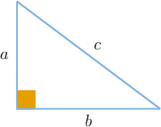

# Describing Relationships Using Polynomial Identities

Source: https://www.mathacademy.com/topics/2051?courseId=128
Topic ID: 2051

## Prerequisites

- [Squaring Binomials](../algebra-i/360-squaring-binomials.md)
- [The Pythagorean Theorem](../geometry/433-the-pythagorean-theorem.md)
- [Solving Systems of Linear Equations Using Elimination: Two Transformations](../algebra-i/4236-solving-systems-of-linear-equations-using-elimination-two-transformations.md)
- [Rational Numbers as Finite or Repeating Decimals](../grade-7/7011-rational-numbers-as-finite-or-repeating-decimals.md)

## Lesson

### Introduction

A **polynomial identity** is an equation where both sides represent the same polynomial even though they are written differently.

Some of the most important polynomial identities are as follows:

$$

\begin{aligned}(𝑥+𝑎)^{2}=𝑥^{2}+2𝑎𝑥+𝑎^{2} \\ (𝑥−𝑎)^{2}=𝑥^{2}−2𝑎𝑥+𝑎^{2} \\ (𝑥−𝑎)(𝑥+𝑎)=𝑥^{2}−𝑎^{2} \\ 𝑥^{2}+(𝑎+𝑏)𝑥+𝑎𝑏=(𝑥+𝑎)(𝑥+𝑏)\end{aligned}

$$

To prove that a polynomial equation is an identity, we start with one side of the equation and then show that it's equivalent to the other side using algebraic manipulation:

For example, we can show that

$$

(x-5)^2+10x = x^2 + 25

$$

is a polynomial identity by performing the following steps:

$$

\begin{aligned} & & (𝑥−5)^{2}+10𝑥 & = \\ Step 1: & & (𝑥^{2}−2⋅𝑥⋅5+5^{2})+10𝑥 & = \\ Step 2: & & (𝑥^{2}−10𝑥+25)+10𝑥 & = \\ Step 3: & & 𝑥^{2}+(−10𝑥+10𝑥)+25 & = \\ Step 4: & & 𝑥^{2}+25 & \end{aligned}

$$

### Example: Verifying Polynomial Identities

#### Question

Consider the following derivation:

$$

\begin{aligned} & & 9−(𝑥−3)^{2} & = \\ Step 1: & & 9−(𝑥^{2}−2⋅𝑥⋅3+3^{2}) & = \\ Step 2: & & 9−(𝑥^{2}−6𝑥+9) & = \\ Step 3: & & −𝑥^{2}+6𝑥+(9+9) & = \\ Step 4: & & −𝑥^{2}+6𝑥+18 & \end{aligned}

$$

Which of the following statements is true?

1. There is a mistake in Step 1

2. There is a mistake in Step 2

3. There is a mistake in Step 3

4. There is a mistake in Step 4

5. $9 - (x-3)^2 = -x^2 +6x+ 18$ is a polynomial identity

#### Explanation

There is a mistake in Step 3. Indeed, the correct simplification looks as follows:

$$

\begin{aligned} & & 9−(𝑥−3)^{2} & = \\ Step 1: & & 9−(𝑥^{2}−2⋅𝑥⋅3+3^{2}) & = \\ Step 2: & & 9−(𝑥^{2}−6𝑥+9) & = \\ Step 3: & & −𝑥^{2}+6𝑥+(9−9) & = \\ & & ⋮ & \end{aligned}

$$

Therefore, the correct answer is "III only."

### Example: Identifying Parity and Divisibility Properties of Natural Numbers

#### Question

Consider the following polynomial identity:

$$

(n+15)^2 - n^2 = 30n+225

$$

From left to right, what is missing from the following sentence?

**

#### Explanation

Factoring the right-hand side of our identity, we get

$$

(n+15)^2 - n^2 = 15(2n+15).

$$

Let $n$ be a natural number. Now, note the following:

- The numbers $n$ and $n+{\color{blue}{15}}$ represent two natural numbers whose difference equals ${\color{blue}{15}}.$

- The expression $(n+15)^2 - n^2$ represents the difference between the squares of these two numbers.

- The expression ${\color{red}{15}}(2n+15)$ represents a number that's divisible by ${\color{red}{15}}.$

Therefore, the correct sentence is as follows:

**

### Generating Pythagorean Triples

Consider the following polynomial identity:

$$

(x^2 – y^2)^2 + (2xy)^2 = (x^2 + y^2)^2

$$

Notice that if we set

$$

a= x^2 – y^2, \qquad b=2xy, \qquad c= x^2+y^2,

$$

then we obtain a triple $(a, b, c)$ satisfying the equation

$$

a^2+b^2=c^2.

$$

Thus, if $a,b$ and $c$ are positive integers then $(a,b,c)$ is a **Pythagorean triple**. In other words, $a,b$ and $c$ correspond to the sides of a right triangle.

We can generate Pythagorean triples by substituting different values of $x$ and $y$ into our polynomial identity.

For example, substituting $x=2$ and $y=1$ into the identity, we get

$$

\begin{aligned}(𝑥^{2}–𝑦^{2})^{2}+(2𝑥𝑦)^{2} & =(𝑥^{2}+𝑦^{2})^{2} \\ (2^{2}–1^{2})^{2}+(2⋅2⋅1)^{2} & =(2^{2}+1^{2})^{2} \\ (4–1)^{2}+4^{2} & =(4+1)^{2} \\ 3^{2}+4^{2} & =5^{2}.\end{aligned}

$$

Therefore, we generate the well-known Pythagorean triple $(3,4,5).$

By convention, we always write the numbers of a Pythagorean triple in ascending order.

### Example: Pythagorean Triples

#### Question

Consider the following polynomial identity for natural $x$ and $y\mathbin{:}$

$$

(x^2 – y^2)^2 + (2xy)^2 = (x^2 + y^2)^2

$$

When $x = p$ and $y=q$ are substituted into this identity, they generate the Pythagorean triple $(8,15,17).$ What is the value of $p+q?$

#### Explanation

We have the Pythagorean triple $(a,b,c) = (8,15,17).$

Comparing our polynomial identity with $a^2+b^2 = c^2,$ we have two possible options:

- Option 1: $\quad x^2-y^2 = 8, \qquad 2xy = 15, \qquad x^2+y^2 = 17$

- Option 2: $\quad x^2-y^2 = 15, \qquad 2xy = 8, \qquad x^2+y^2 = 17$

We'll try both options to see which generates the required triple:

- Considering the first option: Adding the first and third equations, we get which gives and we can disregard this option since $\dfrac{25}2$ is not a perfect square:

- Considering the second option: Adding the first and third equations, we get which gives Substituting this into the second equation, we get

Therefore, we conclude that $x=p=4$ and $y=q=1$ generate the required triple. Let's just test to make sure:

$$

\begin{aligned}(𝑥^{2}–𝑦^{2})^{2}+(2𝑥𝑦)^{2} & =(𝑥^{2}+𝑦^{2})^{2} \\ (4^{2}–1^{2})^{2}+(2⋅4⋅1)^{2} & =(4^{2}+1^{2})^{2} \\ (16–1)^{2}+8^{2} & =(16+1)^{2} \\ 15^{2}+8^{2} & =17^{2} \\ 8^{2}+15^{2} & =17^{2}\,✓\end{aligned}

$$

Finally, $p+q = 4+1 = 5.$
