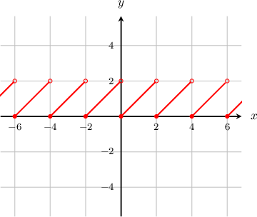
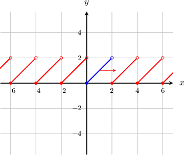
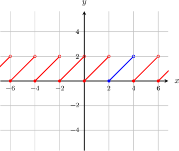
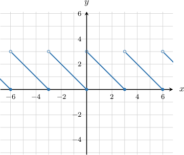
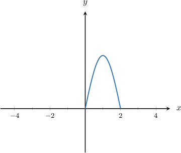
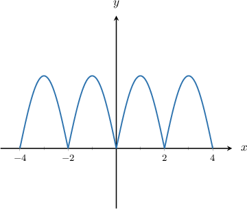
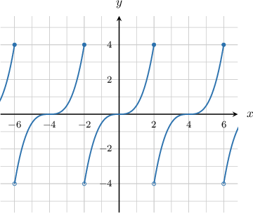

# Periodic Functions

Source: https://www.mathacademy.com/topics/2148?courseId=128
Topic ID: 2148

## Prerequisites

- [Piecewise Functions](../algebra-i/165-piecewise-functions.md)

## Lesson

### Introduction

**Periodic functions** are special functions that repeat themselves every units. The smallest positive value of that has this property is called the **period** of the function.

Let's take the following periodic function as an example:

This function repeats itself with a period of To illustrate, first focus on the part of the graph shown in blue below.

If we shift this part units to the right, the graph remains unchanged!

The same would happen if we shifted the part units to the left.

By knowing the period of a periodic function, we can use a value of the function to infer many other values of the function. For example, in the function above, note that Since the period is if we add (or subtract) any multiple of from the input, the output stays the same. We can write this as

where is an integer.

For example, setting gives the following:

The same is true for negative values of Setting gives the following:

### Example: Identifying the Period of a Function Given Its Graph

#### Question

What is the period of the function shown below?

#### Explanation

Note that if we shift the graph $3$ units left or right, the graph remains unchanged.

On the other hand, if we shift the graph horizontally by any distance other than $3$ (or a multiple other than $3$), we get a different graph.

Therefore, the period of the function is $3.$

### Example: Drawing the Graph of a Periodic Function

#### Question

Part of the graph of a function $y=f(x)$ with period $2$ is shown below. What is the graph of $y=f(x)$ on the interval $-4\leq x \leq 4?$

#### Explanation

The graph above shows the function in the interval $0 \leq x \leq 2.$

Since this interval has length $2,$ and the period of the function is also $2,$ this interval represents a single period of the function.

Therefore, the function will consist of many copies of the shape shown above, shifted horizontally by multiples of $2.$

### Example: Inferring Values of a Periodic Function Given Its Graph

#### Question

The graph of $y=f(x)$ is shown below. Given that $f$ is periodic with period $4$, what is the value of $f(84)?$

#### Explanation

Since the period is $4,$ if we add (or subtract) any multiple of $4$ from the input, the output stays the same.

So, we can keep subtracting $4$ from the input until we get to an input that we see in the graph:

$$

\begin{aligned}𝑓(84) & =𝑓(84−4) \\ & =𝑓(84−2⋅4) \\ & =⋯ \\ & =𝑓(84−20⋅4) \\ & =𝑓(4) \\ & =0\end{aligned}

$$
