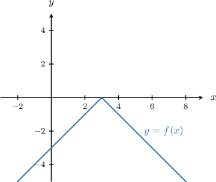

# Roots of Absolute Value Functions

Source: https://www.mathacademy.com/topics/3851?courseId=128
Topic ID: 3851

## Prerequisites

- [The Roots of a Function](../algebra-i/2022-the-roots-of-a-function.md)
- [Combining Transformations of Absolute Value Graphs](../algebra-i/3559-combining-transformations-of-absolute-value-graphs.md)
- [Further Absolute Value Equations](../algebra-i/4029-further-absolute-value-equations.md)

## Lesson

### Introduction

Recall that to find the **roots** of a function $f(x)$, we must solve the equation

$$

f(x) = 0.

$$

For instance, let's calculate the roots of

$$

f(x) = |x-3| -6.

$$

To find the roots of $f(x),$ we need to solve the following absolute value equation:

$$

|x-3| -6 = 0

$$

First, we isolate the absolute value on the left side of the equation:

$$

\begin{aligned}|𝑥−3| & =6\end{aligned}

$$

Either the positive or negative of the expression inside the absolute value must be equal to the right-hand side of the equation. So, we set up the two corresponding equations and solve them independently:

$$

\begin{aligned}𝑥−3 & =6 & \, & \, & −(𝑥−3) & =6 \\ 𝑥 & =9 & & & −𝑥+3 & =6 \\ & & & & −𝑥 & =3 \\ & & & & 𝑥 & =−3\end{aligned}

$$

Therefore, the roots are $x=-3$ and $x=9.$

### Example: Finding the Roots of an Absolute Value Function

#### Question

Calculate the roots of $f(x) = 4|x-1| -16.$

#### Explanation

To find the roots of the function, we must solve the equation $f(x) = 0.$ In this case, our equation is

$$

4|x-1| -16 = 0.

$$

First, we isolate the absolute value on the left side of the equation:

$$

\begin{aligned}4|𝑥−1| & =16 \\ |𝑥−1| & =4\end{aligned}

$$

Either the positive or negative of the expression inside the absolute value must be equal to the right-hand side of the equation. So, we set up the two corresponding equations and solve them independently:

$$

\begin{aligned}𝑥−1 & =4 & \, & \, & −(𝑥−1) & =4 \\ 𝑥 & =5 & & & −𝑥+1 & =4 \\ & & & & −𝑥 & =3 \\ & & & & 𝑥 & =−3\end{aligned}

$$

Therefore, the roots are $x=-3$ and $x=5.$

### Example: Finding the Roots of a Reflected Function

#### Question

Calculate the roots of $f(x) = -3|x+2| +9.$

#### Explanation

To find the roots of the function, we must solve the equation $f(x) = 0.$ In this case, our equation is

$$

-3|x+2| +9 = 0.

$$

First, we isolate the absolute value on the left side of the equation:

$$

\begin{aligned}−3|𝑥+2| & =−9 \\ |𝑥+2| & =3\end{aligned}

$$

Either the positive or negative of the expression inside the absolute value must be equal to the right-hand side of the equation. So, we set up the two corresponding equations and solve them independently:

$$

\begin{aligned}𝑥+2 & =3 & \, & \, & −(𝑥+2) & =3 \\ 𝑥 & =1 & & & −𝑥−2 & =3 \\ & & & & −𝑥 & =5 \\ & & & & 𝑥 & =−5\end{aligned}

$$

Therefore, the roots are $x=-5$ and $x=1.$

### Example: Identifying Absolute Value Functions That Have Roots

#### Question

Which of the following functions has at least one root?

1. $f(x) = -|x-3|$

2. $g(x) = -|x-3| + 3$

3. $h(x) = -|x-3| - 2$

#### Explanation

Let's start by sketching the graph of $y = f(x).$

Let's now examine our three functions:

- The function $f(x)$ has one root at $x=3.$

- The function $g(x)$ has two roots. The graph $y=g(x)$ is obtained from $y = f(x)$ by shifting it vertically ** by $3$ units. As a result, $y=g(x)$ lies partly above and partly below the $x$-axis.

- The function $h(x)$ has no roots. The graph $y=h(x)$ is obtained from $y = f(x)$ by shifting it vertically ** by $2$ units. As a result, $y=h(x)$ lies entirely below the $x$-axis.

Therefore, the correct answer is "I and II only."
