# Inscribed Angles

Source: https://www.mathacademy.com/topics/497?courseId=128
Topic ID: 497

## Prerequisites

- [Central Angles and Arcs](../geometry/550-central-angles-and-arcs.md)

## Lesson

### Introduction

Given a circle, an **inscribed angle** is an angle whose vertex lies on the circumference and whose sides are chords that meet at that vertex.

In the diagram below, the points $P,$ $A,$ and $B$ define the inscribed angle $\angle APB.$

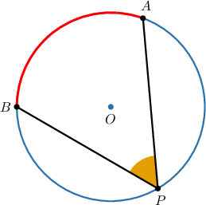

The arc formed by the endpoints of an inscribed angle is called an **intercepted arc**. Here, the endpoints $A$ and $B$ determine the intercepted arc $\overset{\frown}{AB}.$

Remember that the measure of an arc is always equal to the measure of the corresponding central angle. Here, we have

$$

m\overset{\frown}{AB} = m\angle{AOB}.

$$

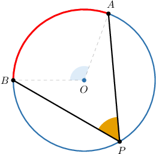

### Example: Identifying Inscribed Angles and Intercepted Arcs

#### Question

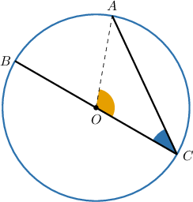

Consider the diagram above. Which of the following statements are true?

1. $\angle{ACB}$ intercepts the arc $\overset{\frown}{AC}$

2. $\angle{AOC}$ is an inscribed angle

3. $\angle{ACB}$ is an inscribed angle

#### Explanation

Let's examine the statements one by one.

- Statement I is false. The angle $\angle ACB$ intercepts the arc $\overset{\frown}{AB},$ as shown below.

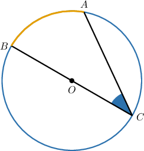

- Statement II is false. The angle $\angle{AOC}$ is a central angle of the circle, not an inscribed angle.

- Statement III is true. Notice that $\angle{ACB}$ is formed by two chords, and its vertex lies on the circumference. Hence, $\angle{ACB}$ is an inscribed angle.

Therefore, the correct answer is "III only."

### The Inscribed Angle Theorem

The **inscribed angle theorem** states the following:

*The measure of an inscribed angle is half the measure of the central angle of the same intercepted arc.*

To illustrate, consider the diagram below.

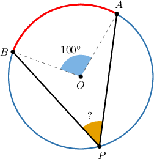

By the inscribed angle theorem, we have

$$

m \angle APB = \dfrac{1}{2} m \angle AOB.

$$

Therefore,

$$

m \angle APB = \dfrac{1}{2} \cdot 100^\circ = 50^\circ.

$$

This gives the following picture.

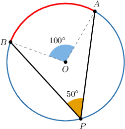

### Example: Applying the Inscribed Angle Theorem in Simple Situations

#### Question

If $m\overset{\frown}{CD}= 110^\circ,\,$ then find the measure of $m\angle CED.$

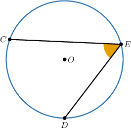

#### Explanation

Since we're told that $m\overset{\frown}{CD}= 110^\circ,\,$ we can add this information to the diagram:

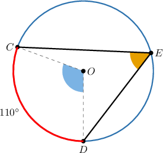

According to the inscribed angle theorem, the measure of an inscribed angle is half the measure of its intercepted arc. So,

$$

\begin{aligned}𝑚∠𝐶𝐸𝐷 & =\frac{1}{2}𝑚\overset{𝐶𝐷}{⌢} \\ & =\frac{1}{2}⋅110^{∘} \\ & =55^{∘}.\end{aligned}

$$

### Another Example of the Inscribed Angle Theorem

As a second example, let's consider the following diagram:

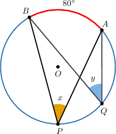

Since $\angle P$ and $\angle Q$ are inscribed angles with the same intercepted arc, we have that

$$

m \angle P = m \angle Q.

$$

Therefore, $x=y,$ and we now have the following picture.

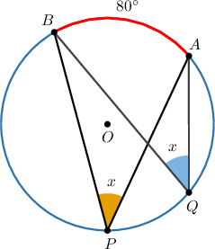

Moreover, since $m\overset{\frown}{AB}=80^\circ,$ we have that $m\angle AOB = 80^\circ,$ and by the inscribed angle theorem,

$$

\begin{aligned}𝑚∠𝑃=𝑚∠𝑄 & =\frac{1}{2}⋅𝑚∠𝐴𝑂𝐵 \\ & =\frac{1}{2}⋅80^{∘} \\ & =40^{∘}.\end{aligned}

$$

Filling in this information, we get the following picture.

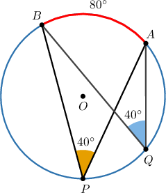

### Example: Applying the Inscribed Angle Theorem in More Advanced Situations

#### Question

Given the circle depicted below, what is the value of $x?$

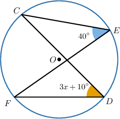

#### Explanation

Since the inscribed angles $\angle FDC$ and $\angle FEC$ intercept the same arc $\overset{\frown}{FC}$, their measures are the same.

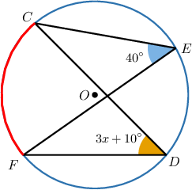

Therefore, we have

$$

\begin{aligned}𝑚∠𝐹𝐷𝐶 & =𝑚∠𝐹𝐸𝐶 \\ 3𝑥+10^{∘} & =40^{∘} \\ 3𝑥 & =30^{∘} \\ 𝑥 & =10^{∘}.\end{aligned}

$$

### Proving the Inscribed Angle Theorem

Let's now prove the inscribed angle theorem.

Consider the following diagram.

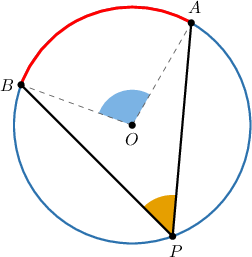

We want to prove the relation

The radius splits into the consecutive angles and Let's call the measure of these angles and

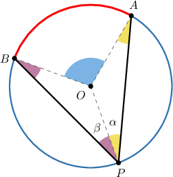

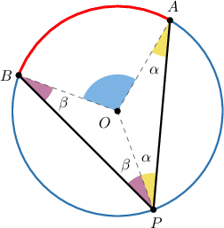

Since the sum of the interior angles of a triangle equals we have

Similarly,

Notice that the arcs and partition the circle. Therefore, the sum of their angles must be a full turn:

We substitute our expressions for and into the above and simplify as follows:

Finally, by the angle addition postulate, we have

Note that this proof covers the case shown in the diagram, where the center lies inside the inscribed angle. The remaining configurations can be proved using similar arguments.
