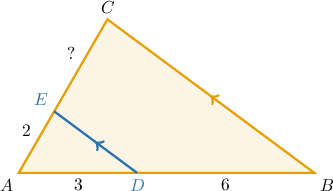
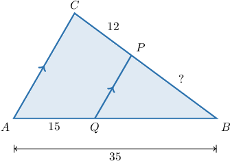
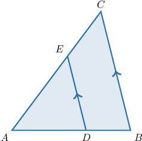
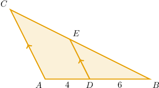
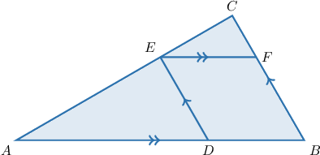
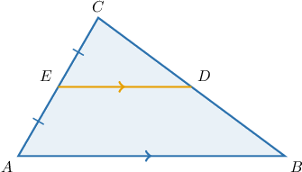
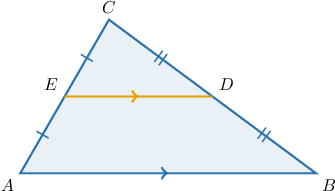

# The Triangle Proportionality Theorem

Source: https://www.mathacademy.com/topics/503?courseId=128
Topic ID: 503

## Prerequisites

- [The Midpoint Theorem](../geometry/1387-the-midpoint-theorem.md)
- [Solving Rational Equations Containing Binomials Using Cross-Multiplication](../algebra-i/3555-solving-rational-equations-containing-binomials-using-cross-multiplication.md)

## Lesson

### Introduction

The **triangle proportionality theorem** states the following:

*If a line segment parallel to a side of a triangle intersects the other two sides, then the segment divides those sides proportionally.*

Let’s use this theorem in the triangle below, where How can we find the length of

Notice that the segment is parallel to the side and it intersects the other two sides, namely and

Therefore, according to the triangle proportionality theorem, the segment divides the two sides and proportionally:

We can substitute the information from the diagram and then solve for as follows:

### Example: Calculating the Length of a Line Segment Using the Triangle Proportionality Theorem

#### Question

In the figure below, $\overline{PQ} \parallel \overline{AC}.$ Determine the measure of $\overline{BP}.$

#### Explanation

First, let's find $BQ{:}$

$$

BQ = AB-AQ = 35-15=20

$$

The triangle proportionality theorem states the following:

If a line parallel to a side of a triangle intersects the other two sides, then the line divides those sides proportionally.

Since ${\color{blue}\overline{PQ}} \parallel \overline{AC},$ then by the triangle proportionality theorem, we obtain

$$

\begin{aligned}\frac{𝐵𝑃}{𝑃𝐶} & =\frac{𝐵𝑄}{𝑄𝐴} \\ \frac{𝐵𝑃}{12} & =\frac{20}{15}.\end{aligned}

$$

Solving the above equation for $BP,$ we get

$$

\begin{aligned}\frac{𝐵𝑃}{12} & =\frac{4}{3} \\ 𝐵𝑃 & =16.\end{aligned}

$$

### Example: Solving for an Unknown Using the Triangle Proportionality Theorem

#### Question

In the figure below, $\overline{DE} \parallel \overline{BC},$ ${AE} = 3x-2,$ $EC = x+6,$ $AD = 12,$ and $DB = 9.$ Find the value of $x.$

#### Explanation

The triangle proportionality theorem states the following:

If a line parallel to a side of a triangle intersects the other two sides, then the line divides those sides proportionally.

Since $\overline{DE} \parallel \overline{BC},$ then by the triangle proportionality theorem, we obtain

$$

\begin{aligned}\frac{𝐴𝐸}{𝐸𝐶} & =\frac{𝐴𝐷}{𝐷𝐵} \\ \frac{3𝑥−2}{𝑥+6} & =\frac{12}{9} \\ 9(3𝑥−2) & =12(𝑥+6) \\ 27𝑥−18 & =12𝑥+72 \\ 15𝑥 & =90 \\ 𝑥 & =6.\end{aligned}

$$

### Example: Using the Triangle Proportionality Theorem Given a Sum of Two Line Segments

#### Question

In the triangle $\triangle ABC$ shown below, $BD+BE=15$ and $\overline{DE}\parallel\overline{AC}.$ Find the length of $\overline{BC}.$

#### Explanation

The triangle proportionality theorem states the following:

If a line parallel to a side of a triangle intersects the other two sides, then the line divides those sides proportionally.

From the above diagram, we notice that $BD=6.$ Now, as $BD+BE=15,$ we have that

$$

BE=15-6=9.

$$

Since $\overline{DE}\parallel\overline{AC},$ then by the triangle proportionality theorem, we obtain

$$

\begin{aligned}\frac{𝐵𝐸}{𝐸𝐶} & =\frac{𝐵𝐷}{𝐷𝐴} \\ \frac{9}{𝐸𝐶} & =\frac{6}{4} \\ \frac{9}{𝐸𝐶} & =\frac{3}{2} \\ 𝐸𝐶 & =\frac{9⋅2}{3} \\ 𝐸𝐶 & =6.\end{aligned}

$$

Finally,

$$

\begin{aligned}𝐵𝐶 & =𝐵𝐸+𝐸𝐶 \\ & =9+6 \\ & =15.\end{aligned}

$$

### Example: Finding the Value of an Unknown Using the Triangle Proportionality Theorem Twice

#### Question

In the figure below, $\overline{AB} \parallel \overline{EF},$ $\overline{BC} \parallel \overline{DE},$ $AD = 4,$ $AB = 6,$ and $BF = 2.$ Find the measure of $\overline{CF}.$

#### Explanation

The triangle proportionality theorem states the following:

If a line parallel to a side of a triangle intersects the other two sides, then the line divides those sides proportionally.

First, since $AD = 4$ and $AD+DB=AB = 6,$ we have that

$$

DB = AB-AD = 6-4=2.

$$

Now, we apply the triangle proportionality theorem twice:

- Since $\overline{DE} \parallel \overline{BC},$ then by the triangle proportionality theorem, we obtain

$$

\begin{aligned}\frac{𝐴𝐸}{𝐸𝐶} & =\frac{𝐴𝐷}{𝐷𝐵} \\ \frac{𝐴𝐸}{𝐸𝐶} & =\frac{4}{2} \\ \frac{𝐴𝐸}{𝐸𝐶} & =2.\end{aligned}

$$

- Since $\overline{EF} \parallel \overline{AB},$ then by the triangle proportionality theorem, we obtain

$$

\begin{aligned}\frac{𝐶𝐹}{𝐹𝐵} & =\frac{𝐶𝐸}{𝐸𝐴} \\ \frac{𝐶𝐹}{𝐹𝐵} & =(\frac{𝐴𝐸}{𝐸𝐶})^{−1} \\ \frac{𝐶𝐹}{2} & =2^{−1} \\ \frac{𝐶𝐹}{2} & =\frac{1}{2} \\ 𝐶𝐹 & =1.\end{aligned}

$$

### Relation to the Midpoint Theorem

The midpoint theorem is a special case of the triangle proportionality theorem.

To understand why, consider the situation when the line parallel to the side of the triangle bisects one of the other sides, as shown below.

Because $\overline{DE}\parallel\overline{AB},$ the triangle proportionality theorem tells us that the sides $\overline{AC}$ and $\overline{BC}$ of $\triangle ABC$ are divided proportionally:

$$

\dfrac{CE}{EA} = \dfrac{CD}{DB} .

$$

We also know that $EA=CE,$ so

$$

\dfrac{CE}{EA} = 1 .

$$

Therefore,

$$

\begin{aligned}\frac{𝐶𝐸}{𝐸𝐴} & =\frac{𝐶𝐷}{𝐷𝐵} \\ 1 & =\frac{𝐶𝐷}{𝐷𝐵} \\ 𝐶𝐷 & =𝐷𝐵.\end{aligned}

$$

Consequently, if the parallel line bisects one of the sides, it must bisect the other side as well.

Going in the other direction, we can also state that if a line segment connects the midpoints of two sides of a triangle, it must be parallel to the third side.
