# Proving Triangle Theorems

Source: https://www.mathacademy.com/topics/508?courseId=128
Topic ID: 508

## Prerequisites

- [Collinear Points](../grade-7/1500-collinear-points.md)
- [The Exterior Angle Theorem](../geometry/5157-the-exterior-angle-theorem.md)
- [Proving Alternate Angle Theorems](../geometry/5488-proving-alternate-angle-theorems.md)

## Lesson

### Introduction

In this lesson, we'll learn how to prove some elementary triangle theorems.

Consider the triangle $\triangle{ABC}$ below.

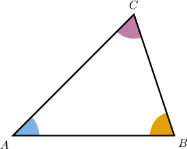

Suppose we wish to prove the following statement:

*The sum of the measures of the interior angles of $\triangle{ABC}$ equals $180^\circ.$*

In addition to the definitions, postulates, and theorems we've used previously, we'll need the following definition of a **straight angle**.

*An angle is straight if its measure equals $180^\circ.$*

Let's now prove this result.

### Proving the Sum of Interior Angles Theorem

We wish to prove the following statement:

*The sum of the measures of the interior angles of $\triangle{ABC}$ equals $180^\circ.$*

The key to unlocking this proof is to *construct* a line parallel to $\overline{AB}$ passing through $C,$ and then apply the alternate interior angles theorem twice.

We'll now go through the step-by-step proof of this statement.

- **Step 1**: We start by constructing a line $\overset{\longleftrightarrow}{DE}$ that passes through the point $C$ and is parallel to $\overline{AB}.$

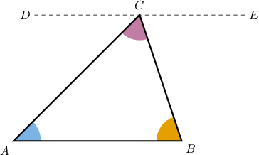

- **Step 2**: Since $\overline{AB}$ and $\overset{\longleftrightarrow}{DE}$ are parallel, $\angle{ACD}$ and $\angle{A}$ are congruent by the *alternate interior angles theorem*.

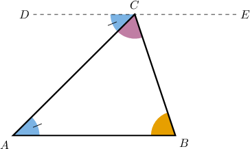

- **Step 3**: Since $\angle{ACD}\cong \angle{A},$ we have by the *definition of congruent angles.*

- **Step 4**: Since $\overline{AB}$ and $\overset{\longleftrightarrow}{DE}$ are parallel, $\angle{BCE}$ and $\angle{B}$ are congruent by the *alternate interior angles theorem*.

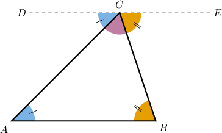

- **Step 5**: Since $\angle{BCE} \cong \angle{B},$ we have by the *definition of congruent angles*.

- **Step 6**: The segments $\overline{AC}$ and $\overline{BC}$ divide the straight angle $\angle{DCE}$ into three consecutive angles: $\angle{ACD},$ $\angle{ACB},$ and $\angle{BCE}.$ So, by the *angle addition postulate*, we must have

- **Step 7**: In steps 3 and 5, we showed that $m\angle{ACD} = m\angle{A}$ and $m\angle{BCE} = m\angle{B},$ respectively. So, by *substituting* these values into the equality in step 6, we obtain

- **Step 8**: Since $\overset{\longleftrightarrow}{DE}$ is a line, $m\angle{DCE} = 180^\circ$ by the *definition of a straight angle*.

- **Step 9**: In step 8, we showed that $m\angle{DCE} = 180^\circ,$ and in step 7, we showed that Therefore, by the *transitive property of equality*, we have as required.

It's **highly recommended** that you practice reconstructing this proof. Try to do this *without* referring to these notes.

### Stating the Full Proof Using the Two-Column Format

The table below shows the proof of the interior angles of a triangle theorem in a two-column format.

Let's now consider an alternative proof of this theorem using the corresponding angles postulate and the vertical angles theorem.

### Example: The Sum of Interior Angles Theorem

#### Question

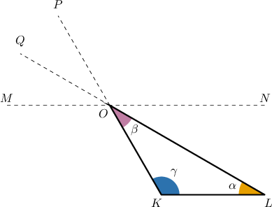

In the diagram above, $\overset{\longleftrightarrow}{KL} \parallel \overset{\longleftrightarrow}{MN}.$

Consider the following statement:

$m\angle{\alpha} + m\angle{\beta} + m\angle{\gamma} = 180^\circ$

Complete the proof below by finding the missing entries.

#### Explanation

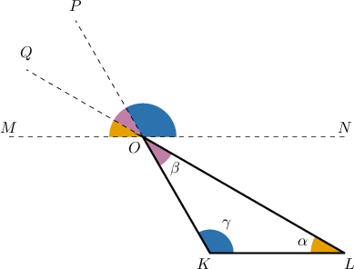

The correct proof is below.

Let's examine the rows of the table with missing parts in turn.

- Consider row 2. From row 1, we have that $\overset{\longleftrightarrow}{KL}$ and $\overset{\longleftrightarrow}{MN}$ are parallel. Therefore, by the corresponding angles postulate, the corresponding angles $\angle {MOQ}$ and $\angle{\alpha}$ are congruent.

- Consider row 4. Since the lines $\overset{\longleftrightarrow}{KP}$ and $\overset{\longleftrightarrow}{LQ}$ meet at the point $O$, $\angle{QOP}$ and $\beta$ are vertical angles, so they are congruent by the vertical angles theorem.

- Consider row 8. Since $\overset{\longleftrightarrow}{MN}$ is a line, $m \angle MON = 180^\circ$ by the definition of a straight angle.

- Consider row 11. From row 8, we have $m \angle MON = 180^\circ,$ and from row 10, we have Therefore, by the transitive property of equality, we have

### The Exterior Angle Theorem

We'll now discuss how to prove the exterior angle theorem. Let's begin by stating this:

*An exterior angle in a triangle equals the sum of the measures of the two non-adjacent interior angles.*

Consider the diagram below, where the points $F,$ $H,$ and $I$ are colinear.

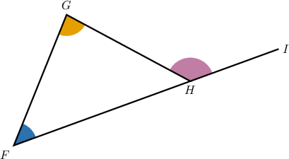

We wish to prove the following statement:

*$m\angle{IHG} = m\angle{F} + m\angle{G}$*

Several different proofs of this result are available, and we'll study two of them.

### Proving the Exterior Angle Theorem

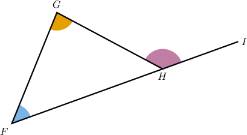

Our goal is to prove the following:

*$m\angle{IHG} = m\angle{F} + m\angle{G}$*

To prove this theorem, we construct a ray from the point $H$ that's parallel to $\overline{FG},$ and then apply the corresponding angles postulate and alternate interior angles theorem.

We complete the proof as follows:

- **Step 1**: We start by constructing a line $\overset{\longleftrightarrow}{HJ}$ through the point $H$ and parallel to $\overset{\longleftrightarrow}{FG}.$

- **Step 2**: Since $\overset{\longleftrightarrow}{FG} \parallel \overset{\longleftrightarrow}{HJ},$ we have that the corresponding angles $\angle{IHJ}$ and $\angle{F}$ are congruent by the *corresponding angles postulate*. Let's add this to our diagram.

- **Step 3**: Since $\angle{IHJ} \cong \angle{F}$ are congruent, we have by the *definition of congruent angles*.

- **Step 4**: Since $\overset{\longleftrightarrow}{FG}$ and $\overset{\longleftrightarrow}{HJ}$ are parallel, we have that the alternate interior angles $\angle{JHG}$ and $\angle{G}$ are congruent by the *alternate interior angles theorem*. Let's add this to our diagram.

- **Step 5**: Since $\angle{JHG}$ and $\angle{G}$ are congruent, we have by the *definition of congruent angles*.

- **Step 6**: In steps 3 and 5, we showed that $m\angle{IHJ}=m\angle{F}$ and $m\angle{JHG}=m\angle{G},$ respectively. So, by the *addition principle*, we get

- **Step 7**: Notice that $\overline{HJ}$ is the common side of the angles $\angle{IHJ}$ and $\angle{JHG}.$ Therefore, by the *angle addition postulate*, we have that

- **Step 8**: In steps 7 and 6, respectively, we showed that and Therefore, by the *transitive property of equality*, we get as required.

Again, it's **highly recommended** that you practice reconstructing this proof.

### Stating the Full Proof Using the Two-Column Format

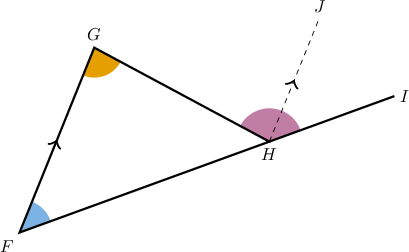

The table below shows our proof of the exterior angle theorem in a two-column format.

Let's now consider a proof of the same theorem that uses the interior angles of a triangle theorem.

### Example: Proving the Exterior Angle Theorem

#### Question

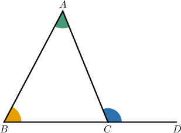

In the diagram above, the points $B,$ $C,$ and $D$ are colinear.

Consider the following statement:

**

The table below provides proof of the statement. Complete the proof by filling in the empty boxes.

#### Explanation

The complete proof is below.

Let's examine the rows of the table with missing parts in turn.

- Consider row 1. According to the linear pair postulate, $\angle{ACB}$ and $\angle{ACD}$ are supplementary angles.

- Consider row 2. From row 1, $\angle{ACB}$ and $\angle{ACD}$ are supplementary angles. Therefore, by definition of supplementary angles,

- Consider row 4. From row 3, we have Now, using the symmetric property of equality, we get

### Example: Constructing Complete Proofs of Triangle Theorems

#### Question

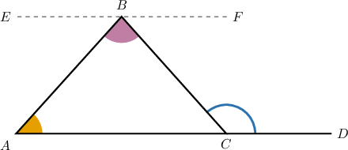

In the diagram above, the points $A,$ $C,$ and $D$ are colinear, and the lines $\overset{\longleftrightarrow}{EF}$ and $\overset{\longleftrightarrow}{AD}$ are parallel.

Consider the following statement:

**

The table below gives the proof of the statement. Complete the proof by filling in the empty boxes.

#### Explanation

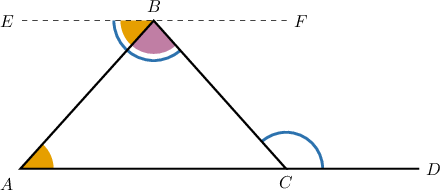

The correct proof is below.

Let's examine each row in turn.

1. Note that we're given $\overset{\longleftrightarrow}{EF} \parallel \overset{\longleftrightarrow}{AD}.$

2. From row 1, we have that $\overset{\longleftrightarrow}{EF}$ and $\overset{\longleftrightarrow}{AD}$ are parallel. Therefore, $\angle{BCD}$ and $\angle{CBE}$ are congruent by the alternate interior angles theorem.

3. From row 2, we have that $\angle{BCD}$ and $\angle{CBE}$ are congruent. Therefore, by the definition of congruent angles, $m\angle{BCD} = m\angle{CBE}.$

4. Note that the segment $\overline{AB}$ divides the angle $\angle{CBE}$ into consecutive angles $\angle{ABE}$ and $\angle{ABC}.$ Therefore, by the angle addition postulate, we must have

5. From row 1, we have that $\overset{\longleftrightarrow}{EF}$ and $\overset{\longleftrightarrow}{AD}$ are parallel. Therefore, $\angle{ABE}$ and $\angle{A}$ are congruent by the alternate interior angles theorem.

6. From row 5, $\angle{ABE}$ and $\angle{A}$ are congruent. Therefore, by the definition of congruent angles, $m\angle{ABE} = m\angle{A}.$

7. From row 6, $m\angle{ABE} = m\angle{A}.$ Substituting this into the equation in row 4, we have

8. From rows 3 and 7, we have Therefore, by the transitive property of equality, $m\angle{BCD} = m\angle{A} + m\angle{ABC}.$
