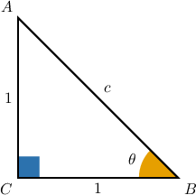
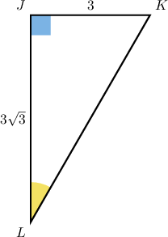
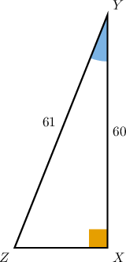
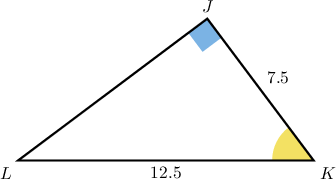

# Calculating Trigonometric Ratios Using the Pythagorean Theorem

Source: https://www.mathacademy.com/topics/633?courseId=128
Topic ID: 633

## Prerequisites

- [The Pythagorean Theorem](../geometry/433-the-pythagorean-theorem.md)
- [The Trigonometric Ratios](../geometry/609-the-trigonometric-ratios.md)

## Lesson

### Introduction

Suppose that we have a right triangle $\triangle ABC$ with legs $AC= BC = 1,$ like the one in the diagram below. How can we find the value $\sin \theta$ if we don't know one of the relevant sides?

Recall the definition of sine:

$$

\sin \theta = \dfrac {\textrm{opposite}}{\textrm{hypotenuse}} = \dfrac {AC}{AB} = \dfrac 1 c

$$

Here, we need to determine the missing side $c.$ The trick is to use the Pythagorean Theorem:

$$

\begin{aligned}𝑐 & =\sqrt{√𝐴𝐶^{2}+𝐵𝐶^{2}} \\ & =\sqrt{√1^{2}+1^{2}} \\ & =\sqrt{√2}\end{aligned}

$$

Finally, we can finish computing the value of $\sin\theta\mathbin{:}$

$$

\begin{aligned}sin⁡𝜃 & =\frac{1}{𝑐}=\frac{1}{\sqrt{√2}}=\frac{1⋅\sqrt{√2}}{\sqrt{√2}⋅\sqrt{√2}}=\frac{\sqrt{√2}}{2}\end{aligned}

$$

No matter which trigonometric function we need to find, if we are missing one of the relevant sides but we know the lengths of the other two sides, we can always use the Pythagorean Theorem.

### Example: Evaluating a Trigonometric Ratio by Using the Pythagorean Theorem to Solve for the Hypotenuse

#### Question

Find the value of $\cos L.$

#### Explanation

Recall the definition of cosine:

$$

\cos L = \dfrac {\textrm{adjacent}}{\textrm{hypotenuse}} = \dfrac {JL}{KL} = \dfrac{3\sqrt{3}}{KL}

$$

Here, we need to determine the missing side $KL.$ The trick is to use the Pythagorean Theorem:

$$

\begin{aligned} KL &= \sqrt{ JK^2 + JL^2 } \\&= \sqrt{ (3)^2 + (3\sqrt3)^2 } \\&= \sqrt{ 9 + 27 } \\&= \sqrt{36}\\&= 6\\\end{aligned}

$$

Therefore,

$$

\begin{aligned} \cos L &= \dfrac{3\sqrt{3}}{KL} \\\[5pt] &= \dfrac{3\sqrt 3}{6} \\\[5pt] &=\dfrac {\sqrt 3} 2. \end{aligned}

$$

### Example: Evaluating a Trigonometric Ratio by Using the Pythagorean Theorem to Solve for a Leg

#### Question

Find the sine of $\angle Y.$

#### Explanation

Recall the definition of sine:

$$

\sin Y = \dfrac {\textrm{opposite}}{\textrm{hypotenuse}} = \dfrac {XZ}{YZ} = \dfrac{XZ}{61}

$$

Here, we need to determine the missing side $XZ.$ The trick is to use the Pythagorean Theorem:

$$

\begin{aligned} XZ &= \sqrt{ YZ^2 - XY^2 } \\&= \sqrt{ 61^2 - 60^2 } \\&= \sqrt{ 3721- 3600 } \\&= \sqrt{121 }\\&= 11 \end{aligned}

$$

Therefore,

$$

\begin{aligned} \sin Y&= \dfrac{XZ}{61} = \dfrac{11}{61}. \end{aligned}

$$

### Example: Evaluating a Trigonometric Ratio by Using the Pythagorean Theorem with Decimals

#### Question

Calculate $\tan K.$

#### Explanation

Recall the definition of tangent:

$$

\tan K = \dfrac {\textrm{opposite}}{\textrm{adjacent}} = \dfrac {JL}{JK} = \dfrac{JL}{7.5}

$$

Here, we need to determine the missing side $JL.$ The trick is to use the Pythagorean Theorem:

$$

\begin{aligned} JL &= \sqrt{ KL^2 - JK^2 } \\&= \sqrt{ 12.5^2 - 7.5^2 } \\&= \sqrt{ 156.25-56.25 } \\&= \sqrt{100 }\\&= 10 \end{aligned}

$$

Therefore,

$$

\begin{aligned} \tan K&= \dfrac{JL}{7.5}\\\[5pt] &= \dfrac{10}{7.5} \\\[5pt] &=\dfrac 4 3. \end{aligned}

$$
