# Tree Diagrams for Dependent Events

Source: https://www.mathacademy.com/topics/739?courseId=128
Topic ID: 739

## Prerequisites

- [The Law of Total Probability](../geometry/773-the-law-of-total-probability.md)
- [Mutually Exclusive Events](../geometry/1154-mutually-exclusive-events.md)

## Lesson

### Introduction

There are $4$ blue and $2$ red marbles in a bag. Suppose that two marbles are picked consecutively *without replacement.* Can we represent all possible outcomes in such a way that makes calculating the various probabilities easy?

One way to represent all possible outcomes is to use a **tree diagram.**

First, let's define the following events:

- Let $B_1$ be the event "the first marble is blue."

- Let $R_1$ be the event "the first marble is red."

- Let $B_2$ be the event "the second marble is blue."

- Let $R_2$ be the event "the second marble is red."

We represent all possible outcomes using a tree diagram, as follows:

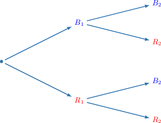

We now need to add some probabilities to our tree diagram.

The probabilities on the first level of the tree correspond to the first event. Now, since there are $6$ marbles in total, $4$ blue and $2$ red, we have

$$

P(B_1)=\dfrac46,\qquad P(R_1)=\dfrac26.

$$

Let's add these probabilities to the first level of our tree diagram.

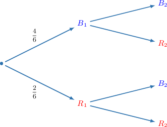

We now need to add probabilities to the second level. To demonstrate, consider the branch highlighted below.

The highlighted branch corresponds to the probability that the second marble is blue *given that* the first marble is blue, i.e., $P(B_2 | B_1).$ Now, if the first marble is blue, there will be $3$ blue marbles remaining out of $5$ marbles in total. Therefore,

$$

P(B_2|B_1)=\dfrac35.

$$

Let's add this to our diagram.

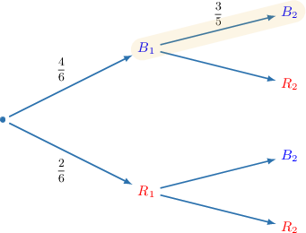

Using the same method to calculate the remaining probabilities, we get

$$

P(R_2|B_1)=\dfrac25, \qquad P(B_2|R_1)=\dfrac45, \qquad P(R_2|R_1)=\dfrac15.

$$

So, we get the following completed tree diagram.

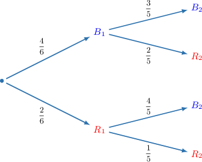

### Example: Interpreting a Tree Diagram

#### Question

The tree diagram below represents the probabilities of the dependent events $A$ and $E.$ What is $P(E|A')?$

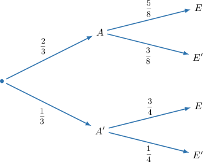

#### Explanation

Recall that $P(E|A')$ means "the probability of $E$ occurring ** $A'$ has occurred."

From the tree diagram, we can see that $P(E|A') = \dfrac{3}{4}.$

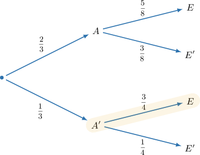

### Calculating the Intersection of Two Events Using a Tree Diagram

If $4$ blue and $2$ red marbles are in a bag and two marbles are picked consecutively without replacement, we get the following tree diagram.

Suppose we wish to calculate $P(R_1\cap B_2),$ the probability that the first marble is red and the second is blue. This event is highlighted below.

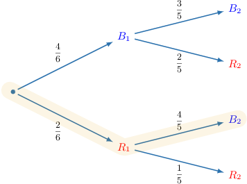

By the multiplication law, we *multiply across the branches* to calculate this probability. Thus, we have

$$

\begin{aligned}𝑃(𝑅_{1}∩𝐵_{2}) & =𝑃(𝑅_{1})⋅𝑃(𝐵_{2}|𝑅_{1}) \\ & =\frac{2}{6}⋅\frac{4}{5} \\ & =\frac{8}{30} \\ & =\frac{4}{15}.\end{aligned}

$$

### Example: Multiplying Across Branches

#### Question

The tree diagram below represents the probabilities of the dependent events $C$ and $D.$ What is $P(C'\cap D')?$

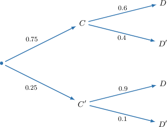

#### Explanation

The multiplication law states that

$$

P(C'\cap D') = P(C')\cdot P(D'|C').

$$

Therefore, to compute $P(C'\cap D')$ using a tree diagram, we multiply the probabilities across the appropriate branches, shown below:

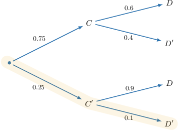

Therefore, the required probability is

$$

P(C' \cap D') = 0.25 \cdot 0.1 = 0.025.

$$

### Calculating the Union of Two Events Using a Tree Diagram

If $4$ blue and $2$ red marbles are in a bag and two marbles are picked consecutively without replacement, we get the following tree diagram.

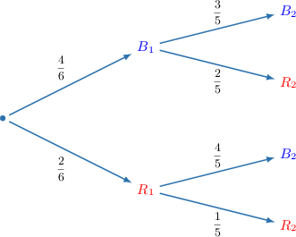

Suppose we wish to calculate $P(R_2),$ the probability that the second marble is red. This event corresponds to *two* branches of our tree diagram, highlighted below.

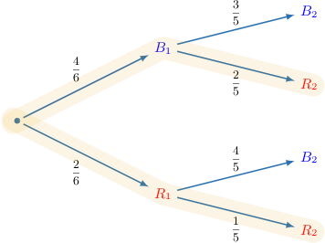

By the multiplication law *and* the law of total probability, we *multiply across the branches* and *add between the branches*. Thus, we have

$$

\begin{aligned}𝑃(𝑅_{2}) & =𝑃(𝑅_{2}∩𝐵_{1})+𝑃(𝑅_{2}∩𝑅_{1}) \\ & =𝑃(𝐵_{1})𝑃(𝑅_{2}|𝐵_{1})+𝑃(𝑅_{1})𝑃(𝑅_{2}|𝑅_{1}) \\ & =\frac{4}{6}⋅\frac{2}{5}+\frac{2}{6}⋅\frac{1}{5} \\ & =\frac{8}{30}+\frac{2}{30} \\ & =\frac{10}{30} \\ & =\frac{1}{3}.\end{aligned}

$$

### Example: Adding Between Branches

#### Question

The tree diagram below represents the probabilities of two dependent events $A$ and $E.$ What is $P(E')?$

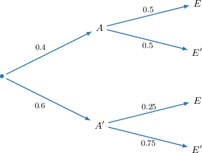

#### Explanation

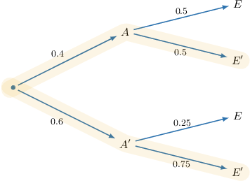

The law of total probability states that

$$

P(E') = P(A \cap E') + P(A' \cap E').

$$

From the tree diagram, we have

$$

P(A\cap E') = 0.4 \cdot 0.5 = 0.2

$$

and also

$$

P(A'\cap E') = 0.6\cdot 0.75 = 0.45.

$$

Therefore,

$$

\begin{aligned}𝑃(𝐸^{′}) & =𝑃(𝐴∩𝐸^{′})+𝑃(𝐴^{′}∩𝐸^{′}) \\ & =0.2+0.45 \\ & =0.65.\end{aligned}

$$
