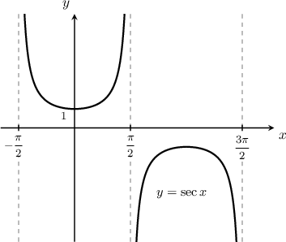
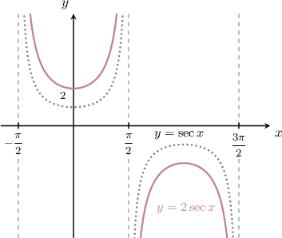
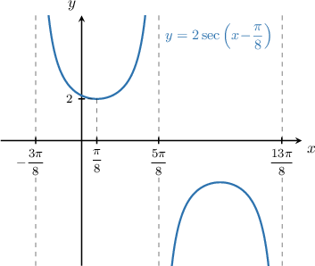
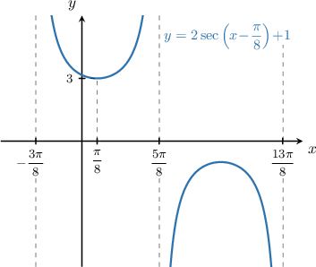
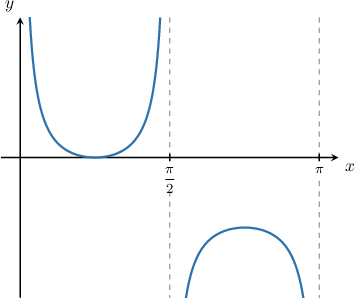
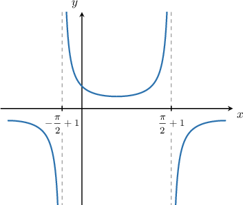
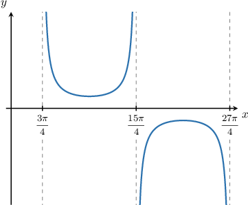
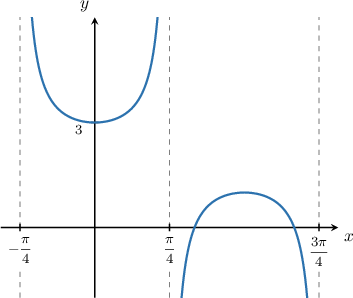
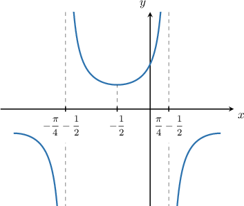

# Combining Graph Transformations of Secant and Cosecant

Source: https://www.mathacademy.com/topics/776?courseId=128
Topic ID: 776

## Prerequisites

- [Vertical Translations of Trigonometric Functions](../algebra-ii/206-vertical-translations-of-trigonometric-functions.md)
- [Horizontal Stretches of Trigonometric Functions](../algebra-ii/784-horizontal-stretches-of-trigonometric-functions.md)
- [Combining Graph Transformations: Two Operations](../algebra-ii/1254-combining-graph-transformations-two-operations.md)
- [Graphing Secant and Cosecant](../algebra-ii/1573-graphing-secant-and-cosecant.md)
- [Horizontal Translations of Trigonometric Functions](../algebra-ii/1659-horizontal-translations-of-trigonometric-functions.md)
- [Vertical Stretches of Trigonometric Functions](../algebra-ii/1661-vertical-stretches-of-trigonometric-functions.md)

## Lesson

### Introduction

We can combine vertical and horizontal shifts and stretches to get new transformed secant and cosecant curves. For example, let's draw the graph of the curve

$$

y = 2 \sec\left(x- \dfrac{\pi}{8}\right) + 1.

$$

To plot the given curve, we follow these steps:

- Start with the graph of $y=\sec{x}.$

- Then, stretch it parallel to the $y$-axis by a stretch factor of $2$ to give $y=2\sec{x}.$

- Next, shift to the **right** by $\dfrac{\pi}{8}$ units to give $y=2\sec\left(x - \dfrac{\pi}{8}\right).$

- Finally, shift it **up** by $1$ unit to give $y=2\sec\left(x - \dfrac{\pi}{8}\right) + 1.$

### Example: Identifying the Vertical Shift of a Transformed Secant or Cosecant Curve

#### Question

The graph below shows the function $y=\csc{\left(2x\right)}+D,$ where $D$ is a constant. What is the value of $D?$

#### Explanation

The constant $D$ represents a vertical shift of the function $y=\csc\left(2x\right).$

Since the local minimum of cosecant is $y=1,$ from the graph we see that the given curve is shifted **** by $1$ unit. So, the equation of the curve is

$$

y=\csc\left(2x\right)-1.

$$

Therefore, $D =-1.$

### Example: Identifying the Horizontal Shift of a Transformed Secant or Cosecant Curve

#### Question

The graph above shows a section of the function $y=\dfrac 1 2\sec{(x+C)},$ where $C$ is a constant. Given that $-\pi < C < \pi,$ what is the value of $C?$

#### Explanation

The constant $C$ represents a horizontal shift of the function $y=\dfrac 1 2\sec x.$

From the graph, we see that the given curve is a secant graph that's been shifted **** by $1$ unit. So, the equation of the curve is

$$

y=\dfrac 1 2\sec\left(x-1\right).

$$

Therefore, $C =-1.$

### Example: Identifying the Horizontal Stretch of a Transformed Secant or Cosecant Curve

#### Question

The graph above shows a section of the function $y=\csc{\left(Bx-\dfrac{\pi}{4}\right)},$ where $B$ is a constant. What is the value of $B?$

#### Explanation

The period of the function is

$$

T = \frac{27\pi}{4} -\frac{3\pi}{4} = \frac{24\pi}{4} = 6\pi.

$$

The formula for the period of the function $y=A\csc(Bx + C) + D$ is given by

$$

T = \dfrac{2\pi}{B}.

$$

Applying the formula for $T$ gives

$$

6\pi = \dfrac{2\pi}{B} \quad\Longrightarrow\quad B = \dfrac{2\pi}{6\pi} = \dfrac 1 3.

$$

So $B=\dfrac 1 3,$ and therefore, the equation of the function is

$$

y=\csc\left(\dfrac x 3-\dfrac\pi 4\right).

$$

### Example: Identifying the Horizontal Stretch and Vertical Shift of a Transformed Secant or Cosecant Curve

#### Question

The graph above shows the function $y=\sec{(Bx)}+D,$ where $B$ and $D$ are constants. What is $B+D?$

#### Explanation

The period of the function is

$$

T = \dfrac{3\pi}4 - \left(-\dfrac \pi 4\right) = \pi.

$$

The formula for the period of the function $y=A\sec(Bx + C) + D$ is given by

$$

T = \dfrac{2\pi}{B}.

$$

Applying the formula of the period, we get

$$

\pi = \dfrac{2\pi}{B}\quad\Longrightarrow\quad B = \dfrac{2\pi}{\pi} = 2.

$$

The parameter $D$ represents the vertical shift of the secant function. Since the local minimum of secant is $y=1,$ we see that the function has been translated by $2$ units ****. Therefore, $D=2.$

So, we have

$$

B+D = 2+2 = 4.

$$

Finally, the equation of the curve is

$$

y=\sec\left(2x\right)+2.

$$

### Example: Identifying the Horizontal Shift of a Horizontally Stretched Secant or Cosecant Curve

#### Question

The graph above shows the function $y=\sec{\left(2x+C\right)},$ where $C$ is a constant. Given that $-\pi < C < \pi,$ what is the value of $C?$

#### Explanation

The parameter $C$ represents a horizontal shift of the function.

First, we rewrite the function by factoring out the horizontal stretch factor, as follows:

$$

\begin{aligned}𝑦 & =sec⁡(2𝑥+𝐶) \\ & =sec⁡(2(𝑥+\frac{𝐶}{2}))\end{aligned}

$$

From the graph, we see that the graph of secant has been shifted by $\dfrac 1 2$ units to the left. Therefore,

$$

\dfrac C 2 = \dfrac{1}{2}\quad\Longrightarrow\quad C = 1.

$$
