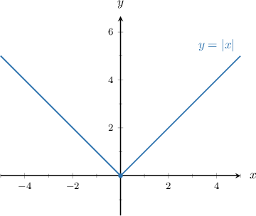
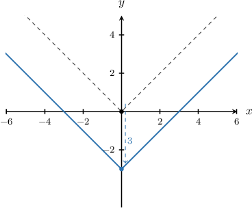
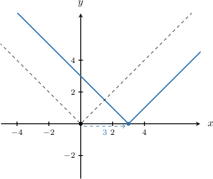
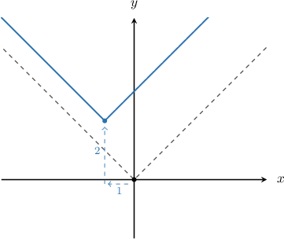

# Absolute Value Graphs

Source: https://www.mathacademy.com/topics/790?courseId=128
Topic ID: 790

## Prerequisites

- [Absolute Value Expressions](../algebra-i/96-absolute-value-expressions.md)
- [Piecewise Functions](../algebra-i/165-piecewise-functions.md)

## Lesson

### Introduction

Let's plot the graph of. According to the algebraic definition of absolute value, we have So, the left-hand branch of the graph is the function, and the right-hand branch is:

Notice that the graph has a sharp corner at We call this point the **vertex** or the **minimum point.**

We can apply **horizontal** and **vertical translations** to the graph of.

- The graph of is a **vertical translation** of the absolute value graph It moves the graph units up.

- The graph of is a **horizontal translation** of the absolute value graph It moves the graph units to the *right*.

Note the following:

- When drawing horizontal and vertical translations, it is easiest to transform the graph's vertex first. Then, the two branches can be drawn coming out of the vertex.

- When we translate the graph the resulting curve is called the **image** of under the translation.

### Example: Graphing a Vertical Translation

#### Question

Sketch the graph of $y=|x|-3$.

#### Explanation

Remember that $y=|x|+a$ is a vertical translation of the absolute value graph $y=|x|$ by $a$ units up.

The function $y=|x|-3$ has $a=-3.$ Therefore, it is a vertical translation of the absolute value graph $y=|x|$ by $3$ units **.

### Example: Graphing a Horizontal Translation

#### Question

Sketch the graph of $y=|x-3|$.

#### Explanation

Remember that $y=|x-a|$ is a horizontal translation of the absolute value graph $y=|x|$ by $a$ units right.

The function $y=|x-3|$ has $a=3.$ Therefore, it is a horizontal translation of the absolute value graph $y=|x|$ by $3$ units right.

**** It's easy to confuse the translations $y=|x-3|$ and $y=|x+3|$. The graph of $y=|x-3|$ is shifted to the right and the graph of $y=|x+3|$ is shifted to the left, even though it seems like it should be the other way around.

### Combining Translations

Horizontal and vertical translations can be combined. It does not matter which we do first.

In general, the graph of $y=|x-h|+k$ is a translation of the graph $y=|x|$ by

- $h$ units right, and

- $k$ units up.

### Example: Combining Horizontal and Vertical Translations

#### Question

Sketch the graph of $y=|x+1|+2$.

#### Explanation

Remember that $y=|x-h|+k$ is a translation of the absolute value graph $y=|x|$ by $h$ units right and $k$ units up.

The function $y=|x+1|+2$ has $h=-1$ and $k=2.$ Therefore, it is a translation of the absolute value graph $y=|x|$ by $1$ unit ** and $2$ units up.

