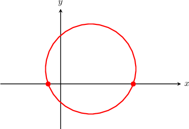
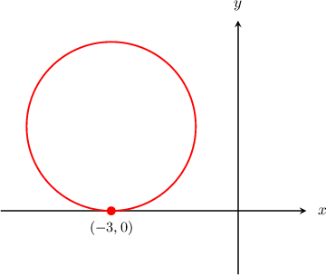
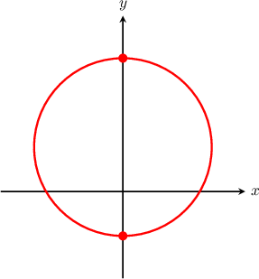
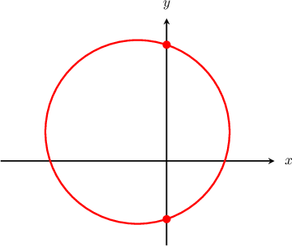
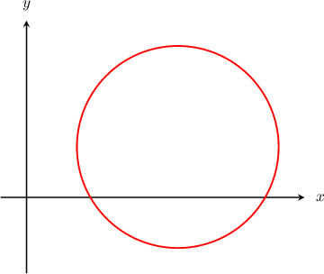

# Calculating Circle Intercepts

Source: https://www.mathacademy.com/topics/844?courseId=128
Topic ID: 844

## Prerequisites

- [Properties of Lines Given in Slope-Intercept Form](../algebra-i/398-properties-of-lines-given-in-slope-intercept-form.md)
- [Equations of Circles](../geometry/843-equations-of-circles.md)
- [Perfect Square Quadratic Equations with One or No Solutions](../algebra-i/1425-perfect-square-quadratic-equations-with-one-or-no-solutions.md)

## Lesson

### Introduction

Consider the circle with equation

$$

(x - 2)^2 + (y - 1)^2 = 3^2,

$$

as shown below. How can we calculate the points where the circle intercepts the $x$-axis?

Remember, when the circle intercepts the $x$-axis, we must have $y = 0.$

Therefore, to find the $x$-intercepts of the circle, we need to set $y = 0$ in the equation of the circle and solve for $x$ as follows:

$$

\begin{aligned}(𝑥−2)^{2}+(𝑦−1)^{2} & =3^{2} \\ (𝑥−2)^{2}+(0−1)^{2} & =3^{2} \\ (𝑥−2)^{2}+1 & =9 \\ (𝑥−2)^{2} & =8 \\ 𝑥−2 & =±\sqrt{√8} \\ 𝑥−2 & =±2\sqrt{√2} \\ 𝑥 & =2±2\sqrt{√2}\end{aligned}

$$

Therefore, the circle intercepts the $x$-axis at $(2-2\sqrt{2},0)$ and $(2+2\sqrt{2},0).$

### Example: Calculating the Intersection of a Circle With the X-Axis

#### Question

Find the $x$-intercepts of the circle $(x + 3)^2 + (y - 2)^2 = 4.$

#### Explanation

We must have $y = 0$ at the $x$-intercepts.

So, we need to substitute $y = 0$ into the equation of the circle and solve for $x,$ as follows:

$$

\begin{aligned}(𝑥+3)^{2}+(𝑦−2)^{2} & =4 \\ (𝑥+3)^{2}+(0−2)^{2} & =4 \\ (𝑥+3)^{2}+4 & =4 \\ (𝑥+3)^{2} & =0 \\ 𝑥+3 & =0 \\ 𝑥 & =−3\end{aligned}

$$

Therefore, the $x$-intercept occurs at the point $(-3,0)$, as shown below.

### Calculating the Intersection of a Circle With the Y-Axis

Consider the circle with equation as shown below. How can we calculate the points where the circle intercepts the -axis?

When the circle intercepts the -axis, we must have

Therefore, to find the -intercepts of the circle, we need to set in the equation of the circle and solve for as follows:

So, the circle intercepts the -axis at and

### Example: Calculating the Intersection of a Circle With the Y-Axis

#### Question

Find the $y$-intercepts of the circle $x^2+y^2+2x-2y= 8,$ shown below.

#### Explanation

We must have $x = 0$ at the $y$-intercepts.

So, we need to substitute $x = 0$ into the equation of the circle and solve for $y,$ as follows:

$$

\begin{aligned}𝑥^{2}+𝑦^{2}+2𝑥−2𝑦 & =8 \\ (0)^{2}+𝑦^{2}+2(0)−2𝑦 & =8 \\ 𝑦^{2}−2𝑦 & =8\end{aligned}

$$

We can solve this equation by completing the square, as follows:

$$

\begin{aligned}𝑦^{2}−2𝑦+1 & =8+1 \\ (𝑦−1)^{2} & =9 \\ 𝑦−1 & =±3 \\ 𝑦 & =1±3\end{aligned}

$$

Therefore, the $y$-intercepts occur at $(0,-2)$ and $(0,4).$

### Example: Identifying When a Circle Does Not Intersect an Axis

#### Question

Calculate the $y$-intercepts of the circle $(x - 3)^2 + (y - 1)^2 = 4.$

#### Explanation

We must have $x = 0$ at the $y$-intercepts.

So, we need to substitute $x = 0$ into the equation of the circle and solve the resulting equation for $y,$ if possible:

$$

\begin{aligned}(𝑥−3)^{2}+(𝑦−1)^{2} & =4 \\ (0−3)^{2}+(𝑦−1)^{2} & =4 \\ 9+(𝑦−1)^{2} & =4 \\ (𝑦−1)^{2} & =−5.\end{aligned}

$$

Since $(y-1)^2 \geq 0$ for all values of $y,$ there is no $y$ such that $(y-1)^2 = -5.$ Therefore, the circle has no $y$-intercepts, as shown below.

