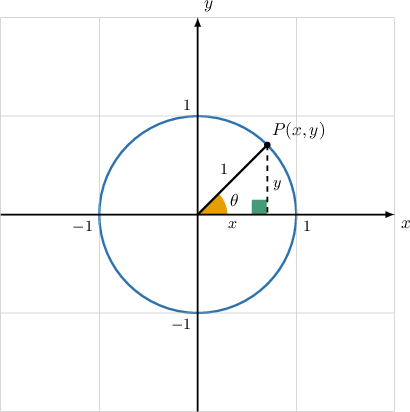
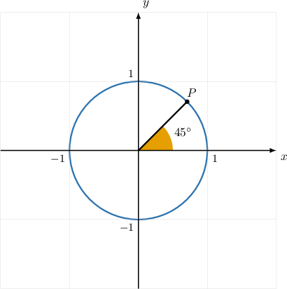
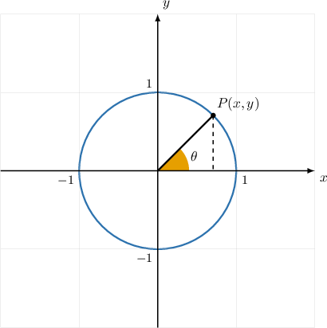
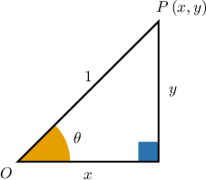
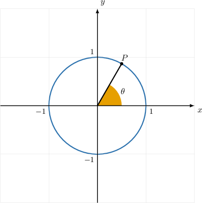
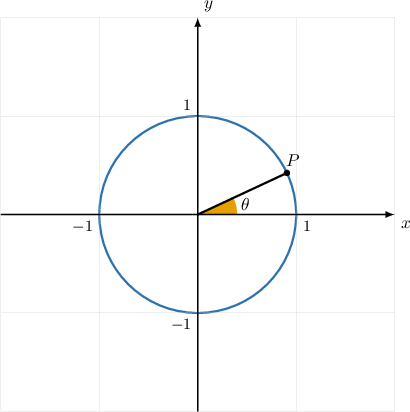
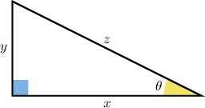
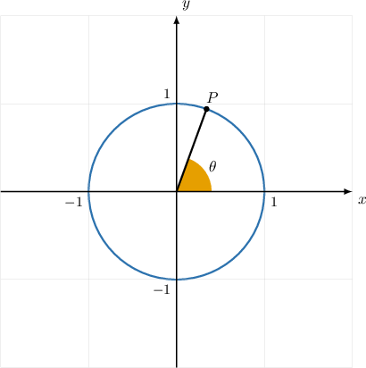

# Properties of the Unit Circle in the First Quadrant

Source: https://www.mathacademy.com/topics/112?courseId=133
Topic ID: 112

## Prerequisites

- [Trigonometric Ratios With Radians](../geometry/516-trigonometric-ratios-with-radians.md)
- [Angles in the Coordinate Plane](../algebra-ii/1848-angles-in-the-coordinate-plane.md)

## Lesson

### Introduction

Let's consider the unit circle with a central angle $\theta$ in the first quadrant, measured in the usual way.

Notice that

- the $x$-coordinate of $P$ coincides with the cosine of the angle $\theta,$ and

- the $y$-coordinate coincides with the sine of the angle $\theta.$

So, we have

$$

x = \cos\theta, \qquad y = \sin\theta.

$$

Consequently, if we know the angle $\theta,$ we can easily work out the coordinates of the point $P,$ and vice-versa. This works regardless of whether the angle $\theta$ is given in degrees or radians.

For now, we'll focus on points located in the first quadrant. Later, we will encounter points in all quadrants.

### Example: Finding the Coordinates of a Point on the Unit Circle Given Its Central Angle

#### Question

The diagram above shows the unit circle. What are the coordinates of the point $P?$

#### Explanation

Any point $(x,y)$ on the unit circle is related to the central angle $\theta$ as follows:

$$

x = \cos\theta, \qquad y = \sin\theta.

$$

We're given that $\theta=45^\circ$ at the point $P.$ Therefore, we have

$$

\begin{aligned}𝑥 & =cos⁡45^{∘}=\frac{\sqrt{√2}}{2}, \\ 𝑦 & =sin⁡45^{∘}=\frac{\sqrt{√2}}{2}.\end{aligned}

$$

So, the coordinates of $P$ are $\left(\dfrac{\sqrt 2}{2},\dfrac{\sqrt 2}{2}\right).$

### A Proof of the Unit Circle Property

Let's consider the unit circle and a point $P(x,y)$ that lies on the circle.

To prove that $x=\cos\theta$ and $y=\sin\theta,$ let's examine the triangle that's formed by $\overline{OP}$ and the $x$-axis.

Notice that:

- The hypotenuse has length $1$ since it is a radius of the unit circle.

- The adjacent and opposite sides have lengths $x$ and $y,$ respectively.

Therefore, using the definitions of $\cos\theta$ and $\sin\theta$, we have

$$

\cos\theta = \dfrac{x}{1} = x, \qquad \sin\theta = \dfrac{y}{1} = y.

$$

### Example: Finding a Central Angle Given the Coordinates of a Point on the Unit Circle

#### Question

The diagram above shows the unit circle. Given that the $y$-coordinate of the point $P$ is $\dfrac{\sqrt 3}{2},$ what is the measure of the angle $\theta?$

#### Explanation

We're given that $y=\dfrac{\sqrt 3}{2}$ at the point $P.$ Therefore, we have

$$

\sin\theta = \dfrac{\sqrt 3}{2}.

$$

We compute the angle $\theta$ using the inverse sine:

$$

\theta = \arcsin\left(\dfrac{\sqrt 3}{2}\right) = 60^\circ.

$$

### Example: Finding a Reciprocal Trigonometric Ratio Given the Coordinates of a Point on the Unit Circle

#### Question

The point $P\left(\dfrac{\sqrt 8}{3},\dfrac{1}{3}\right)$ lies on the unit circle, as shown. What is $\sec\theta?$

#### Explanation

We're given that $x=\dfrac{\sqrt 8}{3}$ at the point $P.$ Therefore, we have

$$

\cos\theta = \dfrac{\sqrt 8}{3}.

$$

Knowing that $\sec\theta = \dfrac{1}{\cos\theta},$ we can calculate $\sec\theta$ as follows:

$$

\sec\theta = \dfrac{1}{\left(\dfrac{\sqrt 8}{3}\right)} =\dfrac{3}{\sqrt 8} = \dfrac{3\sqrt 8}{8}.

$$

### The Relationship Between Sine, Cosine, and Tangent

To find the tangent of an angle using the unit circle, we need to use the relationship

$$

\tan\theta = \dfrac{\sin\theta}{\cos\theta}.

$$

To see why this is true, let's take a look at the following triangle.

For this particular triangle, we have

$$

\sin\theta = \dfrac{y}{z}, \qquad \cos\theta = \dfrac{x}{z}, \qquad \tan\theta = \dfrac{y}{x}.

$$

When we take $\sin\theta$ and divide it by $\cos\theta,$ we get

$$

\begin{aligned}\frac{sin⁡𝜃}{cos⁡𝜃} & =\frac{𝑦}{𝑧}÷\frac{𝑥}{𝑧} \\ & =\frac{𝑦}{𝑧}⋅\frac{𝑧}{𝑥} \\ & =\frac{𝑦⋅𝑧}{𝑥⋅𝑧} \\ & =\frac{𝑦⋅𝑧}{𝑥⋅𝑧} \\ & =\frac{𝑦}{𝑥} \\ & =tan⁡𝜃.\end{aligned}

$$

Although this proof is only for acute angles, the identity is true for any angle, provided that $\tan\theta$ is well-defined.

Finally, since $\cot\theta = \dfrac{1}{\tan\theta},$ it immediately follows that

$$

\cot\theta = \dfrac{1}{\left(\dfrac{\sin\theta}{\cos\theta}\right)} = \dfrac{\cos\theta}{\sin\theta}.

$$

### Example: Finding the Tangent or Cotangent of a Central Angle Given a Point on the Unit Circle

#### Question

The point $P\left(\dfrac{\sqrt 7}{7},\dfrac{\sqrt{42}}{7}\right)$ lies on the unit circle, as shown. What is $\tan\theta?$

#### Explanation

We're given that $x=\dfrac{\sqrt 7}{7}$ and $y=\dfrac{\sqrt{42}}{7}$ at the point $P.$ Therefore, we have

$$

\cos\theta = \dfrac{\sqrt 7}{7}, \qquad \sin\theta =\dfrac{\sqrt{42}}{7}.

$$

Knowing that $\tan\theta = \dfrac{\sin \theta}{\cos\theta},$ we can calculate $\tan\theta$ as follows:

$$

\tan\theta = \dfrac{\left(\dfrac{\sqrt{42}}{7}\right)}{\left(\dfrac{\sqrt 7}{7}\right)} = \dfrac{\sqrt{42} }{\sqrt{7}} = \sqrt 6.

$$
