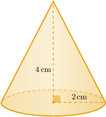
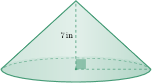

# Volumes of Right Cones

Source: https://www.mathacademy.com/topics/1145?courseId=133
Topic ID: 1145

## Prerequisites

- [Introduction to Functions](../algebra-i/470-introduction-to-functions.md)
- [Identifying Three-Dimensional Shapes](../geometry/2467-identifying-three-dimensional-shapes.md)
- [Solving Equations With Odd Exponents Using the Nth Root Method](../algebra-i/3748-solving-equations-with-odd-exponents-using-the-nth-root-method.md)

## Lesson

### Introduction

Let's consider the right cone below. How can we calculate its volume?

The general formula for the volume $V$ of a right cone is given by

$$

V = \dfrac13\pi r^2 h

$$

where $r$ is the radius of the base, $h$ is the height of the cone, and $\pi\approx 3.141\,59.$

In our case, we have $r=2\,\textrm{cm}$ and $h=4\,\textrm{cm}.$ Substituting these values into the formula, we get

$$

\begin{aligned}𝑉 & =\frac{1}{3}𝜋𝑟^{2}ℎ \\ & =\frac{1}{3}𝜋(2)^{2}(4) \\ & =\frac{16𝜋}{3}\,cm^{3}.\end{aligned}

$$

We often express the volume of a cone as a multiple of $\pi.$ However, we can get a numerical approximation of the volume using a calculator. In doing this, we get

$$

V\approx 16.76\: \textrm{cm}^3

$$

rounded to two decimal places.

### Example: Finding the Volume of a Right Cone

#### Question

The base radius of a right cone is $3 \, \textrm{cm}$ and its height is $5 \, \textrm{cm}.$ Calculate the volume of the cone.

#### Explanation

We can find the volume of a right cone using the formula

$$

V = \dfrac 1 3 \pi r^2 h,

$$

where $r$ is the radius of the base and $h$ is the height of the cone.

Substituting $r = 3\,\textrm{cm}$ and $h = 5\,\textrm{cm}$ into the formula, we get

$$

V = \dfrac 1 3 \pi (3)^2 (5) = 15\pi \, \textrm{cm}^3.

$$

### Example: Finding a Dimension of a Right Cone Given Its Volume

#### Question

The volume of the right cone shown above is $189 \pi \, \textrm{in}^3.$ What is the radius of the base of the cone?

#### Explanation

We can find the volume of a right cone using the formula

$$

V = \dfrac 1 3 \pi r^2 h,

$$

where $r$ is the radius of the base and $h$ is the height of the cone.

Substituting the values

$$

V = 189\pi, \qquad h = 7

$$

into the volume formula, we obtain the following:

$$

\begin{aligned}𝑉 & =\frac{1}{3}𝜋𝑟^{2}ℎ \\ 189𝜋 & =\frac{1}{3}𝜋𝑟^{2}(7) \\ 189𝜋 & =\frac{7}{3}⋅𝜋𝑟^{2} \\ 𝑟^{2} & =\frac{189𝜋⋅3}{7𝜋} \\ 𝑟^{2} & =81 \\ 𝑟 & =9\,cm\end{aligned}

$$

Therefore, the radius of the base of the cone is $9 \, \textrm{cm}.$

### Example: Calculating a Dimension of a Cone Given Its Volume and a Proportional Relationship

#### Question

The volume of a right cone is $144\pi \, \textrm{in}^3,$ and the radius of its base is four times its height. Find the height of the cone.

#### Explanation

We can find the volume of a right cone using the formula

$$

V = \dfrac 1 3 \pi r^2 h,

$$

where $r$ is the radius of the base and $h$ is the height of the cone.

We are also given that $r = 4h.$

Substituting the values

$$

V = 144\pi, \qquad r = 4h

$$

into the volume formula, we obtain the following:

$$

\begin{aligned}𝑉 & =\frac{1}{3}𝜋𝑟^{2}ℎ \\ 144𝜋 & =\frac{1}{3}𝜋(4ℎ)^{2}ℎ \\ 144𝜋 & =\frac{16𝜋⋅ℎ^{3}}{3} \\ ℎ^{3} & =\frac{144𝜋⋅3}{16𝜋} \\ ℎ^{3} & =27 \\ ℎ & =\sqrt[√27]{3} \\ ℎ & =3\,in\end{aligned}

$$

Therefore, the height of the cone is $3 \, \textrm{in}.$
