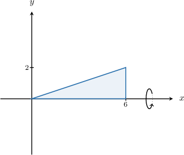
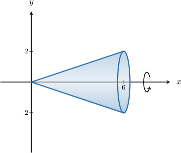
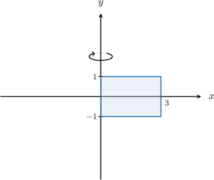
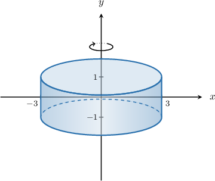
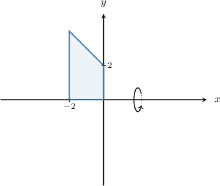
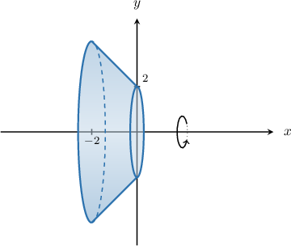
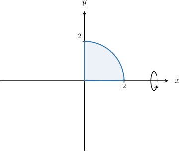
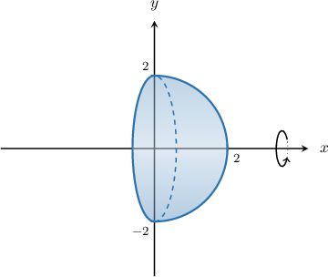
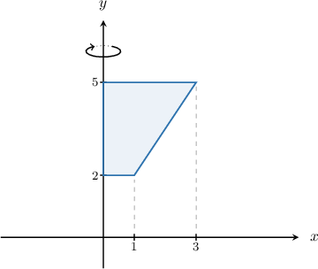
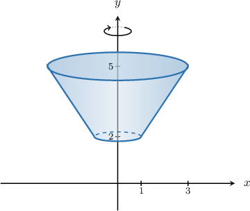

# Volumes of Revolution

Source: https://www.mathacademy.com/topics/1148?courseId=133
Topic ID: 1148

## Prerequisites

- [Volumes of Cylinders](../geometry/1144-volumes-of-cylinders.md)
- [Volumes of Spheres](../geometry/1146-volumes-of-spheres.md)
- [Conical Frustums](../geometry/1764-conical-frustums.md)

## Lesson

### Introduction

Consider the right triangle shown in the picture below.

When we rotate this triangle by $360^\circ$ about the $x$-axis, we get a **solid of revolution**, shown below.

In this case, the solid of revolution is a right cone with base radius $r=2$ and height $h=6.$

### Rotation About the Y-Axis

Now consider the rectangle shown below.

When we rotate this rectangle by $360^\circ$ about the $y$-axis, we get another solution of revolution.

In this case, the solid of revolution is a cylinder with radius $r=3$ and height $h=1-(-1) = 2.$

### Example: Identifying a Solid of Revolution

#### Question

What solid is generated when the figure below is rotated $360^\circ$ about the $x$-axis?

#### Explanation

Our solid of revolution is a conical frustum.

### Example: Finding the Volume Generated When a Shape is Rotated About the X-Axis

#### Question

The figure shown above is rotated $360^\circ$ about the $x$-axis. What is the volume of the corresponding solid of revolution?

#### Explanation

Our solid of revolution is a hemisphere with radius $r=2.$

We can find the volume of a hemisphere using the formula

$$

\begin{aligned}𝑉 & =\frac{1}{2}⋅\frac{4}{3}𝜋𝑟^{3} \\ & =\frac{2}{3}𝜋𝑟^{3}.\end{aligned}

$$

Substituting $r=2$ into the formula, we obtain

$$

V = \dfrac{2}{3}\pi (2)^3 = \dfrac{16}{3} \pi.

$$

### Example: Finding the Volume Generated When a Shape is Rotated About the Y-Axis

#### Question

The figure shown above is rotated $360^\circ$ about the $y$-axis. What is the volume of the corresponding solid of revolution?

#### Explanation

Our solid of revolution is a conical frustum. The radii of the bases are $r=1$ and $R=3,$ and the height of the frustum is $h=5-2=3.$

We can find the volume of a conical frustum using the formula

$$

V = \dfrac{\pi}{3} h (R^2 + r^2 + R r).

$$

Substituting

$$

r = 1, \qquad R = 3, \qquad h = 3

$$

into the formula, we obtain

$$

\begin{aligned}𝑉 & =\frac{𝜋}{3}(3)(3^{2}+1^{2}+3⋅1) \\ & =\frac{𝜋}{3}(3)(13) \\ & =13𝜋.\end{aligned}

$$
