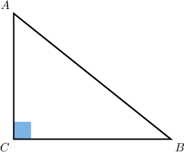
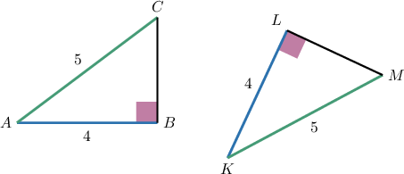
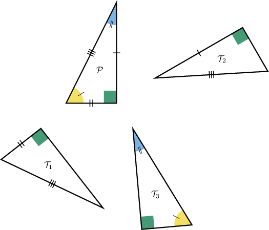
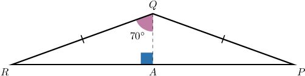
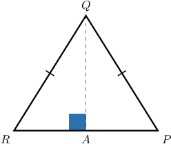
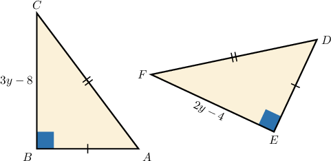

# The HL Congruence Criterion

Source: https://www.mathacademy.com/topics/1521?courseId=133
Topic ID: 1521

## Prerequisites

- [Congruent Polygons](../grade-7/1515-congruent-polygons.md)

## Lesson

### Introduction

Recall that the sides of a right triangle have special names.

- The longest side of a right triangle is called the hypotenuse. In the triangle below, the hypotenuse is $\overline{AB}.$

- The two other sides are called the legs. In the triangle below, the legs are $\overline{AC}$ and $\overline{BC}.$

For right triangles, it is straightforward to prove congruence. The **Hypotenuse-Leg (HL)** criterion states the following:

Two right triangles are congruent if and only if they have congruent hypotenuses and a pair of congruent legs.

To demonstrate, consider the right triangles below.

As we can see, the right triangles have congruent hypotenuses,

$$

\overline{AC} \cong \overline{KM},

$$

and a pair of congruent legs,

$$

\overline{AB} \cong \overline{KL}.

$$

Therefore, the HL congruence criterion guarantees that these two triangles are congruent:

$$

\triangle ABC \cong \triangle KLM.

$$

### Example: Identifying Congruent Triangles Using the HL Criterion

#### Question

According to the HL criterion only, which of the triangles above are congruent to $\mathcal{P}?$

#### Explanation

The HL (hypotenuse-leg) congruence criterion states the following:

Two right triangles are congruent if and only if they have a pair of congruent hypotenuses and a pair of congruent legs.

With that in mind, let's examine each of the given triangles.

- $\mathcal{P} \cong \mathcal{T}_1$ by HL since we have a pair of right angles, a pair of congruent legs, and a pair of congruent hypotenuses.

- $\mathcal{P} \cong \mathcal{T}_2$ by HL since we have a pair of right angles, a pair of congruent legs, and a pair of congruent hypotenuses.

- $\mathcal{P}$ is ** congruent to $\mathcal{T}_3$ by HL since we don't have a pair of congruent legs and congruent hypotenuses.

Therefore, the correct answer is "$\mathcal{T}_1$ and $\mathcal{T}_2$ only."

### Example: Calculating the Measure of an Angle Using the HL Criterion

#### Question

The point $A$ is located on the base $\overline{PR}$ of an isosceles triangle $\triangle PQR$ such that $\angle QAR$ is a right angle. If $m \angle RQA = 70^\circ$ and $m \angle{PQA}=3x+13^\circ,$ what is the value of $x?$

#### Explanation

First, let's draw a sketch using the given information.

Since $\angle RAQ$ and $\angle PAQ$ form a linear pair, we have

$$

\begin{aligned}𝑚∠𝑅𝐴𝑄+𝑚∠𝑃𝐴𝑄 & =180^{∘} \\ 90^{∘}+𝑚∠𝑃𝐴𝑄 & =180^{∘} \\ 𝑚∠𝑃𝐴𝑄 & =90^{∘}.\end{aligned}

$$

Notice that $\triangle QAR$ and $\triangle QAP$ are congruent by HL (hypotenuse-leg) since we have the following congruent legs, hypotenuses, and right angles:

- $m\angle{QAR}=m\angle{QAP}=90^\circ$

- A common leg $\overline{AQ}$

- $\overline{QR}\cong \overline{QP}$

As a consequence, all the corresponding angles must be congruent. In particular, $\angle AQR \cong \angle AQP.$ Thus,

$$

\begin{aligned}𝑚∠𝑃𝑄𝐴 & =𝑚∠𝑅𝑄𝐴 \\ 3𝑥+13^{∘} & =70^{∘} \\ 3𝑥 & =57^{∘} \\ 𝑥 & =19^{∘}.\end{aligned}

$$

### Example: Calculating the Measure of a Side Using the HL Criterion

#### Question

The point $A$ is located on the base $\overline{PR}$ of an isosceles triangle $\triangle PQR,$ where $\angle QAR$ is a right angle. If $AP=24$ and $AR=2x+6,$ what is the value of $x?$

#### Explanation

First, let's draw a sketch using the given information.

Since $\angle QAR$ and $\angle QAP$ form a linear pair, we have

$$

\begin{aligned}𝑚∠𝑄𝐴𝑅+𝑚∠𝑄𝐴𝑃 & =180^{∘} \\ 90^{∘}+𝑚∠𝑄𝐴𝑃 & =180^{∘} \\ 𝑚∠𝑄𝐴𝑃 & =90^{∘}.\end{aligned}

$$

Notice that $\triangle QAR$ and $\triangle QAP$ are congruent by HL (hypotenuse-leg) since we have the following congruent legs, hypotenuses, and right angles:

- $m\angle{QAR}=m\angle{QAP}=90^\circ$

- A common leg $\overline{AQ}$

- $\overline{QR}\cong \overline{QP}$

As a consequence, all the corresponding sides must be congruent. In particular, $\overline{AR} \cong \overline{AP}.$ Thus,

$$

\begin{aligned}𝐴𝑅 & =𝐴𝑃 \\ 2𝑥+6 & =24 \\ 2𝑥 & =18 \\ 𝑥 & =9.\end{aligned}

$$

### Example: Identifying True Statements Using the HL Criterion

#### Question

From the diagram above, which of the following statements are true?

1. $\triangle ABC \cong \triangle DEF$ by HL

2. $\angle C \cong \angle F$

3. $y=4$

#### Explanation

Let's examine each of the given statements in turn.

- Statement I is true. $\triangle ABC$ and $\triangle DEF$ are congruent by HL (hypotenuse-leg) since we have the following congruent legs, hypotenuses, and right angles: $m\angle{B}=m\angle{E}=90^\circ$ $\overline{AB}\cong \overline{ED}$ $\overline{AC}\cong \overline{DF}$

- Statement II is true. Since the triangles are congruent, all the corresponding angles must be congruent. In particular,

- Statement III is true. Since the triangles are congruent, all the corresponding sides must be congruent. In particular, $\overline{BC} \cong \overline{EF}.$ Thus,

Therefore, the correct answer is "I, II, and III."
