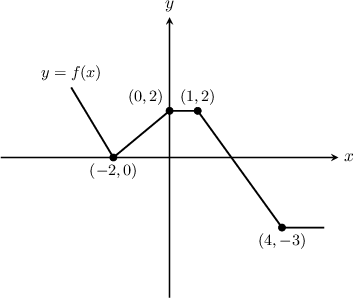
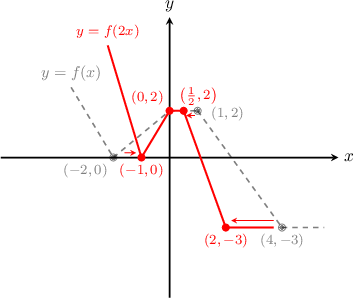
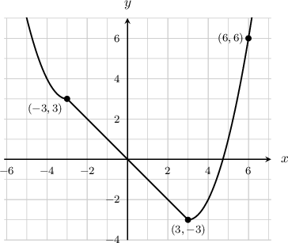
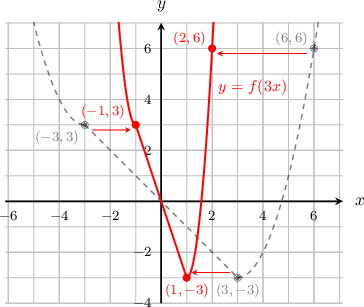
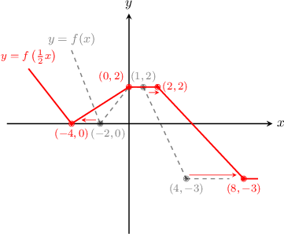

# Horizontal Stretches of Functions

Source: https://www.mathacademy.com/topics/1586?courseId=133
Topic ID: 1586

## Prerequisites

- [Graphs of Functions](../algebra-i/3821-graphs-of-functions.md)

## Lesson

### Introduction

Consider the function whose graph is shown below. How can we plot the graph of

We can use some points on the graph of to find the corresponding points on the graphs of

For example, let's take the point The fact that it lies on the graph of means Then, if we have

This means the point that lies on has a corresponding point that lies on

So, for each point on the graph of there will be a point on the graph of with the *same* -value and *one half* the -value:

Finally, we can plot the points and draw the graph of

The graph of is the graph of **horizontally scaled** by a factor of

Equivalently, we can say that the original graph is **compressed** by a scale factor of

In general, the transformation scales the graph of horizontally by a factor of

- If is greater than the graph is compressed (or squished) towards the -axis by a scale factor of

- If is between and the graph is stretched away from the -axis by a scale factor of

### Example: Plotting the Graph of a Horizontally Compressed Function

#### Question

The graph of is shown below. Sketch the graph of

#### Explanation

To graph the function we take the graph of and compress it by factor of parallel to the -axis. This has the effect of dividing the -coordinates of all points on by

The resulting graph is shown below.

### Example: Plotting the Graph of a Horizontally Stretched Function

#### Question

Plot the graph of $y=f\left(\dfrac{1}{2}x \right)$ for $y=f(x)$ given above.

#### Explanation

To graph the function $y = f\left(\dfrac{1}{2}x\right),$ we take the graph of $y = f(x)$ and stretch it by factor of $2$ parallel to the $x$-axis. This has the effect of multiplying the $x$-coordinates of all points on $y=f(x)$ by $2.$

The resulting graph is shown below.

### Example: Finding a Point that Lies on a Horizontally Stretched Function

#### Question

The point $P$ with coordinates $(6,7)$ lies on the curve $y=f(x).$ Find a point that must lie on the graph of $y= f\left(\dfrac{1}{4}x\right).$

#### Explanation

The function $y = f\left(\dfrac{1}{4}x\right)$ represents a stretch of the function $y = f(x)$ by a factor of $4$ parallel to the $x$-axis. This has the effect of multiplying the $x$-coordinates of all points on $y=f(x)$ by $4.$

Therefore, the point $(6,7)$ on $f(x)$ is mapped to the point $\left(4\cdot 6, 7\right) = (24,7),$ and this point must lie on the graph of $y = f\left(\dfrac{1}{4}x\right).$
