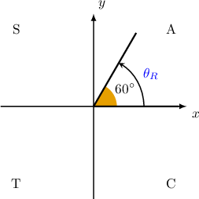
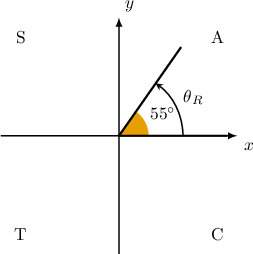
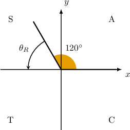
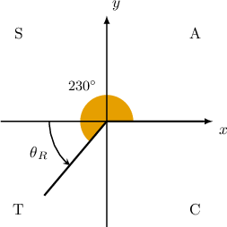

# Extending the Trigonometric Ratios to Negative Angles

Source: https://www.mathacademy.com/topics/166?courseId=133
Topic ID: 166

## Prerequisites

- [Coterminal Angles](../algebra-ii/261-coterminal-angles.md)
- [Extending the Trigonometric Ratios Using Angles in Radians](../algebra-ii/4037-extending-the-trigonometric-ratios-using-angles-in-radians.md)

## Lesson

### Introduction

Recall that the **reference angle** $\theta_R$ of a given angle $\theta$ is the positive acute angle $\theta$ makes with the $x$-axis.

Reference angles can be used to evaluate trigonometric functions at negative angles. In this lesson, we'll learn how to express trigonometric ratios of negative angles in terms of reference angles.

As an example, let's write the following trigonometric ratio in terms of a reference angle:

$$

\sin( -300^\circ )

$$

To express this trigonometric ratio in terms of a reference angle, we first find the corresponding *coterminal angle* that lies in the range $[0^\circ, 360^\circ).$ We do this by adding integer multiples of $360^\circ$ as many times as necessary until we get our coterminal angle:

$$

-300^\circ + 360^\circ = 60^\circ \quad{\color{green}{\checkmark}}

$$

Now, notice that our coterminal angle is acute and lies in the first quadrant. Therefore, $\theta_R = 60^\circ,$ and we conclude that

$$

\sin (-300^\circ) = \sin 60^\circ.

$$

### Example: Expressing a Negative Angle in the First Quadrant in Terms of a Reference Angle

#### Question

What is $\cos(-305^\circ)$ expressed in terms of a reference angle?

#### Explanation

We wish to express $\cos(-305^\circ)$ in terms of $\cos\theta_R,$ where $\theta_R$ is the reference angle corresponding to the angle $\theta = -305^\circ.$

First, we find the corresponding coterminal angle that lies in the range $[0^\circ, 360^\circ).$ We do this by adding integer multiples of $360^\circ$ until we get our desired angle:

$$

-305^\circ + 360^\circ = 55^\circ \quad{\color{green}{\checkmark}}

$$

Notice that our coterminal angle is acute and lies in the first quadrant. Therefore, $\theta_R = 55^\circ,$ and we conclude that

$$

\cos (-305^\circ) = \cos 55^\circ.

$$

### Negative Angles Outside the First Quadrant

Suppose we're given a negative angle $\theta$ that does *not* lie in the first quadrant. In these cases, the procedure for expressing a trigonometric ratio evaluated at $\theta$ in terms of $\theta_R$ is similar to what we saw previously. However, we also need to consider the *sign* of the trigonometric ratio in the quadrant where $\theta$ lies.

As an example, let's express the following trigonometric ratio in terms of a reference angle:

$$

\sin{(-140^\circ)}

$$

To do this, we follow three steps:

- **Step 1**: Find an angle that's coterminal with $-140^\circ$ and lies in the range $[0^\circ, 360^\circ).$ We do this by adding integer multiples of $360^\circ$ until we get our desired angle: Therefore, A sketch of our angle and its corresponding reference angle is shown below.

- **Step 2**: Compute the reference angle. Since $\theta = 220^\circ$ is in the $3$rd quadrant, the reference angle is

- **Step 3**: Determine the correct sign. The sine function is negative $({\color{red}{-}})$ in the third quadrant. Therefore,

So, we conclude that

$$

\sin (-140^\circ) = -\sin{40^\circ}.

$$

### Example: Expressing the Sine of a Negative Angle in Terms of a Reference Angle

#### Question

What is $\sin (-240^\circ)$ expressed in terms of a reference angle?

#### Explanation

We wish to express $\sin(-240^\circ)$ in terms of $\sin\theta_R,$ where $\theta_R$ is the reference angle corresponding to the angle $\theta = -240^\circ.$

To express $\sin(-240^\circ)$ in terms of $\sin\theta_R,$ we proceed as follows:

- ****: Find the corresponding coterminal angle that lies in the range $[0^\circ, 360^\circ).$ We do this by adding integer multiples of $360^\circ$ until we get our desired angle. Therefore,

- ****: Compute the reference angle. Since $\theta = 120^\circ$ is in the $2$nd quadrant, the reference angle is

- ****: Determine the correct sign. The sine function is positive $({\color{blue}{+}})$ in the second quadrant. Therefore,

Therefore, we conclude that

$$

\sin (-240^\circ) = \sin{60^\circ}.

$$

### Example: Expressing the Cosine of a Negative Angle in Terms of a Reference Angle

#### Question

What is $\cos (-130^\circ)$ expressed in terms of a reference angle?

#### Explanation

We wish to express $\cos \left(-130^\circ\right)$ in terms of $\cos\theta_R,$ where $\theta_R$ is the reference angle corresponding to the angle $\theta = -130^\circ.$

To express $\cos \left(-130^\circ\right)$ in terms of $\cos\theta_R,$ we proceed as follows:

- ****: Find the corresponding coterminal angle that lies in the range $[0^\circ, 360^\circ).$ We do this by adding integer multiples of $360^\circ$ until we get our desired angle: Therefore,

- ****: Compute the reference angle. Since $\theta = 230^\circ$ is in the $3$rd quadrant, the reference angle is

- ****: Determine the correct sign. The cosine function is negative $({\color{red}{-}})$ in the third quadrant. Therefore,

Therefore, we conclude that

$$

\cos{\left(-130^\circ\right)} = -\cos{\left(50^\circ\right)}.

$$

### Example: Expressing the Tangent of a Negative Angle in Terms of a Reference Angle

#### Question

What is $\tan (-215^\circ)$ expressed in terms of a reference angle?

#### Explanation

We wish to express $\tan(-215^\circ)$ in terms of $\tan\theta_R,$ where $\theta_R$ is the reference angle corresponding to the angle $\theta = -215^\circ.$

To express $\tan(-215^\circ)$ in terms of $\tan\theta_R,$ we proceed as follows:

- ****: Find the corresponding coterminal angle that lies in the range $[0^\circ, 360^\circ).$ We do this by adding integer multiples of $360^\circ$ until we get our desired angle. Therefore,

- ****: Compute the reference angle. Since $\theta = 145^\circ$ is in the $2$nd quadrant, the reference angle is

- ****: Determine the correct sign. The tangent function is negative $({\color{red}{-}})$ in the second quadrant. Therefore,

Therefore, we conclude that

$$

\tan (-215^\circ) = -\tan{35^\circ}.

$$
