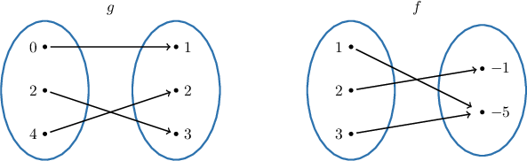
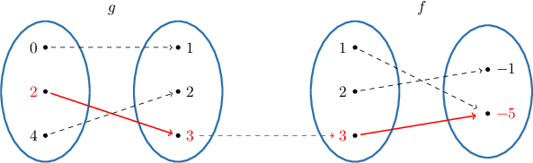

# Function Composition

Source: https://www.mathacademy.com/topics/1985?courseId=133
Topic ID: 1985

## Prerequisites

- [Constructing Linear Functions](../algebra-i/6219-constructing-linear-functions.md)

## Lesson

### Introduction

Let's consider the functions $g$ and $f$ with the mapping diagrams shown below. What will the value $f(g(2))$ be?

The notation $f(g(2))$ means that we first find the value of $g(2)$ and then put the result into the function $f.$ From the left diagram above, $2$ goes to $3,$ so $g(2)=3.$ Now, the diagram on the right tells us that $3$ goes to $-5$. Therefore, we get

$$

f(g(2)) = f(3) =-5.

$$

Passing one function as an input to another is known as **function composition**. This has a special notation,

$$

(f \circ g)(x),

$$

which simply means

$$

f(g(x)).

$$

The key is to use the **inner function** $g(x)$ for the input into the **outer function** $f(x).$

**Watch out!** The composition of functions is *not* a product of functions. Note the subtle differences in notation here:

- $f(g(x)) = (f\circ g)(x)$ means "take $g(x)$ and use it as the input into $f(x)$".

- $(fg)(x) = f(x)g(x)$ means "take $f(x)$ and $g(x)$ and multiply them together".

To evaluate a composite function at a specific point, we evaluate the inner function at the specified value, and then we pass the result to the outer function.

### Example: Evaluating a Composite Function

#### Question

If $f(x) = 2x - 1$ and $g(x) = 5x^2 - 3x$, calculate $(g \circ f)(-1).$

#### Explanation

The expression $(g \circ f)(-1)$ is equivalent to $g(f(-1)).$

To evaluate $g(f(-1)),$ we first compute $f(-1) {:}$

$$

{\color{blue}f(-1)} = 2(-1)-1 = {\color{blue}-3}

$$

Then, we substitute $x=-3$ into $g(x){:}$

$$

\begin{aligned}𝑔(𝑓(−1)) & =𝑔(−3) \\ & =5(−3)^{2}−3(−3) \\ & =5(9)+9 \\ & =54\end{aligned}

$$

Therefore, $(g \circ f)(-1) =54.$

### Example: Function Composition With Tables

#### Question

The functions $f$ and $g$ are defined by the tables below. Find the value of $(f \circ g)(4).$

#### Explanation

The expression $(f \circ g)(4)$ is equivalent to $f(g(4)).$

To evaluate $f(g(4)),$ we first find $g(4).$ From the first table, we have

$$

g(4) = -1.

$$

Then, we substitute $x=-1$ into $f(x).$ From the second table, we have

$$

f(-1) = 5.

$$

Therefore, $(f \circ g)(4) = f(g(4))=5.$

### Example: Composing a Function With Itself

#### Question

If $h(t)=2^t -2t,$ then calculate $(h\circ h)(3).$

#### Explanation

The expression $(h \circ h)(3)$ is equivalent to $h(h(3)).$

To evaluate $h(h(3)),$ we first compute $h(3){:}$

$$

{\color{blue}h(3)} = 2^{(3)}-2(3) = {\color{blue}2}

$$

Then, we substitute $t=2$ into $h(t){:}$

$$

\begin{aligned}ℎ(ℎ(3)) & =ℎ(2) \\ & =2^{(2)}−2(2) \\ & =0\end{aligned}

$$

Therefore, $(h\circ h)(3)=0.$

### Example: Interpreting Function Composition

#### Question

A company manufactures school backpacks. The function $c(q)$ gives the total cost, in dollars, of making $q$ units. The function $q=s(t)$ gives the number of units manufactured during the first $t$ hours of a production run. Which of the following is the best interpretation of $c(s(6))$ in this context?

1. The number of units manufactured during the first $6$ hours of production.

2. The total manufacturing cost during the first $6$ hours of production.

3. The total cost of manufacturing $6$ school backpacks.

#### Explanation

According to the given function definitions, we have the following:

- The number $s(6)$ gives **

- The number $c(s(6))$ gives **

Combining these two statements, we obtain that $c(s(6))$ can be interpreted as follows:

$\qquad$ **
