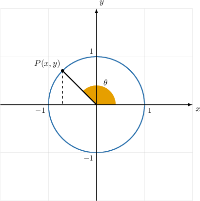
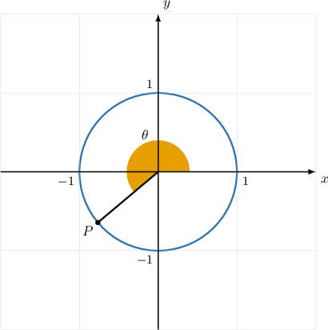
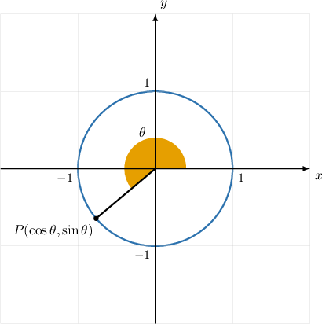
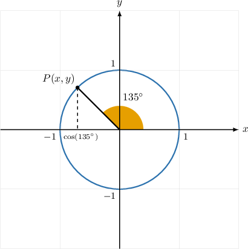
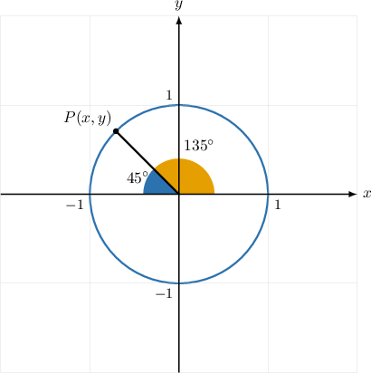
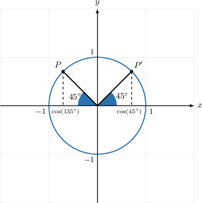
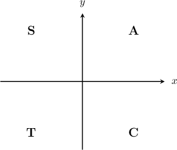
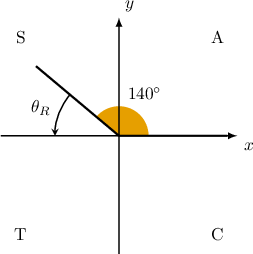
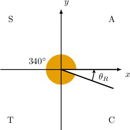
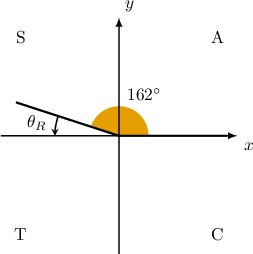

# Extending the Trigonometric Ratios Using the Unit Circle

Source: https://www.mathacademy.com/topics/204?courseId=133
Topic ID: 204

## Prerequisites

- [Properties of the Unit Circle in the First Quadrant](../algebra-ii/112-properties-of-the-unit-circle-in-the-first-quadrant.md)
- [Calculating Reference Angles](../algebra-ii/1456-calculating-reference-angles.md)
- [Reflections of Geometric Figures in the Cartesian Plane](../geometry/1518-reflections-of-geometric-figures-in-the-cartesian-plane.md)

## Lesson

### Introduction

As we've seen, the cosine and sine ratios for *acute* angles can be defined in the following ways:

- Using a right triangle. If $\theta$ is an acute angle in a right triangle, then

- Using the unit circle. If $\theta$ is a central angle made by a point $(x,y)$ on the unit circle in the first quadrant, then

We can't define trigonometric ratios for non-acute angles using right triangles because a right triangle can't have angles larger than $90^\circ.$ However, we can *extend* these ratios for non-acute angles using unit circles.

To do that, let's consider the unit circle with a central angle $\theta$ in any quadrant, measured in the usual way.

We *define* the sine and cosine of $\theta,$ as follows:

$$

\cos\theta = x, \qquad \sin\theta = y

$$

In other words,

- the cosine of $\theta$ is defined to be equal to the $x$-coordinate of $P,$ and

- the sine of $\theta$ is defined to be equal to the $y$-coordinate of $P.$

This way, our trigonometric ratios make sense for any angle, even if this angle is larger than $90^\circ.$

### Example: Finding a Trigonometric Ratio Given a Point on the Unit Circle

#### Question

The diagram above shows a unit circle. Given that the $x$-coordinate of the point $P$ is $-0.7,$ what is the value of $\cos\theta?$

#### Explanation

Any point $(x,y)$ on the unit circle is related to the central angle $\theta$ as follows:

$$

x = \cos\theta, \qquad y = \sin\theta

$$

We're given that $x=-0.7$ at the point $P.$ Therefore, we have

$$

\cos\theta = -0.7.

$$

### Calculating Trigonometric Ratios Using Reference Angles

We can use reference angles to evaluate trigonometric ratios for angles outside the first quadrant.

To demonstrate, let's determine the value of $\cos (135^\circ),$ corresponding to the $x$-coordinate of the point $P$ on the unit circle, as shown below.

The reference angle for $\theta=135^\circ$ is $\theta_R=45^\circ.$ Let's add this to our diagram.

Let $P'$ be the image of $P$ under a reflection across the $y$-axis. This gives a pair of congruent angles of measure $45^\circ,$ as shown.

According to the definition, $\cos(135^\circ)$ is the $x$-coordinate of the point $P.$ But this is the same as the $x$-coordinate of the point $P'$ *taken with the opposite sign.*

The $x$-coordinate of $P'$ equals the cosine of the reference angle.

$$

\cos(45^\circ)=\dfrac{\sqrt{2}}{2}

$$

Therefore, we conclude that

$$

\cos(\, \underbrace{135^\circ}_{\theta} \,) = - \cos(\, \underbrace{45^\circ}_{\theta_R} \,) = -\dfrac{\sqrt{2}}{2}.

$$

So, we simplified the evaluation of $\cos(135^\circ)$ by evaluating the cosine of the corresponding reference angle $\theta_R=45^\circ$ *with an additional sign adjustment* for the final result.

We can use a similar argument to show that, since $y = \sin\theta,$ we have

$$

\sin(135^\circ) = \sin(45^\circ) = \dfrac{\sqrt 2}{2}.

$$

In this case, we do **NOT** change the sign because the $y$-coordinates of $P'$ and $P$ *are equal.*

### The CAST Diagram

We can calculate a trigonometric ratio of *any* angle $\theta$ by finding the ratio of the corresponding reference angle and adjusting the sign depending on which quadrant our angle lies in.

To do this, we perform the following steps:

1. Find the reference angle $\theta_R.$

2. Calculate the value of the ratio for $\theta_R.$

3. Determine whether the resulting ratio is positive or negative.

We must do the last step because the ratio for $\theta_R$ will always be nonnegative, but the ratio for $\theta$ may not be.

But how do we determine whether the ratio for $\theta$ is positive or negative? This depends on the trigonometric ratio and which quadrant the angle is in.

To help us remember when various trigonometric ratios are positive, we use the mnemonic "**A**ll **S**tudents **T**ake **C**alculus."

- **A**ll of the trigonometric ratios are positive in quadrant I

- **S**ine (and only sine) is positive in quadrant II

- **T**angent (and only tangent) is positive in quadrant III

- **C**osine (and only cosine) is positive in quadrant IV

We can represent this in a so-called CAST diagram, shown below.

For example, let's consider $\sin 140^\circ.$

**Step 1**: Since $\theta = 140^\circ$ is the $2$nd quadrant, the reference angle $\theta_R$ is

$$

\begin{aligned}𝜃_{𝑅} & =180^{∘}−𝜃 \\ & =180^{∘}−140^{∘} \\ & =40^{∘}.\end{aligned}

$$

**Step 2**: The given ratio is $\sin{140^\circ},$ and therefore we're interested in $\sin\theta_R = \sin{40^\circ}.$

**Step 3:** The ratio $\sin{140^\circ}$ must be *positive* because the sine ratio is *always* positive in the $2$nd quadrant. Therefore,

$$

\sin 140^\circ = \sin{40^\circ}.

$$

Let's see another example.

### Example: Expressing the Sine of an Angle in Terms of a Reference Angle

#### Question

What is $\sin 335^\circ$ expressed in terms of a reference angle?

#### Explanation

To express $\sin{335^\circ}$ in terms of $\sin\theta_R,$ we follow three steps:

1. Find its reference angle $\theta_R.$

2. Calculate the value of the function for $\theta_R.$

3. Determine whether the resulting value is positive or negative.

First, let's draw the angle $335^\circ$ in the coordinate plane (CAST diagram):

****: Since $\theta = 335^\circ$ is in the $4$th quadrant, the reference angle $\theta_R$ is

$$

\begin{aligned}𝜃_{𝑅} & =360^{∘}−𝜃 \\ & =360^{∘}−335^{∘} \\ & =25^{∘}.\end{aligned}

$$

****: The given ratio is $\sin{335^\circ},$ and therefore we're interested in $\sin\theta_R = \sin{25^\circ}.$

**** The ratio $\sin{335^\circ}$ must be ** because the sine ratio is ** negative in the $4$th quadrant. Therefore,

$$

\sin 335^\circ = -\sin{25^\circ}.

$$

### Example: Expressing the Cosine of an Angle in Terms of a Reference Angle

#### Question

What is $\cos 340^\circ$ expressed in terms of a reference angle?

#### Explanation

To express $\cos{340^\circ}$ in terms of $\cos\theta_R,$ we follow three steps:

1. Find its reference angle $\theta_R.$

2. Calculate the value of the function for $\theta_R.$

3. Determine whether the resulting value is positive or negative.

First, let's draw the angle $340^\circ$ in the coordinate plane (CAST diagram):

****: Since $\theta = 340^\circ$ is in the $4$th quadrant, the reference angle $\theta_R$ is

$$

\begin{aligned}𝜃_{𝑅} & =360^{∘}−𝜃 \\ & =360^{∘}−340^{∘} \\ & =20^{∘}.\end{aligned}

$$

****: The given ratio is $\cos{340^\circ},$ and therefore we're interested in $\cos\theta_R = \cos{20^\circ}.$

**** The ratio $\cos{340^\circ}$ must be ** because the cosine ratio is ** positive in the $4$th quadrant. Therefore,

$$

\cos 340^\circ = \cos{20^\circ}.

$$

### Example: Expressing the Tangent of an Angle in Terms of a Reference Angle

#### Question

What is $\tan 162^\circ$ expressed in terms of a reference angle?

#### Explanation

To express $\tan{162^\circ}$ in terms of $\tan\theta_R,$ we follow three steps:

1. Find its reference angle $\theta_R.$

2. Calculate the value of the function for $\theta_R.$

3. Determine whether the resulting value is positive or negative.

First, let's draw the angle $162^\circ$ in the coordinate plane (CAST diagram):

****: Since $\theta = 162^\circ$ is in the $2$nd quadrant, the reference angle $\theta_R$ is

$$

\begin{aligned}𝜃_{𝑅} & =180^{∘}−𝜃 \\ & =180^{∘}−162^{∘} \\ & =18^{∘}.\end{aligned}

$$

****: The given ratio is $\tan{162^\circ}$, and therefore we're interested in $\tan\theta_R = \tan{18^\circ}.$

**** The ratio $\tan{162^\circ}$ must be ** because the tangent ratio is ** negative in the $2$nd quadrant. Therefore,

$$

\tan 162^\circ = -\tan{18^\circ}.

$$
