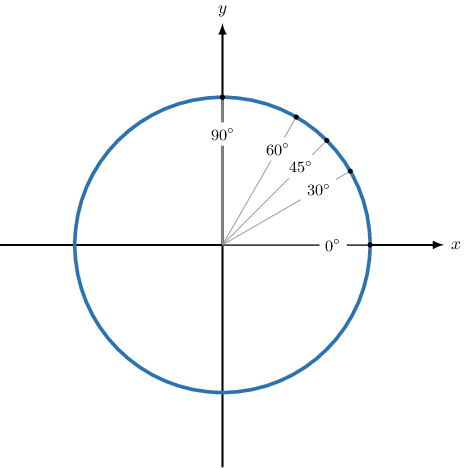
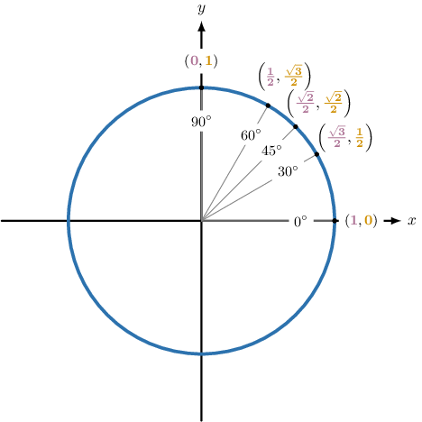
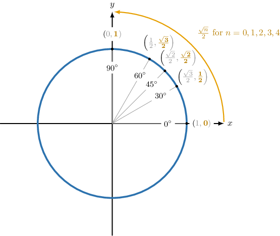
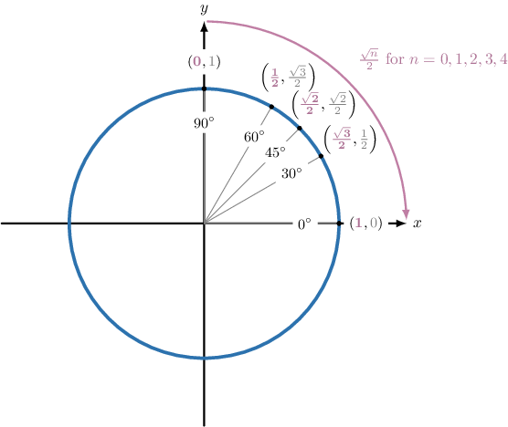
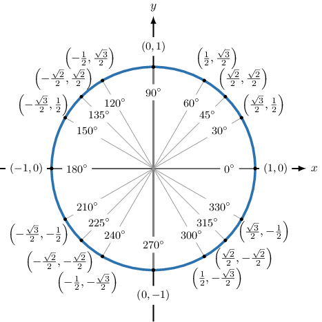

# Finding Trigonometric Ratios of Special Angles Using the Unit Circle

Source: https://www.mathacademy.com/topics/268?courseId=133
Topic ID: 268

## Prerequisites

- [Finding Trigonometric Ratios of Quadrantal Angles](../algebra-ii/269-finding-trigonometric-ratios-of-quadrantal-angles.md)
- [Introduction to Sequences](../algebra-i/2271-introduction-to-sequences.md)

## Lesson

### Introduction

The unit circle provides a convenient way to represent the sine and cosine of special angles in each quadrant.

We first recall the following:

- The -coordinate of any point on the unit circle equals the *cosine* of the corresponding central angle, and

- the -coordinate equals the *sine* of the corresponding central angle.

Let's use the unit circle to list the special values of sine and cosine, starting with the first quadrant. First, we mark off the special angles in this quadrant.

Now, let's write down each point's - and -coordinates, corresponding to the cosine and sine of each point's central angle. In addition, we'll highlight the -coordinate at each point.

Before we move on, observe that if we rotate counterclockwise from the positive -axis, we see that the -coordinates at the special angles are given by the following sequence:

as shown below.

There is a similar pattern for the -coordinates (corresponding to the cosine of the central angle). The only difference is that now we go in reverse, from to as shown below

Take a moment to ensure you can reproduce this diagram on your own without looking. We'll add to it shortly.

### A Method For Constructing the Other Quadrants

So, we know how the unit circle can be used to list the cosine and sine of the special angles in the *first* quadrant. But what about the other quadrants?

The values in the remaining quadrants can be obtained from the coordinates in the first quadrant. Let's see how:

- To obtain the points in the *second* quadrant, let's first mark off the special angles in this quadrant. These angles have the same reference angles as the angles in the first quadrant: $180^\circ - 30^\circ = 150^\circ$ $180^\circ - 45^\circ = 135^\circ$ $180^\circ - 60^\circ = 120^\circ$ We mark these angles below and include the quadrantal angle $180^\circ.$ Now, we reflect the coordinates in the first quadrant in the $y$-axis. This changes the sign of the $x$-coordinate at each point and leaves the $y$-coordinate unchanged.

- To obtain the points in the third quadrant, we first find the special angles in this quadrant. Again, these angles have the same reference angles as the special angles in the first quadrant: $180^\circ + 30^\circ = 210^\circ$ $180^\circ + 45^\circ = 225^\circ$ $180^\circ + 60^\circ = 240^\circ$ Then, we take the points in the second quadrant and reflect them in the $x$-axis. This changes the sign of the $y$-coordinate at each point and leaves the $x$-coordinate unchanged.

- Finally, to obtain the points in the fourth quadrant, we first compute the special angles in this quadrant: $360^\circ - 30^\circ = 330^\circ$ $360^\circ - 45^\circ = 315^\circ$ $360^\circ - 60^\circ = 300^\circ$ Then, we take the points in the first quadrant and reflect them in the $x$-axis. This changes the sign of the $y$-coordinate at each point and leaves the $x$-coordinate unchanged.

Therefore, our complete unit circle is as follows.

Take a moment to ensure you can create this diagram yourself without looking. We'll be referring to it often!

### Example: Finding the Sine or Cosine of a Special Angle Given in Degrees

#### Question

What is the value of $\cos 225^\circ?$

#### Explanation

Let's remind ourselves of the special trigonometric ratios, as given by the unit circle.

From the unit circle, we see that the angle $225^\circ$ corresponds to the point $\left(-\dfrac{\sqrt{2}}{2}, -\dfrac{\sqrt{2}}{2} \right).$

Since the cosine of the angle corresponds to the $x$-coordinate, we have $\cos 225^\circ = -\dfrac{\sqrt{2}}{2}.$

### Example: Finding the Sine or Cosine of a Special Angle Given in Radians

#### Question

What is the value of $\sin \left(\dfrac {7\pi} 4\right)?$

#### Explanation

Let's remind ourselves of the special trigonometric ratios, as given by the unit circle.

From the unit circle, we see that the angle $\dfrac{7\pi}{4}$ corresponds to the point $\left(\dfrac{\sqrt{2}}{2}, -\dfrac{\sqrt{2}}{2} \right).$

Since the sine of the angle corresponds to the $y$-coordinate, we have $\sin \left(\dfrac {7\pi} 4\right) = -\dfrac {\sqrt 2} 2.$

### Example: Finding the Secant or Cosecant of a Special Angle

#### Question

Find the value of $\csc 120^\circ.$

#### Explanation

Let's remind ourselves of the special trigonometric ratios, as given by the unit circle.

From the unit circle, we see that the angle $120^\circ$ corresponds to the point $\left(-\dfrac{1}{2}, \dfrac{\sqrt{3}}{2} \right).$

Since the sine of the angle corresponds to the $y$-coordinate, we have $\sin 120^\circ= \dfrac{\sqrt 3}{2}.$

Therefore, using the fact that $\csc{\theta} = \dfrac{1}{\sin\theta},$ we have

$$

\csc 120^\circ = \dfrac{1}{\sin 120^\circ } = \dfrac{2}{\sqrt 3} = \dfrac{2\sqrt 3}{3}.

$$

### Example: Finding the Tangent or Cotangent of a Special Angle

#### Question

Find the value of $\tan \left(\dfrac {4 \pi} 3\right).$

#### Explanation

Let's remind ourselves of the special trigonometric ratios, as given by the unit circle.

From the unit circle, we see that the angle $\dfrac{4\pi}{3}$ corresponds to the point $\left(-\dfrac{1}{2}, -\dfrac{\sqrt{3}}{2} \right).$

- Since the cosine of the angle corresponds to the $x$-coordinate, we have $\cos\left(\dfrac {4\pi} {3}\right) = -\dfrac 1 2.$

- Since the sine of the angle corresponds to the $y$-coordinate, we have $\sin\left(\dfrac {4\pi} {3}\right) = -\dfrac {\sqrt 3} 2.$

Therefore, using the fact that $\tan{\theta} = \dfrac{\sin\theta}{\cos\theta},$ we have

$$

\tan\left(\dfrac{4\pi}{3}\right) = \dfrac{\sin{\left(\dfrac{4\pi}{3}\right) }}{\cos{\left(\dfrac{4\pi}{3}\right) }} = \dfrac{\left(-\dfrac {\sqrt 3} 2\right)}{\left(-\dfrac 1 2\right)} = \sqrt{3}.

$$
