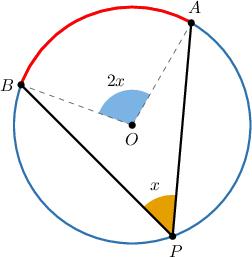
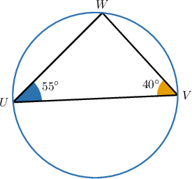
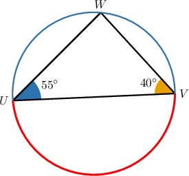
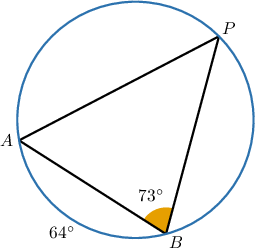
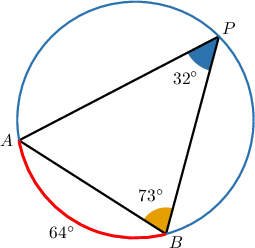
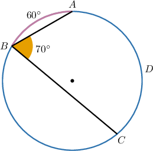
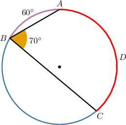
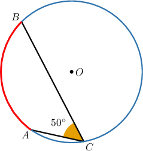
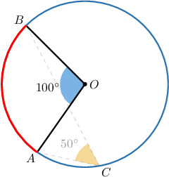

# Problem-Solving With Inscribed Angles

Source: https://www.mathacademy.com/topics/3547?courseId=133
Topic ID: 3547

## Prerequisites

- [Inscribed Angles](../geometry/497-inscribed-angles.md)
- [Calculating Arc Lengths of Circular Sectors](../geometry/597-calculating-arc-lengths-of-circular-sectors.md)
- [The Isosceles Triangle Theorem](../grade-8/1403-the-isosceles-triangle-theorem.md)

## Lesson

### Introduction

Recall that the inscribed angle theorem tells us that the measure of an inscribed angle is half the measure of the central angle that intercepts the same arc.

We can use this theorem to solve different types of problems involving circles.

For instance, how can we find $m\overset{\frown}{UV}$ in the diagram below?

By considering the sum of the interior angles in $\triangle UVW$, we get the following:

$$

\begin{aligned}𝑚∠𝑈+𝑚∠𝑉+𝑚∠𝑊 & =180^{∘} \\ 55^{∘}+40^{∘}+𝑚∠𝑊 & =180^{∘} \\ 95^{∘}+𝑚∠𝑊 & =180^{∘} \\ 𝑚∠𝑊 & =85^{∘}\end{aligned}

$$

Now, according to the inscribed angle theorem, the measure of an inscribed angle is half the measure of its intercepted arc.

Therefore, we have

$$

\begin{aligned}𝑚\overset{𝑈𝑉}{⌢} & =2𝑚∠𝑊 \\ & =2⋅85^{∘} \\ & =170^{∘}.\end{aligned}

$$

### Example: Applying the Inscribed Angle Theorem to Inscribed Triangles

#### Question

Given that $m\overset{\frown}{AB} = 64^\circ,$ calculate $m \angle A.$

#### Explanation

According to the inscribed angle theorem, the measure of an inscribed angle is half the measure of its intercepted arc.

$$

\begin{aligned}𝑚∠𝑃 & =\frac{1}{2}𝑚\overset{𝐴𝐵}{⌢} \\ & =\frac{1}{2}⋅64^{∘} \\ & =32^{∘}.\end{aligned}

$$

Therefore, by considering the sum of the interior angles in $\triangle ABP$, we get the following:

$$

\begin{aligned}𝑚∠𝐴+𝑚∠𝐵+𝑚∠𝑃 & =180^{∘} \\ 𝑚∠𝐴+73^{∘}+32^{∘} & =180^{∘} \\ 𝑚∠𝐴+105^{∘} & =180^{∘} \\ 𝑚∠𝐴 & =75^{∘}\end{aligned}

$$

### Example: Finding the Measure of an Arc Using the Inscribed Angle Theorem

#### Question

Given the picture below, find $m\overset{\frown}{BC}.$

#### Explanation

First, we will find $m\overset{\frown}{CDA}.$

The measure of an inscribed angle is half the measure of its intercepted arc. So,

$$

\begin{aligned}𝑚\overset{𝐶𝐷𝐴}{⌢} & =2𝑚∠𝐴𝐵𝐶 \\ & =2⋅70^{∘} \\ & =140^{∘}.\end{aligned}

$$

Now, we can find the measure of $\overset{\frown}{ABC}$ as

$$

\begin{aligned}𝑚\overset{𝐴𝐵𝐶}{⌢} & =360^{∘}−𝑚\overset{𝐶𝐷𝐴}{⌢} \\ & =360^{∘}−140^{∘} \\ & =220^{∘}.\end{aligned}

$$

Finally, we obtain

$$

\begin{aligned}𝑚\overset{𝐵𝐶}{⌢} & =𝑚\overset{𝐴𝐵𝐶}{⌢}−𝑚\overset{𝐴𝐵}{⌢} \\ & =220^{∘}−60^{∘} \\ & =160^{∘}.\end{aligned}

$$

### Example: Finding the Length of an Arc or Radius Using the Inscribed Angle Theorem

#### Question

In the diagram below, the length of the arc $\overset{\frown}{AB}$ equals $10\pi$ and $m\angle{BCA} = 50^\circ.$ What is the radius of the circle?

#### Explanation

According to the inscribed angle theorem, the measure of an inscribed angle is half the measure of its intercepted arc. Therefore,

$$

\begin{aligned}𝑚\overset{𝐴𝐵}{⌢} & =2𝑚∠𝐵𝐶𝐴 \\ & =2⋅50^{∘} \\ & =100^{∘}.\end{aligned}

$$

The corresponding central angle of the arc $\overset{\frown}{AB}$ is $\angle{AOB}.$

Notice that

$$

\dfrac{m\angle{AOB}}{360^\circ} = \dfrac{100^\circ}{360^\circ} = \dfrac{5}{18}.

$$

Now, if the circumference of the circle is $C=2 \pi r$, then we can write an equation for the length of the arc $\overset{\frown}{AB}$ as follows:

$$

\begin{aligned}\frac{5}{18}𝐶 & =10𝜋 \\ \frac{5}{18}⋅2𝜋𝑟 & =10𝜋 \\ \frac{5}{9}𝜋𝑟 & =10𝜋\end{aligned}

$$

Solving for $r,$ we get

$$

\begin{aligned}\frac{5}{9}𝑟 & =10 \\ 𝑟 & =\frac{90}{5} \\ 𝑟 & =18.\end{aligned}

$$
