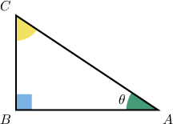

# Trigonometric Functions of Complementary Angles

Source: https://www.mathacademy.com/topics/510?courseId=133
Topic ID: 510

## Prerequisites

- [The Reciprocal Trigonometric Ratios](../geometry/611-the-reciprocal-trigonometric-ratios.md)
- [Simplifying Linear Expressions When a Group of Terms Is Subtracted](../grade-7/3873-simplifying-linear-expressions-when-a-group-of-terms-is-subtracted.md)
- [Non-Adjacent Complementary Angles](../grade-8/6207-non-adjacent-complementary-angles.md)

## Lesson

### Introduction

Consider the right triangle below.

We know that

$$

\begin{aligned}sin⁡𝐴=\frac{𝐵𝐶}{𝐴𝐶}, & \,cos⁡𝐶=\frac{𝐵𝐶}{𝐴𝐶}, \\ cos⁡𝐴=\frac{𝐴𝐵}{𝐴𝐶}, & \,sin⁡𝐶=\frac{𝐴𝐵}{𝐴𝐶}.\end{aligned}

$$

Consequently, $\sin A = \cos C$ and $\cos A = \sin C.$

Now, let $m\angle A =\theta.$ Then, since $\angle A$ and $\angle C$ are complementary, we have $m\angle C = 90^\circ - \theta,$ and we conclude that

$$

\begin{aligned}sin⁡𝜃 & =cos⁡(90^{∘}−𝜃) \\ cos⁡𝜃 & =sin⁡(90^{∘}−𝜃).\end{aligned}

$$

In other words,

- the sine of an angle equals the cosine of its complement, and

- the cosine of an angle equals the sine of its complement.

Sine and cosine are known as **cofunctions**. The latter is called **co**sine to indicate that it is the **co**function of sine.

### Reciprocal Functions of Complementary Angles

So far, we know that

$$

\begin{aligned}sin⁡𝜃 & =cos⁡(90^{∘}−𝜃), \\ cos⁡𝜃 & =sin⁡(90^{∘}−𝜃).\end{aligned}

$$

Using the above properties, we can also derive cofunction properties for secant and cosecant. We start with

$$

\begin{aligned}sec⁡𝜃 & =\frac{1}{cos⁡𝜃} \\ & =\frac{1}{sin⁡(90^{∘}−𝜃)} \\ & =csc⁡(90^{∘}−𝜃).\end{aligned}

$$

By the same reasoning, we can show that

$$

\begin{aligned}csc⁡𝜃 & =sec⁡(90^{∘}−𝜃).\end{aligned}

$$

So we have deduced that secant and **co**secant are also cofunctions. To summarize:

$$

\begin{aligned}sec⁡𝜃 & =csc⁡(90^{∘}−𝜃), \\ csc⁡𝜃 & =sec⁡(90^{∘}−𝜃)\end{aligned}

$$

Finally, by similar reasoning, it's possible to show that tangent and **co**tangent are cofunctions. Their cofunction relationships are

$$

\begin{aligned}tan⁡𝜃 & =cot⁡(90^{∘}−𝜃), \\ cot⁡𝜃 & =tan⁡(90^{∘}−𝜃).\end{aligned}

$$

### Example: Expressing a Trigonometric Ratio as a Cofunction of a Complementary Angle

#### Question

Express $\sin 20^\circ$ as a cofunction of a complementary angle.

#### Explanation

The cofunction of $\sin x$ is $\cos x,$ and the sine of an angle is the cosine of its complement.

The angle complementary to $20^\circ$ is $90^\circ-20^\circ = 70^\circ.$ So we have

$$

\sin 20^\circ=\cos(90^\circ - 20^\circ)=\cos{70^\circ}.

$$

### Example: Finding the Value of a Variable Satisfying a Cofunction Equality

#### Question

Find a value of $x$ satisfying the equation $\tan 35^\circ = \cot x.$

#### Explanation

Since the tangent of an angle equals the cotangent of its complement, we have

$$

\begin{aligned}tan⁡35^{∘} & =cot⁡(90^{∘}−35^{∘})=cot⁡55^{∘}.\end{aligned}

$$

Therefore, $x=55^\circ$ satisfies the given equation.

### Example: Expressing a Trigonometric Ratio With a Linear Expression Angle as a Cofunction of a Complementary Angle

#### Question

Express $\cos \left(\theta - 15^\circ \right)$ as a cofunction of a complementary angle.

#### Explanation

We know that the cofunction of $\cos\theta$ is $\sin\theta,$ and the angle complementary to $\theta - 15^\circ$ is

$$

90^\circ-(\theta - 15^\circ) = 90^\circ - \theta + 15^\circ = 105^\circ - \theta .

$$

So we have

$$

\cos \left(\theta - 15^\circ \right) = \sin\Bigl(90^\circ-(\theta - 15^\circ)\Bigr) = \sin \left(105^\circ - \theta \right).

$$

### Example: Solving for a Variable Given Two Angles and a Cofunction Equality

#### Question

Given that $m\angle A=\left(2x+10\right)^\circ$ and $m\angle B=\left(3x+30\right)^\circ,$ solve $\sin A = \cos B$ for $x.$ Suppose that both $\angle A$ and $\angle B$ are acute.

#### Explanation

If both angles are acute and $\sin A = \cos B,$ then the angles $\angle A$ and $\angle B$ must be complementary, and we have

$$

\begin{aligned} m\angle A+m\angle B &= 90^\circ \\\left(2x+10\right)^\circ+ \left(3x+30\right)^\circ &= 90^\circ \\(2x+10) + (3x+30) &= 90 \\5x+40 &= 90 \\5x&=50\\x &= 10. \end{aligned}

$$
