# Combining Graph Transformations: Three or More Operations

Source: https://www.mathacademy.com/topics/634?courseId=133
Topic ID: 634

## Prerequisites

- [Combining Graph Transformations: Two Operations](../algebra-ii/1254-combining-graph-transformations-two-operations.md)

## Lesson

### Introduction

Suppose we are given the graph of shown below.

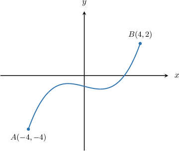

How can we use graph transformations to plot the graph of

Since this function involves several transformations, we apply them in the following order:

1. First, we perform the transformations *inside* the argument of We first carry out horizontal stretches, followed by horizontal translations.

2. Then, we perform the transformations *outside* the argument of We first carry out vertical stretches, followed by vertical translations.

In this case, we begin by factoring out the coefficient next to the inside the function:

Now, to plot we apply the following steps:

- Consider the curve

- Stretch it by a scale factor of parallel to the -axis to get the graph of

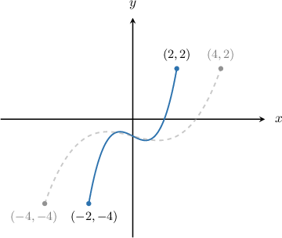

- Then, translate it to the right by units to get the graph of

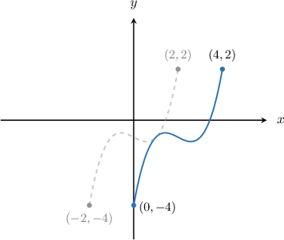

- There is no vertical scaling, so we omit this step.

- Finally, translate it up by unit to get the graph of

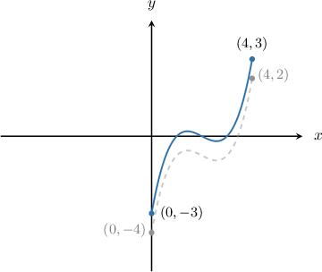

### Example: Identifying Graph Transformations Resulting From Three Operations

#### Question

The diagram below shows the function $y=f(x).$ Plot the graph of $y=f\left(2x+2\right)-1.$

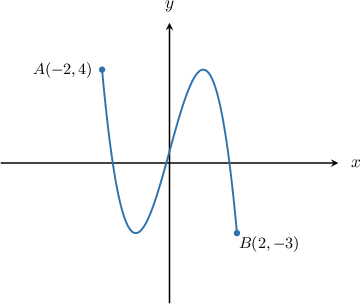

#### Explanation

To perform transformations of functions with multiple operations, we must remember the following rule:

1. First, we perform the transformations ** the argument of $f.$ We first carry out horizontal stretches, followed by horizontal translations.

2. Then, we perform the transformations ** the argument of $f.$ We first carry out vertical stretches, followed by vertical translations.

First, let's factor out the coefficient next to the $x$ inside the function:

$$

y = f\left(2x+2\right) -1 = f\left(2(x+1)\right) - 1

$$

To plot $y=f\left(2(x+1)\right) - 1,$ we apply the following steps:

- Take the curve $y=f(x).$

- Stretch it by a scale factor of $\dfrac{1}{2}$ parallel to the $x$-axis to get the graph of $y=f(2x).$

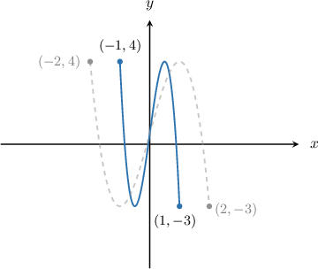

- Then, translate it to the left by $1$ unit to get the graph of $y=f\left(2(x+1)\right).$

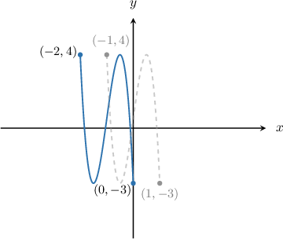

- Finally, translate it down by $1$ unit to get the graph of $y=f\left(2(x+1)\right)-1.$

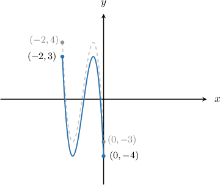

### Example: Identifying Graph Transformations Resulting From Four Operations

#### Question

The diagram below shows the function $y=f(x).$ Plot the graph of $y=2f\left(3(x+3)\right)+5.$

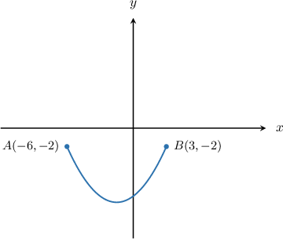

#### Explanation

To perform transformations of functions with multiple operations, we must remember the following rule:

1. First, we perform the transformations ** the argument of $f.$ We first carry out horizontal stretches, followed by horizontal translations.

2. Then, we perform the transformations ** the argument of $f.$ We first carry out vertical stretches, followed by vertical translations.

To plot $y=2f\left({3}(x+3)\right)+5,$ we apply the following steps:

- Take the curve $y=f(x).$

- Stretch it by a scale factor of $\dfrac{1}{3}$ parallel to the $x$-axis to get the graph of $y=f\left({3}x\right).$

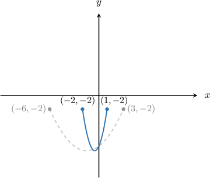

- Then, translate it left by $3$ units to get the graph of $y=f\left({3}(x+3)\right).$

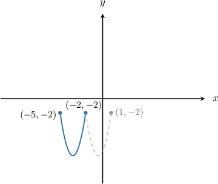

- Then, stretch it by a scale factor of $2$ parallel to the $y$-axis to get the graph of $y=2f\left(3(x+3)\right).$

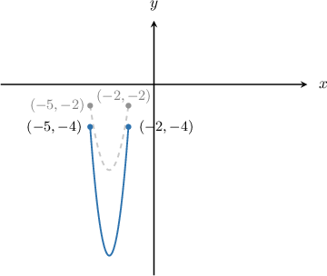

- Finally, translate it up by $5$ units to get the graph of $y=2f\left(3(x+3)\right)+5.$

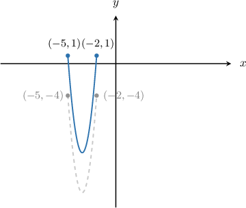

### Example: Determining the Correct Order of Transformations Given a Transformed Function Expression

#### Question

The graph of $y=f\left(\dfrac x2-3\right)+5$ can be obtained from the graph of $y=f(x)$ by applying **** of the following transformations:

- $(\textrm{T}1)$ - Stretch by a scale factor of $2$ parallel to the $x$-axis

- $(\textrm{T}2)$ - Translate up by $5$ units

- $(\textrm{T}3)$ - Translate right by $6$ units

- $(\textrm{T}4)$ - Stretch by a scale factor of $\dfrac 12$ parallel to the $x$-axis

What is a possible ordering of the appropriate transformations?

#### Explanation

To perform transformations of functions with multiple operations, we must remember the following rule:

1. First, we perform the transformations ** the argument of $f.$ We first carry out horizontal stretches, followed by horizontal translations.

2. Then, we perform the transformations ** the argument of $f.$ We first carry out vertical stretches, followed by vertical translations.

First, let's factor out the coefficient next to the $x$ inside the function:

$$

y=f\left(\dfrac x2-3\right)+5 = f\left(\dfrac 12(x-6)\right)+5

$$

To get $y=f\left(\dfrac 12(x-6)\right)+5,$ we could apply the following steps:

- Take the curve $y=f(x).$

- Apply transformation $(\textrm{T}1)\mathbin{:}$ Stretch $y=f(x)$ by a scale factor of $2$ parallel to the $x$-axis to get the graph of

- Apply transformation $(\textrm{T}3)\mathbin{:}$ Translate $y=f\left(\dfrac x2 \right)$ right by $6$ units to get the graph of

- Apply transformation $(\textrm{T}2)\mathbin{:}$ Translate $y=f\left(\dfrac12{(x-6)}\right)$ up by $5$ units to get the graph of

Therefore, a possible order of transformations is

$$

(\textrm{T}1) \to (\textrm{T}3) \to (\textrm{T}2).

$$
