# Linear Correlation

Source: https://www.mathacademy.com/topics/734?courseId=133
Topic ID: 734

## Prerequisites

- [Compound Inequalities](../grade-7/2310-compound-inequalities.md)
- [Trend Lines](../algebra-i/2609-trend-lines.md)

## Lesson

### Introduction

There is a **linear correlation** between two sets of paired observations if the data points on the corresponding scatter plot are located along a straight line.

We say that the correlation is **positive** if the corresponding trend line has a *positive slope*. Similarly, we say that the correlation is **negative** if the corresponding trend line has a *negative slope*.

We have a **strong** correlation if the data points lie *close* to the corresponding trend line. Similarly, we have a **weak** correlation if the data points are scattered *far* from the corresponding trend line.

Let's see a few examples:

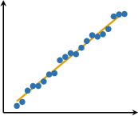

- The trend line has a *positive* slope.

- The data points lie *close* to the trend line.

- The trend line has a *positive* slope.

- The data points lie *far* from the trend line.

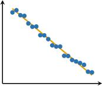

- The trend line has a *negative* slope.

- The data points lie *close* to the trend line.

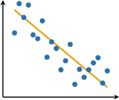

- The trend line has a *negative* slope.

- The data points lie *far* from the trend line.

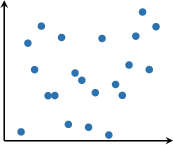

- The data points are scattered randomly.

### Example: Identifying the Type and Strength of a Given Correlation

#### Question

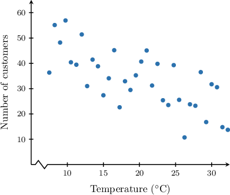

The scatterplot above shows the correspondence between the mean daily temperature outside a particular coffee shop and the number of customers ordering hot drinks. Which of the following best describes the correlation between the variables in the scatter plot?

#### Explanation

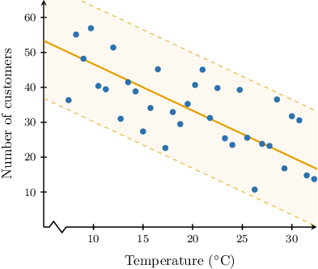

We note the following:

- The points in the scatter plot seem to follow a straight line with a ** slope. So, we have a ** correlation.

- The points are scattered quite far from the corresponding trend line. So, we have a ** correlation.

Therefore, the variables have a ** linear correlation.

### The Correlation Coefficient

The linear **correlation coefficient** $\rho$ (the Greek letter rho, pronounced "row") is a real number between $-1$ and $1$ that shows the strength of a linear correlation. It has the following properties:

- $\rho = 1$ indicates a perfect positive correlation

- $\rho = -1$ indicates a perfect negative correlation

- $\rho = 0$ indicates no (linear) correlation

The approximate value of $\rho$ can be determined from the scatter plot.

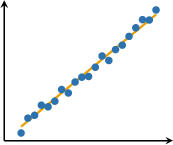

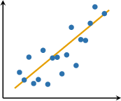

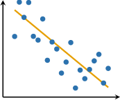

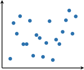

### Example: Estimating the Correlation Coefficient

#### Question

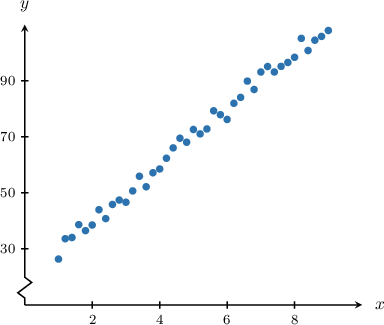

Which of the following could be the correlation coefficient for the data in the scatter plot above?

1. $\rho =-0.8$

2. $\rho= 0.3$

3. $\rho = 0.9$

#### Explanation

Recall that the linear correlation coefficient $\rho$ satisfies the inequality

$$

-1 \leq \rho \leq 1,

$$

where $\rho = 1$ indicates a perfect positive correlation, and $\rho = -1$ indicates a perfect negative correlation.

With that in mind, let's examine our scatter plot.

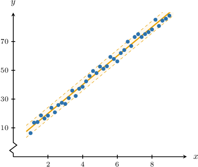

We note the following:

- The points in the scatter plot seem to follow a straight line with a ** slope. So, the correlation coefficient must be **. Thus, we disregard the following value:

- The points lie pretty close to the corresponding trend line. So, the correlation coefficient must be closer to $1.$ Thus, we disregard the following value:

Therefore, the best approximation of the correlation coefficient from the given options is $\rho= 0.9.$

### Example: Identifying a Scatter Plot Given a Correlation Coefficient

#### Question

It is known that there is a linear correlation between the variables $x$ and $y.$ Given that the correlation coefficient is $\rho\approx -0.85,$ sketch a possible scatter plot that corresponds to this situation.

#### Explanation

Recall that the linear correlation coefficient $\rho$ satisfies the inequality

$$

-1 \leq \rho \leq 1,

$$

where $\rho = 1$ indicates a perfect positive correlation, and $\rho = -1$ indicates a perfect negative correlation.

Therefore, since $\rho \approx -0.85,$ there is a ** linear correlation in the data.

- The ** linear correlation means that the data points should be scattered along a line with a ** slope.

- Since the correlation is **, most of the points should lie ** to the trend line.

Therefore, this situation could correspond to the following scatter plot:

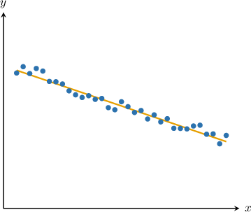
