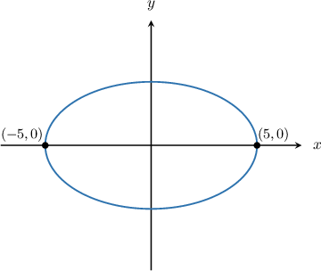
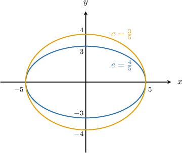
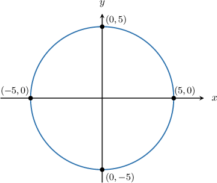
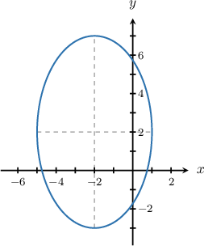

# Vertices and Eccentricity of Ellipses

Source: https://www.mathacademy.com/topics/1027?courseId=101
Topic ID: 1027

## Prerequisites

- [Foci of Ellipses](./1026-foci-of-ellipses.md)

## Lesson

### Introduction

The **vertices** of an ellipse are the endpoints of its major axis. For example, the vertices of the ellipse shown below are $(5,0)$ and $(-5,0).$

To compute the vertices given an equation of an ellipse, we need to find the center of the ellipse and the length of the semi-major axis.

Recall that the equation of an ellipse centered at $(h,k)$ is given by

$$

\dfrac{(x-h)^2}{a^2} + \dfrac{(y-k)^2}{b^2} = 1.

$$

We have the following cases:

- If $a^2 > b^2,$ then the ellipse is horizontal (i.e. "wide"). The length of the semi-major axis is $a,$ and the coordinates of the vertices are $(h \pm a, k).$

- If $b^2 > a^2,$ then the ellipse is vertical (i.e. "tall"). The length of the semi-major axis is $b,$ and the coordinates of the vertices are $(h, k \pm b).$

For example, the ellipse

$$

\dfrac{(x-1)^2}{{\color{blue}4}^2} + \dfrac{(y-2)^2}{3^2} = 1,

$$

is a wide ellipse with its center at $(1,2).$ The length of the semi-major axis is ${\color{blue}4},$ so the coordinates of the vertices are given by $(1 \pm {\color{blue}4}, 2).$ That is to say, the vertices are at $(-3,2)$ and $(5,2).$

On the other hand, the ellipse

$$

\dfrac{(x-1)^2}{3^2} + \dfrac{(y-2)^2}{ {\color{blue}4}^2} = 1,

$$

is tall ellipse with its center at $(1,2).$ The length of the semi-major axis is ${\color{blue}4},$ so the coordinates of the vertices are given by $(1, 2 \pm {\color{blue}4}).$ That is to say, the vertices are at $(1,-2)$ and $(1,6).$

### Example: Calculating the Vertices of a Wide Ellipse

#### Question

Calculate the vertices of the ellipse $\dfrac{(x-2)^2}{16} + \dfrac{(y+4)^2}{4} = 1.$

#### Explanation

The equation of an ellipse centered at $(h,k)$ is given by

$$

\dfrac{(x-h)^2}{a^2} + \dfrac{(y-k)^2}{b^2} = 1.

$$

Since $16 > 4,$ the ellipse is horizontal. The vertices of a horizontal ellipse are $(h \pm a, k).$

Comparing our equation with the standard equation, we have $(h, k) = (2, -4)$ and $a=\sqrt{16} = 4.$ Therefore, the coordinates of the vertices are

$$

(h \pm a, k) = (2\pm 4, -4),

$$

which gives the vertices $(-2, -4)$ and $(6,-4).$

### Example: Calculating the Vertices of a Tall Ellipse

#### Question

Calculate the vertices of the ellipse $\dfrac{(x+1)^2}{25} + \dfrac{(y-2)^2}{64} = 1.$

#### Explanation

The equation of an ellipse centered at $(h,k)$ is given by

$$

\dfrac{(x-h)^2}{a^2} + \dfrac{(y-k)^2}{b^2} = 1.

$$

Since $25 < 64,$ the ellipse is vertical. The vertices of a vertical ellipse are $(h, k \pm b).$

Comparing our equation with the standard equation, we have $(h, k) = (-1, 2)$ and $b=\sqrt{64} = 8.$ Therefore, the coordinates of the vertices are

$$

(h, k \pm b) = (-1, 2 \pm 8),

$$

which gives the vertices $(-1, -6)$ and $(-1,10).$

### The Eccentricity of an Ellipse

There is a parameter that describes how much a given ellipse deviates from a circle. We call this parameter the **eccentricity** and denote it with the letter $e.$

To compute the eccentricity, we first need to compute the focal length $c=\sqrt{\vert a^2 - b^2 \vert}.$ Then, the eccentricity is the ratio of the focal length to the length of the semi-major axis:

- For a horizontal ellipse, the length of the semi-major axis is $a,$ so the eccentricity is

- For a vertical ellipse, the length of the semi-major axis is $b,$ so the eccentricity is The eccentricity of an ellipse can only take values between $0$ and $1$, so

The eccentricity is a measure of how "squashed" an ellipse is compared to a circle.

- When $e\approx 0,$ the ellipse is squashed a little bit, and it closely resembles a circle.

- When $e \approx 1,$ the ellipse is very squashed.

To illustrate, let's have a look at the diagram below.

We see that for the blue (inner) ellipse we have $a = 5,$ $b = 3,$ and $c = \sqrt {|a^2 - b^2|} = \sqrt {|25 - 9|} = 4$. Then the eccentricity is

$$

e = \dfrac c a = \dfrac 4 5.

$$

For the orange (outer) ellipse, we have $a = 5,$ $b = 4,$ $c = \sqrt {|a^2 - b^2|} = \sqrt {|25 - 16|} = 3.$ Its eccentricity is

$$

e = \dfrac c a = \dfrac 3 5.

$$

The blue ellipse's eccentricity is higher than that of the orange ellipse, which makes sense since the blue ellipse is more squashed than the orange one.

Equivalently, the orange ellipse's eccentricity is lower than that of the blue ellipse, which makes sense because the orange ellipse more closely resembles a circle than the blue ellipse does.

### The Eccentricity of a Circle

If an ellipse has eccentricity $e=0,$ then the ellipse is an exact circle.

To understand why this is, remember that a circle is a special case of an ellipse with $a=b=r.$ Then the focal length is

$$

c = \sqrt {|a^2 - b^2|} = \sqrt {|r^2 - r^2|} = 0,

$$

and since the length of all the semi-axes is equal to $r,$ the eccentricity is

$$

e = \dfrac 0 r=0.

$$

For example, consider the circle below.

For this circle, we have $a=b=5.$ Then the focal length is

$$

c = \sqrt {|a^2 - b^2|} = \sqrt {|5^2 - 5^2|} = 0,

$$

and consequently, the eccentricity is

$$

e = \dfrac 0 r = \dfrac 0 5 =0.

$$

### Example: Calculating the Eccentricity of a Wide Ellipse

#### Question

Calculate the eccentricity of the ellipse $\dfrac{(x-5)^2}{9}+\dfrac{(y-3)^2}{5}=1.$

#### Explanation

The standard equation of an ellipse centered at $(h, k)$ is given by

$$

\dfrac{(x-h)^2}{a^2} + \dfrac{(y-k)^2}{b^2} = 1.

$$

Since $9 > 5,$ the ellipse is horizontal. For a horizontal ellipse, the eccentricity $e$ is given by $e=\dfrac{c}{a},$ where the focal length $c$ is

$$

c=\sqrt{\vert a^2 - b^2 \vert}.

$$

Comparing our equation with standard equation, we find that $a = \sqrt{9} = 3$ and $b = \sqrt{5}.$ Therefore, the eccentricity is

$$

\begin{aligned}𝑒 & =\frac{𝑐}{𝑎} \\ & =\frac{\sqrt{√|𝑎^{2}−𝑏^{2}|}}{𝑎} \\ & =\frac{\sqrt{√|9−5|}}{3} \\ & =\frac{\sqrt{√4}}{3} \\ & =\frac{2}{3}.\end{aligned}

$$

### Example: Calculating the Eccentricity of Tall Ellipse

#### Question

Calculate the eccentricity of the ellipse given above.

#### Explanation

For a vertical ellipse, the eccentricity is given by $e=\dfrac{c}{b},$ where the focal length $c$ is given by

$$

c= \sqrt{\vert a^2 - b^2\vert}.

$$

Here, the ellipse is centered at $(h,k)=(-2,2),$ the horizontal radius has length $a=3$ and the vertical radius has length $b=5.$

Since $5>3,$ the semi-major axis has length $b=5,$ and therefore the eccentricity is

$$

\begin{aligned}𝑒 & =\frac{𝑐}{𝑏} \\ & =\frac{\sqrt{√|𝑎^{2}−𝑏^{2}|}}{𝑏} \\ & =\frac{\sqrt{√|3^{2}−5^{2}|}}{5} \\ & =\frac{\sqrt{√|9−25|}}{5} \\ & =\frac{\sqrt{√|−16|}}{5} \\ & =\frac{4}{5}.\end{aligned}

$$
