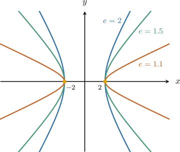

# Eccentricity and Vertices of Hyperbolas

Source: https://www.mathacademy.com/topics/1031?courseId=101
Topic ID: 1031

## Prerequisites

- [Foci of Hyperbolas](./1030-foci-of-hyperbolas.md)

## Lesson

### Introduction

Recall that a horizontal hyperbola centered at $(h,k)$ is given by the equation

$$

\dfrac{(x-h)^2}{a^2} - \dfrac{(y-k)^2}{b^2} = 1,

$$

and a vertical hyperbola centered at $(h,k)$ is given by the equation

$$

\dfrac{(y-k)^2}{a^2} - \dfrac{(x-h)^2}{b^2} = 1.

$$

In either case, the **eccentricity** is a measure of how "curved" the hyperbola is, and it is defined as

$$

e = \dfrac {\sqrt {a^2 + b^2}} a = \dfrac{c}{a},

$$

where the quantity $c=\sqrt{a^2+b^2}$ is known as the **focal length**.

Three hyperbolas with different eccentricities are graphed below. The lower the eccentricity, the sharper the curve at the vertices of the hyperbola.

Note that $e > 1$ because the numerator of the fraction $\dfrac {\sqrt {a^2 + b^2}} a$ is always larger than the denominator.

Lastly, note that for a hyperbola, you can remember some properties of the eccentricity by comparing it to the measure of an angle:

- The eccentricity measures the sharpness of the curve at the vertices of the hyperbola, similar to how the measure of an angle measures the sharpness of the corner formed by an angle.

- Hyperbolas with lower eccentricities have sharper curves, similar to how angles with lower measures have sharper corners.

### Example: Calculating the Eccentricity of a Hyperbola

#### Question

Calculate the eccentricity of the hyperbola $\dfrac {(x + 3)^2} {20} - \dfrac {(y - 1)^2} {16} =1.$

#### Explanation

The equation of a ** hyperbola centered at $(h,k)$ is given by

$$

\dfrac{(x-h)^2}{a^2} - \dfrac{(y-k)^2}{b^2} = 1.

$$

The eccentricity is given by $e = \dfrac{c}{a},$ where $c=\sqrt{a^2+b^2}$ is the focal length.

Comparing our equation with the standard equation, we have $a = \sqrt{20} = 2\sqrt{5}$ and $b = \sqrt{16} = 4$.

Therefore, the eccentricity is

$$

\begin{aligned}𝑒 & =\frac{\sqrt{√𝑎^{2}+𝑏^{2}}}{𝑎} \\ & =\frac{\sqrt{√20+16}}{2\sqrt{√5}} \\ & =\frac{\sqrt{√36}}{2\sqrt{√5}} \\ & =\frac{6}{2\sqrt{√5}} \\ & =\frac{3\sqrt{√5}}{5}.\end{aligned}

$$

### Example: Calculating the Eccentricity of a Hyperbola Given in Expanded Form

#### Question

Calculate the eccentricity of the hyperbola $y^2 - 8x^2 - 48x = 88.$

#### Explanation

The equation of a ** hyperbola centered at $(h,k)$ is given by

$$

\dfrac{(y-k)^2}{a^2} - \dfrac{(x-h)^2}{b^2} = 1.

$$

The eccentricity is given by $e = \dfrac{c}{a},$ where $c=\sqrt{a^2+b^2}$ is the focal length.

To rewrite the equation of the hyperbola in standard form, we need to group $x$ terms and complete the square, as follows:

$$

\begin{aligned}𝑦^{2}−8𝑥^{2}−48𝑥 & =88 \\ 𝑦^{2}−8[𝑥^{2}+6𝑥] & =88 \\ 𝑦^{2}−8[(𝑥+3)^{2}−9] & =88 \\ 𝑦^{2}−8(𝑥+3)^{2}+72 & =88 \\ 𝑦^{2}−8(𝑥+3)^{2} & =16 \\ \frac{𝑦^{2}}{16}−\frac{(𝑥+3)^{2}}{2} & =1.\end{aligned}

$$

Comparing our equation with the standard equation, we have $a = \sqrt{16} = 4$ and $b = \sqrt{2}.$

Therefore, the eccentricity is

$$

\begin{aligned}𝑒 & =\frac{\sqrt{√𝑎^{2}+𝑏^{2}}}{𝑎} \\ & =\frac{\sqrt{√16+2}}{4} \\ & =\frac{\sqrt{√18}}{4} \\ & =\frac{3\sqrt{√2}}{4}.\end{aligned}

$$

### Vertices of Hyperbolas

The two points that are closest to the center $(h,k)$ of a hyperbola are the **vertices** of a hyperbola.

- The coordinates of the vertices of a horizontal hyperbola are $(h \pm a, k)$.

- The coordinates of the vertices of a vertical hyperbola are $(h, k\pm a).$

### Example: Calculating the Vertices of a Hyperbola

#### Question

Calculate the vertices of the hyperbola $\dfrac {(x + 3)^2} {9} - \dfrac {(y - 1)^2} {16} =1.$

#### Explanation

The coordinates of the vertices of a horizontal hyperbola are $(h \pm a, k).$

The equation of a horizontal hyperbola centered at $(h,k)$ is given by

$$

\dfrac{(x-h)^2}{a^2} - \dfrac{(y-k)^2}{b^2} = 1.

$$

Comparing our equation with the standard equation, we have $(h,k) = (-3,1)$, $a = \sqrt{9} = 3$ and $b = \sqrt{16} = 4$.

Therefore, the coordinates of the vertices are

$$

(h\pm a,k) =(-3\pm3,1)

$$

which gives the vertices $(-6,1)$ and $(0,1).$

### Example: Calculating the Vertices of a Hyperbola Given in Expanded Form

#### Question

Calculate the vertices of the hyperbola $8y^2 - x^2 + 32y = -16.$

#### Explanation

The equation of a ** hyperbola centered at $(h,k)$ is given by

$$

\dfrac{(y-k)^2}{a^2} - \dfrac{(x-h)^2}{b^2} = 1.

$$

The coordinates of the vertices are $(h, k \pm a).$

To rewrite the equation of the hyperbola in standard form, we need to group $y$ terms and complete the squares, as follows:

$$

\begin{aligned}8𝑦^{2}−𝑥^{2}+32𝑦=−16 & \\ 8[𝑦^{2}+4𝑦]−𝑥^{2}=−16 & \\ 8[(𝑦+2)^{2}−4]−𝑥^{2}=−16 & \\ 8(𝑦+2)^{2}−32−𝑥^{2}=−16 & \\ 8(𝑦+2)^{2}−𝑥^{2}=16 & \\ \frac{(𝑦+2)^{2}}{2}−\frac{𝑥^{2}}{16} & =1\end{aligned}

$$

Comparing our equation with the standard equation, we have $(h, k) = (0,-2)$ and $a = \sqrt{2}.$

Therefore, the coordinates of the vertices are

$$

(h, k \pm a) = (0 , -2 \pm \sqrt{2}).

$$

So the vertices are $(0, -2 - \sqrt{2})$ and $(0, -2 + \sqrt{2}).$
