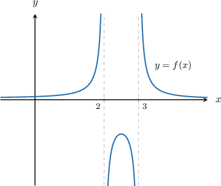
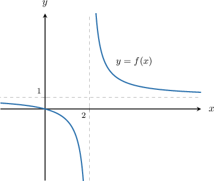

# The Domain and Range of a Rational Function

Source: https://www.mathacademy.com/topics/115?courseId=101
Topic ID: 115

## Prerequisites

- [Calculating the Inverse of a Function](../algebra-ii/627-calculating-the-inverse-of-a-function.md)
- [Locating Holes in Rational Functions](./1817-locating-holes-in-rational-functions.md)
- [The Range of a Function: Advanced Cases](../algebra-i/3728-the-range-of-a-function-advanced-cases.md)

## Lesson

### Introduction

A rational function is defined for all values of $x$ except for those at vertical asymptotes and holes. So, to find the domain, we must exclude all values of $x$ that make the denominator zero.

For instance, suppose we want to define the domain of the rational function $f(x),$ given by

$$

f(x)=\dfrac{1}{x^2-5x+6}.

$$

Setting the denominator equal to zero and solving, we get

$$

\begin{aligned}𝑥^{2}−5𝑥+6 & =0 \\ (𝑥−2)(𝑥−3) & =0 \\ 𝑥 & =2,3.\end{aligned}

$$

Therefore, the domain is $x \in \left(-\infty, 2\right) \cup \left(2,3 \right) \cup \left(3,\infty \right),$ as we can see in the graph of the function below.

### Example: Finding the Domain of a Rational Function

#### Question

What is the domain of the function $f(x) = \dfrac{x-5}{x^2-3x-10}?$

#### Explanation

A rational function is defined for all values of $x$ except for those at vertical asymptotes and holes. So, to find the domain, we must exclude all values of $x$ that make the denominator zero.

Setting the denominator equal to zero and solving, we get

$$

\begin{aligned}𝑥^{2}−3𝑥−10 & =0 \\ (𝑥+2)(𝑥−5) & =0 \\ 𝑥 & =−2,5.\end{aligned}

$$

Therefore, the domain is $x \in \left(-\infty, -2\right) \cup (-2,5) \cup \left(5,\infty \right).$

### The Range of a Rational Function

Finding the range of a rational function is not as straightforward as finding the domain. Here, we will focus on finding the range of a rational function in the simple case when the numerator and denominator are linear expressions.

One way to find the range of such a rational function $f(x)$ is to find the domain of its inverse function $f^{-1}(x).$

To illustrate, let's find the range of the function $f(x),$ given by

$$

f(x) = \dfrac{x}{x-2}.

$$

First, we set $y = f(x)$ and make $x$ the subject of the equation, as follows:

$$

\begin{aligned}𝑦 & =\frac{𝑥}{𝑥−2} \\ 𝑦(𝑥−2) & =𝑥 \\ 𝑥𝑦−2𝑦 & =𝑥 \\ 𝑥𝑦−𝑥 & =2𝑦 \\ 𝑥(𝑦−1) & =2𝑦 \\ 𝑥 & =\frac{2𝑦}{𝑦−1}\end{aligned}

$$

The above equation tells us that the right-hand side exists for all values of $y$ except for those that make the denominator zero.

Setting the denominator equal to zero and solving, we get

$$

\begin{aligned}𝑦−1 & =0 \\ 𝑦 & =1.\end{aligned}

$$

Therefore, the range is $f(x) \in \left(-\infty, 1\right) \cup \left(1,\infty \right),$ as we can see in the graph of the function below.

### Example: Finding the Range of a Rational Function

#### Question

What is the range of the function $f(x) = \dfrac{x-5}{2x-5}?$

#### Explanation

One way to determine the range of a rational function $f(x)$ is to find the domain of its inverse function $f^{-1}(x).$

First, let's set $y = f(x)$ and make $x$ the subject of the equation, as follows:

$$

\begin{aligned}𝑦 & =\frac{𝑥−5}{2𝑥−5} \\ 𝑦(2𝑥−5) & =𝑥−5 \\ 2𝑥𝑦−5𝑦 & =𝑥−5 \\ 2𝑥𝑦−𝑥 & =5𝑦−5 \\ 𝑥(2𝑦−1) & =5𝑦−5 \\ 𝑥 & =\frac{5𝑦−5}{2𝑦−1}\end{aligned}

$$

The above equation tells us that the right-hand side exists for all values of $y$ except for those that make the denominator zero.

Setting the denominator equal to zero and solving, we get

$$

\begin{aligned}2𝑦−1 & =0 \\ 2𝑦 & =1 \\ 𝑦 & =\frac{1}{2}.\end{aligned}

$$

Therefore, the range is $f(x) \in \left(-\infty, \dfrac1 2\right) \cup \left(\dfrac1 2,\infty \right).$

### Example: Finding the Range of a Rational Function Containing Holes

#### Question

What is the range of the function $f(x) = \dfrac{x-1}{3x^2-2x-1}?$

#### Explanation

First, let's factor the numerator and denominator:

$$

f(x) = \dfrac{x-1}{3x^2-2x-1} = \dfrac{x-1}{(3x+1)(x-1)}

$$

Notice that the numerator and denominator both have $(x-1)$ as a common factor. Setting this common factor equal to zero and solving for $x$ gives

$$

x - 1 = 0\quad\Longrightarrow\quad x= 1.

$$

Therefore, the function has a hole at $x = 1.$

To find the $y$-coordinate of the hole, we find the reduced rational function $F(x)$ and evaluate it at the $x$-coordinate of the hole.

Finding the reduced rational function $F(x),$ we get

$$

\begin{aligned}𝐹(𝑥) & =\frac{𝑥−1}{(3𝑥+1)(𝑥−1)} \\ & =\frac{𝑥−1}{(3𝑥+1)(𝑥−1)} \\ & =\frac{1}{3𝑥+1}.\end{aligned}

$$

The $y$-coordinate of the hole is given by

$$

\begin{aligned}𝐹(1) & =\frac{1}{3(1)+1} \\ & =\frac{1}{4}.\end{aligned}

$$

So, the coordinates of the hole are $\left(1, \dfrac14\right).$

Now, let's make $x$ the subject of the simplified equation, as follows:

$$

\begin{aligned}𝑦 & =\frac{1}{3𝑥+1} \\ 𝑦(3𝑥+1) & =1 \\ 3𝑥𝑦+𝑦 & =1 \\ 3𝑥𝑦 & =1−𝑦 \\ 𝑥 & =\frac{1−𝑦}{3𝑦}\end{aligned}

$$

The above equation tells us that the right-hand side exists for all values of $y$ except for those that make the denominator zero.

Setting the denominator equal to zero and solving, we get

$$

\begin{aligned}3𝑦=0\,⟹\,𝑦=0.\end{aligned}

$$

Therefore, the range is $f(x) \in \left(-\infty, 0\right) \cup \left(0,\dfrac1 4 \right) \cup \left(\dfrac 1 4,\infty \right).$
