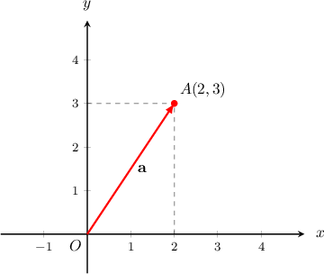
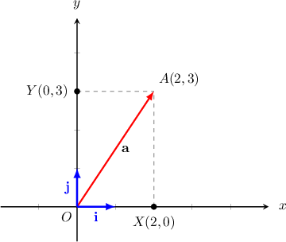
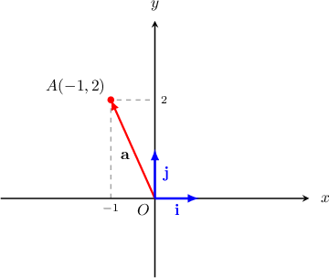
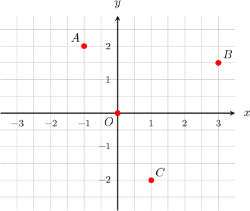
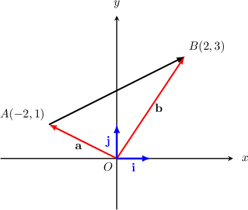

# Two-Dimensional Vectors Expressed in Component Form

Source: https://www.mathacademy.com/topics/1165?courseId=101
Topic ID: 1165

## Prerequisites

- [Unit Vectors](./1104-unit-vectors.md)
- [Linear Combinations of Vectors and Their Properties](./1105-linear-combinations-of-vectors-and-their-properties.md)

## Lesson

### Introduction

We can use Cartesian coordinates to define vectors in the plane. For example, consider the diagram shown below.

The point $A$ has coordinates $(2,3).$ We also have the point $O(0,0)$ that is called the **origin**.

The vector $\overrightarrow{OA}=\mathbf{a}$ is called the **position vector** of $A.$ A position vector always has its tail at the origin.

Now let's define two special unit vectors $\mathbf{i}$ and $\mathbf{j},$ where $|\, \mathbf{i} \,| = |\, \mathbf{j} \,| = 1,$ as follows:

- $\mathbf{i}$ is a horizontal unit vector that points to the right along the positive direction of the $x$-axis, while

- $\mathbf{j}$ is a vertical unit vector that points upwards along the positive direction of the $y$-axis.

These vectors are shown in the picture below.

We have

$$

\begin{aligned} & \overset{𝑂𝑋}{}=2𝐢, \\ & \overset{𝑋𝐴}{}=\overset{𝑂𝑌}{}=3𝐣.\end{aligned}

$$

Now, from $\triangle OXA,$ we have

$$

\begin{aligned}\overset{𝑂𝐴}{} & =\overset{𝑂𝑋}{}+\overset{𝑋𝐴}{} \\ & =2𝐢+3𝐣.\end{aligned}

$$

So, the point $A$ with coordinates $(2,3)$ has a position vector

$$

\begin{aligned}\overset{𝑂𝐴}{} & =2𝐢+3𝐣.\end{aligned}

$$

In general, if a point $A$ has coordinates $(a_x,a_y),$ then its position vector is given by

$$

\overrightarrow{OA} = \mathbf{a} = a_x\mathbf{i}+a_y\mathbf{j}.

$$

### Example: Expressing a Position Vector in Component Form

#### Question

Find the position vector of $A(-1,2)$ in terms of $\mathbf{i}$ and $\mathbf{j}.$

#### Explanation

Our vector is shown in the diagram below.

Remember that in general, if a point $A$ has coordinates $(a_x,a_y),$ then its position vector is given by

$$

\overrightarrow{OA} = a_x\mathbf{i}+a_y\mathbf{j}.

$$

Here, the point $A$ has coordinates $(-1,2),$ so its position vector is given by

$$

\begin{aligned}\overset{𝑂𝐴}{} & =(−1)⋅𝐢+2⋅𝐣 \\ & =−𝐢+2𝐣.\end{aligned}

$$

### Alternatives to i,j Notation

The $\mathbf{i,j}$ notation can sometimes be cumbersome. An alternative is to use **angle bracket** notation. For example, using angle bracket notation, the vector $2\mathbf{i}+3\mathbf{j}$ can be expressed as

$$

2\mathbf{i}+3\mathbf{j}=\langle 2,3 \rangle.

$$

Note that, using angle bracket notation, the special unit vectors can be expressed as

$$

\begin{aligned}𝐢=1𝐢+0𝐣=⟨1,0⟩, \\ 𝐣=0𝐢+1𝐣=⟨0,1⟩.\end{aligned}

$$

We can also use **column vector** notation, which is similar to angle bracket notation but expresses the vector as a column rather than a row. For example, using column vector notation, the vector $2\mathbf{i}+3\mathbf{j}$ can be expressed as

$$

[\begin{aligned}2 \\ 3\end{aligned}]

$$

Using column vector notation, the special unit vectors can be expressed as $[\begin{aligned}1 \\ 0\end{aligned}]$ and $[\begin{aligned}0 \\ 1\end{aligned}]$

**Note:** Sometimes, the round bracket notation $(\ldots)$ is used to denote vectors. However, we will avoid using that notation here, because it also looks like the coordinates of a point. A point and its position vector are two separate objects!

### Example: Expressing a Position Vector in Angle Bracket Notation

#### Question

The points $A, B, C,$ and $O$ are shown in the picture below. Find the corresponding position vectors, using angle bracket notation.

#### Explanation

For a point with coordinates $(a_x, a_y),$ the position vector is $\left< a_x, a_y \right>.$

- The point $A$ has coordinates $(-1,2),$ so the position vector is

- The point $B$ has coordinates $(3, 1.5),$ so the position vector is

- The point $C$ has coordinates $(1,-2),$ so the position vector is

- The point $O$ has coordinates $(0,0),$ so the position vector is

### Example: Expressing a Vector in Component Form

#### Question

Let $A(-2,1)$ and $B(2,3).$ Find $\overrightarrow{AB}$ in terms of $\mathbf{i}$ and $\mathbf{j}.$

#### Explanation

Our vector is shown in the diagram below.

We have

$$

\begin{aligned} & \overset{𝑂𝐴}{}=𝐚=−2𝐢+𝐣, \\ & \overset{𝑂𝐵}{}=𝐛=2𝐢+3𝐣.\end{aligned}

$$

Now, from $\triangle OAB,$ we have

$$

\begin{aligned}\overset{𝐴𝐵}{} & =\overset{𝐴𝑂}{}+\overset{𝑂𝐵}{} \\ & =−\overset{𝑂𝐴}{}+\overset{𝑂𝐵}{} \\ & =𝐛−𝐚 \\ & =(2𝐢+3𝐣)−(−2𝐢+𝐣) \\ & =4𝐢+2𝐣.\end{aligned}

$$

### Expressing Vectors as Differences of Position Vectors

If $A$ and $B$ are points in the Cartesian plane with position vectors $\mathbf{a}$ and $\mathbf{b}$ respectively, then

$$

\overrightarrow{AB} = \mathbf{b}-\mathbf{a}.

$$

To understand why the equation above is true, remember that $\overrightarrow{OA} = \mathbf{a}$ and $\overrightarrow{OB} = \mathbf{b}.$ Then, we have

$$

\begin{aligned}\overset{𝐴𝐵}{} & =\overset{𝐴𝑂}{}+\overset{𝑂𝐵}{} \\ & =−\overset{𝑂𝐴}{}+\overset{𝑂𝐵}{} \\ & =−𝐚+𝐛 \\ & =𝐛−𝐚.\end{aligned}

$$

For example, given $A(5,13)$ and $B(-2,-35)$, we have

$$

\begin{aligned} & \overset{𝑂𝐴}{}=𝐚=5𝐢+13𝐣, \\ & \overset{𝑂𝐵}{}=𝐛=−2𝐢−35𝐣.\end{aligned}

$$

Now, using the formula, we obtain

$$

\begin{aligned}\overset{𝐴𝐵}{} & =𝐛−𝐚 \\ & =(−2𝐢−35𝐣)−(5𝐢+13𝐣) \\ & =−7𝐢−48𝐣.\end{aligned}

$$
