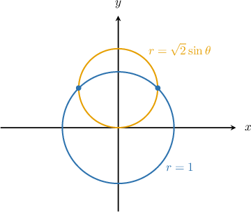
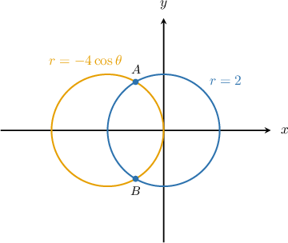
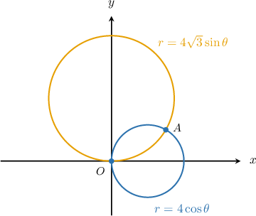
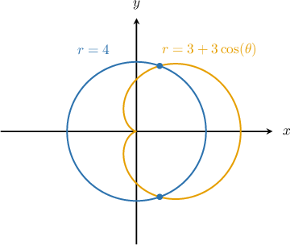

# Finding Intersections of Polar Curves

Source: https://www.mathacademy.com/topics/1274?courseId=101
Topic ID: 1274

## Prerequisites

- [Calculating the Intersection of Two Lines](../algebra-i/408-calculating-the-intersection-of-two-lines.md)
- [Solving Trigonometric Equations Using the Sin-Cos-Tan Identity](./947-solving-trigonometric-equations-using-the-sin-cos-tan-identity.md)
- [Polar Equations of Circles Centered on the Coordinate Axes](./1270-polar-equations-of-circles-centered-on-the-coordinate-axes.md)

## Lesson

### Introduction

It is often more convenient to use polar coordinates to determine the points of intersection of two curves. This is especially true if we are dealing with two circles.

Suppose, for example, that we are given the circles ${\color{}r=\sqrt2\, {\sin{\theta}}}\,$ and $\, {\color{}r=1},$ as shown in the figure below. How do we determine the polar coordinates of the points of intersection of these two curves?

To determine the polar coordinates of the intersection points, we must solve the following system of equations for $r$ and $\theta\mathbin{:}$

$$

\begin{aligned}𝑟=\sqrt{√2} \,sin⁡𝜃 \\ 𝑟=1\end{aligned}

$$

So, we begin by setting the equations equal to each other and solving for $\theta.$ This gives

$$

\begin{aligned}\sqrt{√2} \,sin⁡𝜃 & =1 \\ sin⁡𝜃 & =\frac{1}{\sqrt{√2}} \\ & =\frac{\sqrt{√2}}{2}.\end{aligned}

$$

Solving this equation in the interval $[0,2\pi),$ we obtain

$$

\theta_1 = \dfrac{\pi}{4}, \qquad \theta_2 = \dfrac{3\pi}{4}.

$$

Also, notice that $r=1$ at both intersection points. Therefore, the polar coordinates of the points of intersection are

$$

(r,\theta)=\bigg(1, \dfrac{\pi}{4}\bigg)\qquad \textrm{and} \qquad(r,\theta)=\bigg(1, \dfrac{3\pi}{4}\bigg).

$$

### Example: Finding the Points of Intersection of Two Circles Where One Is Centered at the Origin

#### Question

The circles and intersect at points and as shown below. What are the polar coordinates of the point

#### Explanation

To determine the polar coordinates of the intersection points, we will solve the following system of equations for and We begin by setting the equations equal to each other and solving for This gives

Solving this equation in the interval we obtain and

Also, notice that at both intersection points.

Therefore, the polar coordinates of the point are

### Example: Finding the Points of Intersection Between a Circle and Another Curve

#### Question

The circles $r=4\cos \theta$ and $r=4\sqrt{3}\sin \theta$ intersect at points $O$ and $A,$ as shown in the diagram. What are the polar coordinates of the point $A?$

#### Explanation

First of all, we notice from the graph that $(r,\theta)=\left(0, 0\right)$ is an obvious first point of intersection.

To find the second point of intersection, we set the equations of the curves equal to each other and solve for $\theta\mathbin{:}$

$$

\begin{aligned}4\sqrt{√3}sin⁡𝜃 & =4cos⁡𝜃 \\ \frac{sin⁡𝜃}{cos⁡𝜃} & =\frac{4}{4\sqrt{√3}} \\ tan⁡𝜃 & =\frac{1}{\sqrt{√3}}\end{aligned}

$$

This gives us the solution $\theta =\dfrac{\pi}{6}$ in the $1$st quadrant.

Now, we use the equation $r=4\cos \theta$ to find the $r$-coordinate of the point $A\mathbin{:}$

$$

\begin{aligned}𝑟 & =4cos⁡(\frac{𝜋}{6}) \\ & =4⋅\frac{\sqrt{√3}}{2} \\ & =2\sqrt{√3}\end{aligned}

$$

Therefore, polar coordinates of the point $A$ are $(r,\theta)=\left(2\sqrt{3}, \dfrac{\pi}{6}\right).$

### Example: Finding the Points of Intersection of a Limaçon and Another Curve

#### Question

Find the polar coordinates of the intersection points of the polar curves $r =3+3\cos\theta$ and $r = 4,$ shown below. Round your answers to $1$ decimal place where appropriate.

#### Explanation

To determine the polar coordinates of the intersection points, we will solve the following system of equations for $r$ and $\theta\mathbin{:}$

$$

\begin{aligned}𝑟=3+3cos⁡𝜃 \\ 𝑟=4\end{aligned}

$$

We begin by setting the equations equal to each other and solving for $\theta.$ This gives

$$

\begin{aligned} 3+3\cos \theta & = 4\\\[5pt] 3\cos \theta & = 1 \\[3pt] \cos \theta & = \dfrac 1 3. \end{aligned}

$$

Solving this equation in the interval $[0^\circ,360^\circ),$ we obtain $\theta_1 \approx 70.5^{\circ}$ and $\theta_2 \approx 289.5,$ rounded to $1$ decimal place.

Notice that we must have $r=4$ at any of the points of intersection.

Therefore, the polar coordinates of the points of intersection are

$$

(r,\theta)=\left(4 , 70.5 \, ^\circ \right)\qquad \textrm{and} \qquad (r,\theta)=\left(4 , 289.5 \, ^\circ\right).

$$
