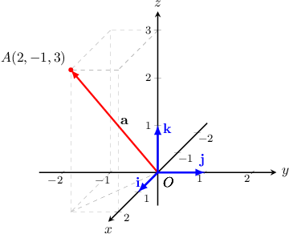

# Calculating the Magnitude of Cartesian Vectors in 3D

Source: https://www.mathacademy.com/topics/1277?courseId=101
Topic ID: 1277

## Prerequisites

- [Addition and Scalar Multiplication of Cartesian Vectors in 3D](./175-addition-and-scalar-multiplication-of-cartesian-vectors-in-3d.md)
- [Calculating the Magnitude of Cartesian Vectors in 2D](./176-calculating-the-magnitude-of-cartesian-vectors-in-2d.md)
- [The Distance Formula in Three Dimensions](../geometry/512-the-distance-formula-in-three-dimensions.md)

## Lesson

### Introduction

Consider the vector $\mathbf{a}=\langle 2,-1,3 \rangle,$ shown below.

To compute the magnitude (length) of $\mathbf{a},$ we can use the Pythagorean theorem in three dimensions:

$$

\begin{aligned}𝐚 & =\sqrt{√(2)^{2}+(−1)^{2}+(3)^{2}} \\ & =\sqrt{√4+1+9} \\ & =\sqrt{√14}\end{aligned}

$$

In general, given a vector

$$

\begin{aligned}𝑎_{𝑥} \\ 𝑎_{𝑦} \\ 𝑎_{𝑧}\end{aligned}

$$

the magnitude of the vector can always be computed as

$$

|\,\mathbf{a}\,| = \sqrt{a_x^2+a_y^2+a_z^2}.

$$

**Note**

We sometimes use the notation $|| \mathbf a ||$ to denote the magnitude of a vector.

### Example: Calculating the Magnitude of a Vector Given in Component Form

#### Question

Let $\mathbf{a}=\langle 2, -3, -7 \rangle$. Find $|\mathbf{a}|$.

#### Explanation

Using the formula, we have

$$

\begin{aligned}|\,𝐚\,| & =\sqrt{√𝑎_{2𝑥}^{}+𝑎_{2𝑦}^{}+𝑎_{2𝑧}^{}} \\ & =\sqrt{√2^{2}+(−3)^{2}+(−7)^{2}} \\ & =\sqrt{√4+9+49} \\ & =\sqrt{√62}.\end{aligned}

$$

### Example: Calculating a Unit Vector Parallel to a Given Vector

#### Question

Let $\begin{aligned}4 \\ −5 \\ 1\end{aligned}$ Find a unit vector that is parallel to $\mathbf{a}.$

#### Explanation

Remember that to find a unit vector that is parallel to a given vector, we need to divide the given vector by its length:

$$

\mathbf{u} = \dfrac{\mathbf{a}}{|\,\mathbf{a}\,|}

$$

Using the formula for the magnitude of a vector, we get

$$

\begin{aligned}|\,𝐚\,| & =\sqrt{√𝑎_{2𝑥}^{}+𝑎_{2𝑦}^{}+𝑎_{2𝑧}^{}} \\ & =\sqrt{√4^{2}+(−5)^{2}+1^{2}} \\ & =\sqrt{√16+25+1} \\ & =\sqrt{√42}.\end{aligned}

$$

Finally, we divide $\mathbf{a}$ by its length and get the following unit vector:

$$

\begin{aligned}𝐮 & =\frac{𝐚}{|\,𝐚\,|} \\ & =\frac{1}{\sqrt{√42}}𝐚 \\ & =\frac{1}{\sqrt{√42}}⋅\begin{aligned}4 \\ −5 \\ 1\end{aligned} \\ & =\begin{aligned}4/\sqrt{√42} \\ −5/\sqrt{√42} \\ 1/\sqrt{√42}\end{aligned}\end{aligned}

$$

### Example: Calculating the Magnitude of a Vector Given the Coordinates of its Endpoints

#### Question

Let $A(1,1,2)$ and $B(2,-2,3).$ Find $|\overrightarrow{AB}|.$

#### Explanation

We have

$$

\begin{aligned} & \overset{𝑂𝐴}{}=𝐚=𝐢+𝐣+2𝐤, \\ & \overset{𝑂𝐵}{}=𝐛=2𝐢−2𝐣+3𝐤.\end{aligned}

$$

Expressing $\overrightarrow{AB}$ as the difference of position vectors, we obtain:

$$

\begin{aligned}\overset{𝐴𝐵}{} & =\overset{𝑂𝐵}{}−\overset{𝑂𝐴}{} \\ & =𝐛−𝐚 \\ & =(2𝐢−2𝐣+3𝐤)−(𝐢+𝐣+2𝐤) \\ & =𝐢−3𝐣+𝐤.\end{aligned}

$$

Now, using the formula for the magnitude of a vector, we get

$$

\begin{aligned}|\overset{𝐴𝐵}{}| & =\sqrt{√1^{2}+(−3)^{2}+1^{2}} \\ & =\sqrt{√1+9+1} \\ & =\sqrt{√11}.\end{aligned}

$$
