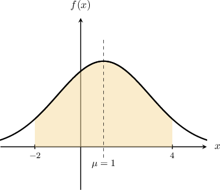

# Mean and Variance of the Normal Distribution

Source: https://www.mathacademy.com/topics/1470?courseId=101
Topic ID: 1470

## Prerequisites

- [The Normal Distribution](./1843-the-normal-distribution.md)

## Lesson

### Introduction

We've seen how to calculate probabilities for normally distributed random variables $X\sim N(\mu,\sigma^2)$ when $\mu$ and $\sigma^2$ are both *known.*

In this lesson, we'll learn how to calculate the mean $\mu$ or the variance $\sigma^2$ of a normally distributed random variable when given a specific probability.

For example, suppose we have a normally distributed random variable $X$ with *unknown* mean ${\color{blue}\mu}$ and *known* variance ${\color{red}{\sigma}}^2 = {\color{red}2}^2.$ We write this as follows:

$$

X \sim N({\color{blue}\mu}, {\color{red}2}^2)

$$

Now, suppose we also know that

$$

P(X \leq 2.1) = 0.7088.

$$

We can use this additional information about $X$ to calculate the mean ${\color{blue}\mu}.$

First, we transform to a standard normal random variable $Z\sim N(0,1)$ by $z$-scoring:

$$

Z = \dfrac{X - \mu}{\sigma}

$$

Applying the $z$-scoring transformation to our probability statement, we get the following:

$$

\begin{aligned}𝑃(𝑋≤2.1) & =0.7088 \\ 𝑃(\frac{𝑋−𝜇}{𝜎}≤\frac{2.1−𝜇}{𝜎}) & =0.7088 \\ 𝑃(𝑍≤\frac{2.1−𝜇}{𝜎}) & =0.7088\end{aligned}

$$

Substituting ${\color{red}{\sigma}} = {\color{red}{2}},$ we get

$$

P\left(Z \leq \dfrac{2.1 - {\color{blue}{\mu}}}{\color{red}{2}}\right) = 0.7088.

$$

Now, using the fact that $P(Z\leq z) = \Phi(z),$ where $\Phi$ is the cumulative distribution function of $Z,$ we can write the above statement as follows:

$$

\Phi\left(\dfrac{2.1 - {\color{blue}{\mu}}}{2}\right) = 0.7088 \qquad\Longrightarrow\qquad \Phi^{-1}(0.7088) = \dfrac{2.1 - {\color{blue}{\mu}}}{2}

$$

Let's now take a look at the table of values for $\Phi(z).$

According to the table, we have

$$

\Phi(0.55) = 0.7088 \qquad \Longrightarrow \qquad \Phi^{-1}( 0.7088) = 0.55.

$$

Equating our two expressions for $\Phi^{-1}(0.7088),$ we can now solve for $\mu$ as follows:

$$

\begin{aligned}\frac{2.1−𝜇}{2} & =0.55 \\ 2.1−𝜇 & =1.1 \\ 𝜇 & =1\end{aligned}

$$

### Example: Finding the Mean

#### Question

The data below is taken from the table of values of the cumulative distribution function $\Phi(z)$ for the standard normal distribution. Given that $X \sim N(\mu, 6^2)$ with $P(X > 4) = 0.1841,$ find $\mu.$

#### Explanation

First, we convert the given probability into a cumulative probability using the complement:

$$

\begin{aligned}𝑃(𝑋≤4) & =1−𝑃(𝑋>4) \\ & =1−0.1841 \\ & =0.8159\end{aligned}

$$

Then, we transform to a standard normal random variable by $z$-scoring:

$$

\begin{aligned}𝑃(𝑋≤4) & =0.8159 \\ 𝑃(𝑍≤\frac{4−𝜇}{6}) & =0.8159 \\ Φ(\frac{4−𝜇}{6}) & =0.8159 \\ \frac{4−𝜇}{6} & =Φ^{−1}(0.8159)\end{aligned}

$$

According to the table, we have

$$

\Phi(0.90) = 0.8159 \quad \Rightarrow \quad \Phi^{-1}( 0.8159) = 0.90.

$$

Therefore, we have

$$

\begin{aligned}\frac{4−𝜇}{6} & =0.90 \\ 4−𝜇 & =5.4 \\ 𝜇 & =−1.4.\end{aligned}

$$

### Example: Finding the Variance or Standard Deviation

#### Question

The data below is taken from the table of values of the cumulative distribution function $\Phi(z)$ for the standard normal distribution. Given that $X\sim N(2.5, \sigma^2)$ and $P(X \geq 3) = 0.4013,$ find $\sigma^2.$

#### Explanation

First, we convert the given probability into a cumulative probability using the complement:

$$

\begin{aligned}𝑃(𝑋≤3) & =1−𝑃(𝑋≥3) \\ & =1−0.4013 \\ & =0.5987\end{aligned}

$$

Then, we transform to a standard normal random variable by $z$-scoring:

$$

\begin{aligned}𝑃(𝑋≤3) & =0.5987 \\ 𝑃(𝑍≤\frac{3−2.5}{𝜎}) & =0.5987 \\ Φ(\frac{0.5}{𝜎}) & =0.5987 \\ \frac{0.5}{𝜎} & =Φ^{−1}(0.5987)\end{aligned}

$$

According to the table, we have

$$

\Phi(0.25) = 0.5987 \quad \Rightarrow \quad \Phi^{-1}( 0.5987) = 0.25.

$$

Therefore, we have

$$

\begin{aligned}\frac{0.5}{𝜎} & =0.25 \\ 𝜎 & =\frac{0.5}{0.25} \\ 𝜎 & =2\end{aligned}

$$

Finally,

$$

\begin{aligned}𝜎^{2}=2^{2}=4.\end{aligned}

$$

### Using Symmetry Properties

It's often helpful to use the symmetry properties of the normal distribution to help us determine unknown parameters.

For example, suppose we have the following normal random variable with unknown variance $\sigma^2{:}$

$$

X \sim N(1, \sigma^2)

$$

Suppose we also know that

$$

P(-2 \lt X \lt 4) = 0.8714.

$$

The interval $-2 \lt X \lt 4$ and the area associated with the probability that $X$ lies within this interval are shown below.

The endpoints of the interval $(-2,4)$ both lie at a distance of ${\color{red}{3}}$ from the mean $\mu.$ So, this interval is symmetric about the mean, and we can write the given probability as follows:

$$

P(\mu - {\color{red}{3}} \lt X \lt \mu + {\color{red}{3}}) = 0.8714

$$

By symmetry, the total shaded equals twice the area between the mean $\mu$ and the right endpoint:

$$

2P(\mu < X < \mu + 3) = 0.8714

$$

Dividing this equation by $2,$ we get

$$

P(\mu < X < \mu + 3) = 0.4357.

$$

Let's write this probability in terms of $Z\sim N(0,1)$ by $z$-scoring:

$$

\begin{aligned}𝑃(\frac{𝜇−𝜇}{𝜎}<\frac{𝑋−𝜇}{𝜎}<\frac{𝜇+3−𝜇}{𝜎})=0.4357\end{aligned}

$$

This simplifies to

$$

\begin{aligned}𝑃(0<𝑍<\frac{3}{𝜎})=0.4357.\end{aligned}

$$

Writing this in terms of $\Phi,$ we have

$$

\Phi\left(\dfrac{3}{\sigma}\right) - \Phi(0) = 0.4357

$$

and since we know that $\Phi(0) = 0.5,$ we have

$$

\Phi\left(\dfrac{3}{\sigma}\right) - 0.5= 0.4357

$$

which we can write as

$$

\Phi\left(\dfrac{3}{\sigma}\right) = 0.9357\qquad\Rightarrow\qquad \dfrac{3}{\sigma} = \Phi^{-1}(0.9357).

$$

Let's now take a look at the table of values for $\Phi(z),$

According to the table, we have

$$

\Phi(1.52) = 0.9357 \quad \Longrightarrow \quad \Phi^{-1}(0.9357) = 1.52.

$$

Finally, we can solve for $\sigma{:}$

$$

\begin{aligned}\frac{3}{𝜎} & =1.52 \\ 𝜎 & =\frac{3}{1.52} \\ 𝜎 & ≈1.974\end{aligned}

$$

### Example: Finding a Missing Parameter Using Symmetry When the Mean Is Zero

#### Question

The data below is taken from the table of values of the cumulative distribution function $\Phi(z)$ for the standard normal distribution. Given that $X \sim N(0, \sigma^2)$ is a normal random variable with $P(-3.18 < X < 3.18) = 0.4038,$ find $\sigma.$

#### Explanation

First, we find the cumulative probability using symmetry:

$$

\begin{aligned}𝑃(−3.18<𝑋<3.18) & =0.4038 \\ 2𝑃(0<𝑋<3.18) & =0.4038 \\ 𝑃(0<𝑋<3.18) & =0.2019 \\ 𝑃(𝑋<3.18)−𝑃(𝑋<0) & =0.2019 \\ 𝑃(𝑋<3.18)−0.5 & =0.2019 \\ 𝑃(𝑋<3.18) & =0.7019 \\ 𝑃(𝑋≤3.18) & =0.7019\end{aligned}

$$

Then, we transform to a standard normal random variable by $z$-scoring:

$$

\begin{aligned}𝑃(𝑋≤3.18) & =0.7019 \\ 𝑃(𝑍≤\frac{3.18−0}{𝜎}) & =0.7019 \\ Φ(\frac{3.18}{𝜎}) & =0.7019 \\ \frac{3.18}{𝜎} & =Φ^{−1}(0.7019)\end{aligned}

$$

According to the table, we have

$$

\Phi(0.53) = 0.7019 \quad \Rightarrow \quad \Phi^{-1}( 0.7019) = 0.53.

$$

Therefore, we have

$$

\begin{aligned}\frac{3.18}{𝜎} & =0.53 \\ 𝜎 & =\frac{3.18}{0.53} \\ 𝜎 & =6.\end{aligned}

$$

### Example: Finding a Missing Parameter Using Symmetry When the Mean Is Nonzero

#### Question

The data below is taken from the table of values of the cumulative distribution function $\Phi(z)$ for the standard normal distribution. Given that $X \sim N(\mu, 2^2)$ is a normal random variable with $P(-4\mu< X < 6\mu) = 0.6528,$ find $\mu$ rounded to $2$ decimal places.

**

#### Explanation

Note that we can write the given probability as

$$

P(\mu -5\mu < X < \mu +5\mu) = 0.6528,

$$

which tells us that the interval $-4\mu< X < 6\mu$ is symmetric about the mean $\mu.$

First, we find the cumulative probability using symmetry:

$$

\begin{aligned}𝑃(𝜇−5𝜇<𝑋<𝜇+5𝜇) & =0.6528 \\ 2𝑃(𝜇<𝑋<𝜇+5𝜇) & =0.6528 \\ 𝑃(𝜇<𝑋<𝜇+5𝜇) & =0.3264 \\ 𝑃(𝑋<𝜇+5𝜇)−𝑃(𝑋<𝜇) & =0.3264 \\ 𝑃(𝑋<𝜇+5𝜇)−0.5 & =0.3264 \\ 𝑃(𝑋<𝜇+5𝜇) & =0.8264 \\ 𝑃(𝑋≤6𝜇) & =0.8264\end{aligned}

$$

Then, we transform to a standard normal random variable by $z$-scoring:

$$

\begin{aligned}𝑃(𝑋≤6𝜇) & =0.8264 \\ 𝑃(𝑍≤\frac{6𝜇−𝜇}{2}) & =0.8264 \\ Φ(\frac{5𝜇}{2}) & =0.8264 \\ \frac{5𝜇}{2} & =Φ^{−1}(0.8264)\end{aligned}

$$

According to the table, we have

$$

\Phi(0.94) = 0.8264 \quad \Rightarrow \quad \Phi^{-1}( 0.8264) = 0.94.

$$

Therefore, we have

$$

\begin{aligned}\frac{5𝜇}{2} & =0.94 \\ 5𝜇 & =1.88 \\ 𝜇 & ≈0.38\end{aligned}

$$
