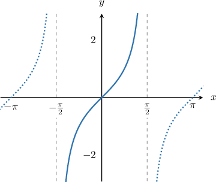
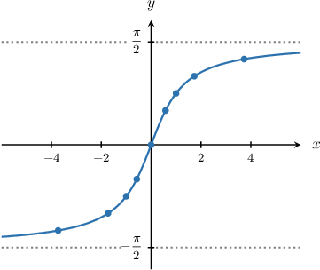
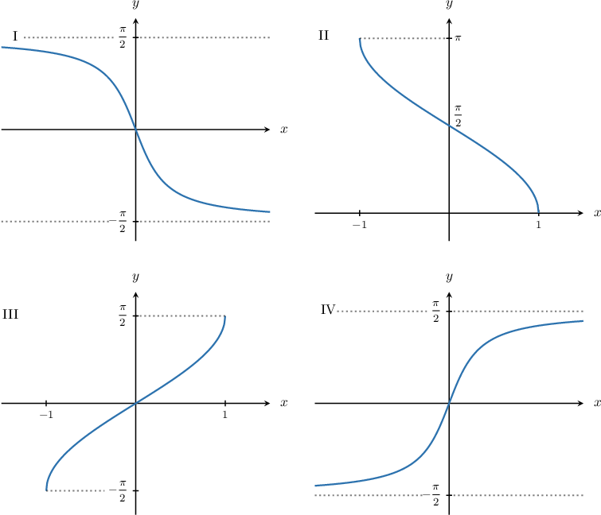
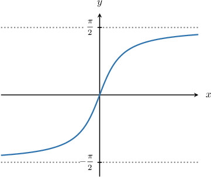

# Graphing the Inverse Tangent Function

Source: https://www.mathacademy.com/topics/1487?courseId=101
Topic ID: 1487

## Prerequisites

- [Graphing Tangent and Cotangent](../algebra-ii/1493-graphing-tangent-and-cotangent.md)
- [Invertible Functions](../algebra-ii/1889-invertible-functions.md)
- [Domain and Range of Inverse Functions](../algebra-ii/3734-domain-and-range-of-inverse-functions.md)

## Lesson

### Introduction

How do we plot the graph of $y=\arctan x?$ As usual, we can use a table of known values.

In order to determine these known values, let's first look at the graph of the tangent function.

We see the tangent function is a one-to-one function on the interval $x\in\left(-\dfrac{\pi}{2}, \dfrac{\pi}{2}\right)\!.$ So if we restrict the domain to this interval, we can define the inverse function $y=\arctan x.$

Remember that the inverse swaps the domain and range of the original function. So the domain of $y=\arctan x$ is $x\in (-\infty, \infty),$ while the range is $y \in\left(-\dfrac{\pi}{2}, \dfrac{\pi}{2}\right)\!.$ In the domain, we create a table of values:

Now, we can graph a sketch of the inverse tangent function:

Some key characteristics of the graph are:

- The domain is all real numbers.

- There is a zero at $x=0.$

- The function is negative over $(-\infty, 0)$ and positive over $(0, \infty).$

- The function is strictly increasing in its entire domain.

- $y\to-\dfrac \pi 2$ (from above) as $x\to-\infty.$

- $y\to\dfrac \pi 2$ (from below) as $x\to\infty.$

- The lines $y=\pm\dfrac \pi 2$ are horizontal asymptotes of the function.

**Watch out!** Notice that the function $y=\arctan x$ never reaches the value $-\dfrac \pi 2$ as $x\to-\infty.$ So, there is *no* minimum value. Similarly, the function never reaches the value $\dfrac \pi 2$ as $x\to\infty.$ So, there is *no* maximum value.

### Example: Graphing the Inverse Tangent Function

#### Question

Which of the following plots is the graph of $y=\arctan x?$

#### Explanation

Let's recall some of the basic properties of $y=\arctan x.$

- The domain is all real numbers.

- There is a zero at $x=0.$

- The function is negative over $(-\infty, 0)$ and positive over $(0, \infty).$

- The function is strictly increasing in its entire domain.

- $y\to-\dfrac \pi 2$ (from above) as $x\to-\infty.$

- $y\to\dfrac \pi 2$ (from below) as $x\to\infty.$

- The lines $y=\pm\dfrac \pi 2$ are horizontal asymptotes of the function.

Of the given functions, the only one that has all of these properties is IV.

### Example: Identifying Values in the Domain of the Inverse Tangent Function

#### Question

Which of the following values lies in the domain of $y = \arctan x?$

1. $2\pi$

2. $-1$

3. $0$

#### Explanation

Let's recall the graph of $y=\arctan x.$

Note that the function is defined for all real numbers.

Therefore, all the given values are in the domain of $y=\arctan x.$

### Example: Identifying Values in the Range of the Inverse Tangent Function

#### Question

Which of the following values is in the range of $y=\arctan x?$

1. $\dfrac \pi 2$

2. $\dfrac \pi 4$

3. $-\dfrac \pi 3$

#### Explanation

Let's recall the graph of $y=\arctan x.$

Note that the range of the function is $y\in\left(-\dfrac\pi 2, \dfrac \pi 2\right).$

Therefore, the values $\dfrac\pi 4$ and $-\dfrac \pi 3$ are in the range of $y=\arctan x.$ However, $y=\dfrac\pi 2$ is ** in the range of $y=\arctan x.$

So the correct answer is "II and III only."

### Example: Determining Points that Lie on the Graph of the Inverse Tangent Function

#### Question

Which of the following points lies on the graph of the function $y=\arctan x?$

1. $\left(\dfrac\pi 3,\sqrt 3\right)$

2. $\left(0, \pi\right)$

3. $\left(0,0\right)$

#### Explanation

In order for a point $(a,b)$ to lie on the graph of the function $y=\arctan x,$ the following conditions must hold:

- The reflected point $(b,a)$ must lie on the graph of $y=\tan x.$

- The $y$-value of the point must lie in the range of $y=\arctan x,$ which is $y\in \left(-\dfrac{\pi}{2},\dfrac{\pi}{2}\right).$

With this in mind, let's check each of the points.

- First, we consider the point $\left(\dfrac\pi 3,\sqrt 3\right).$ We note the following: The point $\left(\sqrt 3,\dfrac{\pi}{3}\right)$ does **** lie on the graph of $y=\tan x.$ $\quad{\color{red}{\times}}$ Therefore, the point $\left(\dfrac\pi 3,\sqrt 3\right)$ does **** lie on the graph of $y=\arctan x.$

- Next, we consider the point $\left(0,\pi\right).$ We note the following: The point $\left(\pi,0\right)$ lies on the graph of $y=\tan x.\quad{\color{green}{\checkmark}}$ The range of $y=\arctan x$ is $y\in \left(-\dfrac{\pi}{2},\dfrac{\pi}{2}\right),$ and $y=\pi$ does not lie within this range. $\quad{\color{red}{\times}}$ Therefore, the point $\left(\pi, 0\right)$ does **** lie on the graph of $y=\arctan x.$

- Finally, we consider the point $\left(0,0\right).$ We note the following: The point $\left(0,0\right)$ lies on the graph of $y=\tan x.\quad{\color{green}{\checkmark}}$ The range of $y=\arctan x$ is $y\in \left(-\dfrac{\pi}{2},\dfrac{\pi}{2}\right),$ and $y=0$ lies within this range. $\quad{\color{green}{\checkmark}}$ Therefore, the point $\left(0,0\right)$ lies on the graph of $y=\arctan x.$
