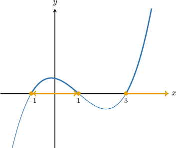
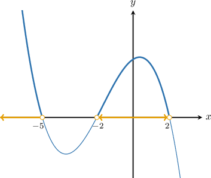
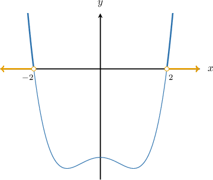
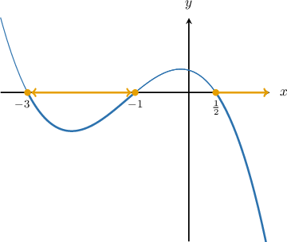

# Solving Polynomial Inequalities Using Special Factoring Techniques and the Graphical Method

Source: https://www.mathacademy.com/topics/1494?courseId=101
Topic ID: 1494

## Prerequisites

- [Solving Biquadratic Equations](../algebra-ii/481-solving-biquadratic-equations.md)
- [The Rational Roots Theorem](./757-the-rational-roots-theorem.md)
- [Solving Polynomial Inequalities Using a Graphical Method](./2147-solving-polynomial-inequalities-using-a-graphical-method.md)

## Lesson

### Introduction

Sometimes, when we want to solve polynomial inequalities using the graphical method, we need to apply special factoring techniques to plot the polynomial. Specifically, the techniques that we might want to apply are:

- factoring by grouping

- the biquadratic factoring method

- the rational roots theorem

For instance, suppose we want to solve the inequality $f(x) \geq 0,$ where $f(x) = x^3 -3x^2 -x +3.$

First, we factor the polynomial $f(x).$ In this case, we can factor the polynomial by grouping:

$$

\begin{aligned}𝑓(𝑥) & =𝑥^{3}−3𝑥^{2}−𝑥+3 \\ & =(𝑥^{3}−3𝑥^{2})−(𝑥−3) \\ & =𝑥^{2}(𝑥−3)−(𝑥−3) \\ & =(𝑥^{2}−1)(𝑥−3) \\ & =(𝑥+1)(𝑥−1)(𝑥−3)\end{aligned}

$$

The roots of the polynomial are $x=-1,$ $x=1,$ and $x=3,$ which are all simple roots.

So, we can graph the curve as follows:

Since we are interested in solving $f(x) \geq0,$ we look for the part of the curve that is above the $x$-axis or touches this axis.

Based on the graph, the solution is

$$

x \in [-1, 1] \cup [3, \infty).

$$

### Example: Solving a Polynomial Inequality Using Grouping

#### Question

Given that $f(x) = -x^3 - 5x^2 + 4x + 20,$ solve $f(x) > 0.$

#### Explanation

To solve the inequality $f(x) > 0,$ we need to find the values of $x$ for which the curve $y=f(x)$ lies above the $x$-axis.

First, we factor the polynomial $f(x){:}$

$$

\begin{aligned}𝑓(𝑥) & =−𝑥^{3}−5𝑥^{2}+4𝑥+20 \\ & =−[𝑥^{3}+5𝑥^{2}−4𝑥−20] \\ & =−[𝑥^{2}(𝑥+5)−4(𝑥+5)] \\ & =−[(𝑥^{2}−4)(𝑥+5)] \\ & =−(𝑥+2)(𝑥−2)(𝑥+5)\end{aligned}

$$

The roots of the polynomial are $x=-5,$ $x=-2$ and $x=2,$ which are all simple roots.

So, we can graph the curve as follows:

Since we are interested in solving $f(x) > 0,$ we look for the part of the curve that is above the $x$-axis.

Based on the graph, the solution is

$$

x \in (-\infty, -5) \cup (-2,2).

$$

### Example: Solving a Biquadratic Inequality

#### Question

Given that $P(x) = x^4 - 8,$ solve $P(x) \gt 2x^2.$

#### Explanation

To solve this inequality, we first need to move all of the terms to the left-hand side so that the right-hand side is $0.$

$$

\begin{aligned}𝑃(𝑥) & >2𝑥^{2} \\ 𝑥^{4}−8 & >2𝑥^{2} \\ 𝑥^{4}−2𝑥^{2}−8 & >0\end{aligned}

$$

To solve the inequality $P(x) \gt 2x^2,$ we solve the equivalent problem $f(x) \gt 0,$ where $f(x) = x^4 - 2x^2 - 8.$ To do this, we need to find the values of $x$ for which the curve $y = f(x)$ lies above the $x$-axis.

We factor the polynomial $f(x),$ as follows:

$$

\begin{aligned}𝑓(𝑥) & =𝑥^{4}−2𝑥^{2}−8 \\ & =𝑥^{4}−4𝑥^{2}+2𝑥^{2}−8 \\ & =𝑥^{2}(𝑥^{2}−4)+2(𝑥^{2}−4) \\ & =(𝑥^{2}+2)(𝑥^{2}−4) \\ & =(𝑥^{2}+2)(𝑥+2)(𝑥−2)\end{aligned}

$$

The roots of the polynomial $f(x) = x^4 - 2x^2 - 8$ are $x = \pm{2},$ which are all simple roots.

Next, we graph the curve $y=f(x)$.

Since we are interested in solving $f(x) \gt 0,$ we look for the part of the curve that is above the $x$-axis.

Based on the graph, the solution is

$$

x \in (-\infty,-2) \cup (2,\infty).

$$

### Example: Solving a Polynomial Inequality Using the Rational Roots Theorem

#### Question

Let $P(x) =- 2 x^3 - 7 x^2 - 2 x + 3$. Given that $P(x)$ has at least one integer root, solve $P(x) \leq 0$.

#### Explanation

To solve the inequality $P(x) \leq 0,$ we need to find the values of $x$ for which the curve $y=P(x)$ lies below the $x$-axis or touches this axis.

First, we factor the polynomial $P(x).$ We can do this using the rational roots theorem. According to this theorem, the possible rational roots of $P(x)$ are

$$

\pm \dfrac{1}{2} , \pm \dfrac{3}{2}, \pm 1 , \pm 3 .

$$

We're given that the polynomial has at least one integer root, and so the list of possible integer roots is

$$

\pm 1, \pm 3.

$$

Let's now test each of the above options until we find a root:

$$

\begin{aligned}𝑃(1) & =−2(1)^{3}−7(1)^{2}−2(1)+3−8\,× \\ 𝑃(−1) & =−2(−1)^{3}−7(−1)^{2}−2(−1)+3=0\,✓\end{aligned}

$$

Therefore $x=-1$ is a root of $P(x),$ and so $(x+1)$ is a factor of $f(x)$ by the factor theorem.

Now, let's use synthetic division to factor $P(x).$ We get the following:

Therefore,

$$

\begin{aligned}𝑃(𝑥) & =(𝑥+1)(−2𝑥^{2}−5𝑥+3) \\ & =−(𝑥+1)(2𝑥^{2}+5𝑥−3).\end{aligned}

$$

Since the highest-degree factor is now quadratic, we can continue factoring using the usual methods. This gives

$$

P(x) =-(x+1)(2x-1)(x+3).

$$

Therefore, we have $3$ simple roots, $x=-3,-1,\dfrac{1}{2}.$

So, we can graph the curve as follows:

Since $P(x) \leq 0$ when the curve $y=P(x)$ is below $x$-axis or touches this axis, the solution is

$$

x \in [-3,-1] \cup \left[\dfrac{1}{2}, \infty \right).

$$
