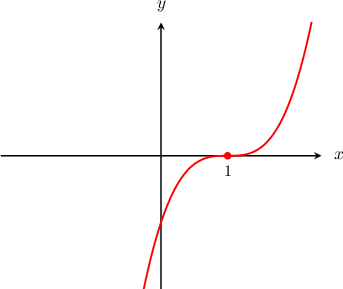
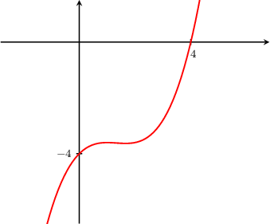
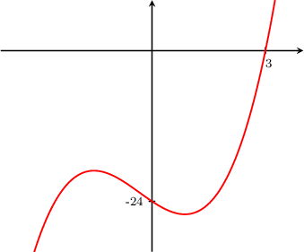
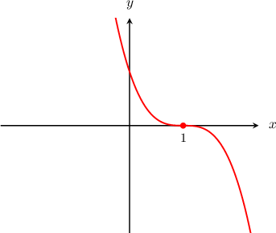
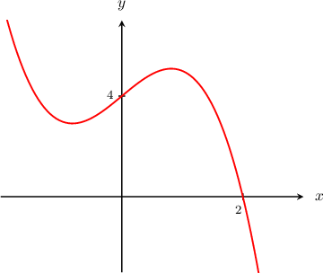
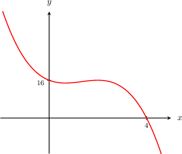

# Graphing Cubic Curves Containing One Distinct Real Root

Source: https://www.mathacademy.com/topics/2084?courseId=101
Topic ID: 2084

## Prerequisites

- [Graphing Cubic Curves Containing a Double Root](./1656-graphing-cubic-curves-containing-a-double-root.md)

## Lesson

### Introduction

The graph of any cubic function $y = f(x)= ax^3 + bx^2 + cx +d,$ where $a >0,$ has a characteristic inverted ${\textsf{S}}$-shape, with $y$-values ranging from $-\infty$ to $+\infty.$ This means that every such function has at least one real root and at most three distinct roots.

For instance, suppose that we want to plot the graph of $y = x^3-3x^2 +3x-1.$ First, we need to find the roots, so we set $y=0$ and solve. Noting that the polynomial is a perfect cube, we find

$$

\begin{aligned}𝑥^{3}−3𝑥^{2}+3𝑥−1 & =0 \\ (𝑥−1)^{3} & =0.\end{aligned}

$$

So we get one real root $x=1,$ which has multiplicity $3.$

At a root of multiplicity $3,$ the graph becomes **tangent** (i.e., lies parallel) to the $x$-axis and crosses the $x$-axis.

Therefore, the graph looks as follows:

### Example: Graphing a Factored Cubic Curve with a Positive Leading Coefficient

#### Question

Sketch the curve $f(x) = \dfrac{1}{5}(x-4)(x^2 + 5).$

#### Explanation

The equation is already fully factored. Note that the discriminant of $x^2 + 5 = 0$ is

$$

\mathcal{D}= 0^2 - 4(1)(5) = -20 < 0,

$$

which implies that the quadratic factor has no real roots. So by the zero-product rule, we deduce that the function $f(x)$ has a single root at $x=4.$

We also find the $y$-intercept of the curve by plugging the value $x=0$ into the equation:

$$

\begin{aligned}𝑦 & =\frac{1}{5}(0−4)(0^{2}+5) \\ & =\frac{1}{5}(−4)(5) \\ & =−4\end{aligned}

$$

So, the curve:

- has a $y$-intercept at the point $(0,-4),$

- passes through the $x$-axis at the single root $x=4,$ and

- has no more $x$-intercepts.

Because the leading coefficient is positive, the graph takes an inverted ${\textsf{S}}$-shape. Therefore, the graph looks as follows:

### Example: Graphing an Expanded Cubic Curve with a Positive Leading Coefficient

#### Question

Given that $(x-3)$ is a factor of $f(x) = x^3 + x^2 - 4x - 24,$ sketch the curve $y = f(x).$

#### Explanation

First, we need to factor the polynomial. We are told that $(x-3)$ is a factor of $f(x),$ so $(x-3)$ divides $f(x)$ with zero remainder. To begin factoring $f(x),$ we can divide it by $(x-3)$ using synthetic division:

$$

\begin{aligned} & 𝑥^{3} & 𝑥^{2} & 𝑥^{1} & 𝑥^{0} \\ 3 & 1 & 1 & −4 & −24 \\ & & 3 & 12 & 24 \\ & 1 & 4 & 8 & 0\end{aligned}

$$

Therefore,

$$

\dfrac{f(x)}{x-3} = x^2 + 4x + 8,

$$

which means that

$$

f(x) = (x-3)(x^2 + 4x + 8).

$$

The equation is now fully factored. Note that the discriminant of $x^2 + 4x + 8 = 0$ is

$$

\mathcal{D}= 4^2 - 4(1)(8) = -16 < 0,

$$

which implies that the quadratic factor has no real roots. So by the zero-product rule, we deduce that $f(x)$ has a single root at $x=3.$

We also find the $y$-intercept of the curve by substituting the value $x=0$ into the equation:

$$

\begin{aligned}𝑦 & =0^{3}+0^{2}−4(0)−24=−24.\end{aligned}

$$

So, the curve:

- has a $y$-intercept at $(0,-24),$

- passes through the $x$-axis at the single root $x=3,$ and

- has no more $x$-intercepts.

Because the leading coefficient is positive, the graph takes an inverted ${\textsf{S}}$-shape. Therefore, the graph looks as follows (figure not to scale):

### Negative Cubic Curves With Only One Distinct Real Root

The graph of any cubic function $y = f(x)= ax^3 + bx^2 + cx +d,$ where $a <0,$ has a characteristic ${\textsf{S}}$-shape, with $y$-values ranging from $+\infty$ to $-\infty.$

For instance, suppose that we want to plot the graph of $y = -x^3+3x^2 -3x+1.$ First, we need to find the roots, so we set $y=0$ and solve. Noting that the polynomial is a perfect cube, we find

$$

\begin{aligned}−𝑥^{3}+3𝑥^{2}−3𝑥+1 & =0 \\ (−𝑥+1)^{3} & =0 \\ −(𝑥−1)^{3} & =0.\end{aligned}

$$

So we get one real root $x=1,$ which has multiplicity $3.$

At a root of multiplicity $3,$ the graph becomes tangent to the $x$-axis and crosses the $x$-axis. Therefore, the graph looks as follows:

### Example: Graphing a Factored Cubic Curve with a Negative Leading Coefficient

#### Question

Sketch the curve $f(x) = -(x-2)(x^2 + 2x + 2).$

#### Explanation

The equation is already fully factored. Note that the discriminant of $x^2 + 2x + 2 = 0$ is

$$

\mathcal{D}= 2^2 - 4(1)(2) = -4 < 0,

$$

which implies that the quadratic factor has no real roots. So by the zero-product rule, we deduce that the function $f(x)$ has a single root at $x=2.$

We also find the $y$-intercept of the curve by plugging the value $x=0$ into the equation:

$$

\begin{aligned}𝑦 & =−(0−2)(0^{2}+2(0)+2) \\ & =−(−2)(2) \\ & =4\end{aligned}

$$

So, the curve:

- has a $y$-intercept at the point $(0,4),$

- passes through the $x$-axis at the single root $x=2,$ and

- has no more $x$-intercepts.

Because the leading coefficient is negative, the graph has an ${\textsf{S}}$-shape. Therefore, the graph looks as follows (figure not to scale):

### Example: Graphing an Expanded Cubic Curve with a Negative Leading Coefficient

#### Question

Given that $(x-4)$ is a factor of $f(x) = -x^3 + 4x^2 - 4x + 16,$ sketch the curve $y=f(x).$

#### Explanation

First, we need to factor the polynomial. We are told that $(x-4)$ is a factor of $f(x),$ so $(x-4)$ divides $f(x)$ with zero remainder. To begin factoring $f(x),$ we can divide it by $(x-4)$ using synthetic division:

$$

\begin{aligned} & 𝑥^{3} & 𝑥^{2} & 𝑥^{1} & 𝑥^{0} \\ 4 & −1 & 4 & −4 & 16 \\ & & −4 & 0 & −16 \\ & −1 & 0 & −4 & 0\end{aligned}

$$

Therefore,

$$

\begin{aligned}\frac{𝑓(𝑥)}{𝑥−4} & =−𝑥^{2}−4 \\ & =−(𝑥^{2}+4),\end{aligned}

$$

which means that

$$

f(x) = -(x-4)(x^2 + 4).

$$

The equation is now fully factored. Note that the discriminant of $x^2 + 4 = 0$ is

$$

\mathcal{D} = 0^2 - 4(1)(4) = - 16 < 0,

$$

which implies that the quadratic factor has no real roots. So by the zero-product rule, we deduce that $f(x)$ has a single root at $x=4.$

We also find the $y$-intercept of the curve by substituting the value $x=0$ into the equation:

$$

y = -(0)^3 + 4(0)^2 - 4(0) + 16 = 16

$$

So, the curve:

- has a $y$-intercept at $(0,16),$

- passes through the $x$-axis at the single root $x=4,$ and

- has no more $x$-intercepts.

Because the leading coefficient is negative, the graph has an ${\textsf{S}}$-shape. Therefore, the graph looks as follows (figure not to scale):

