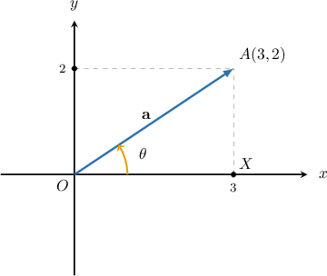
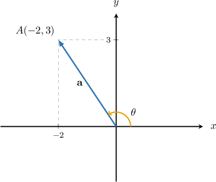
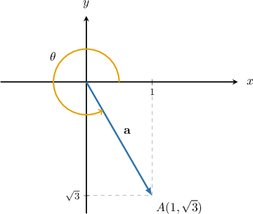
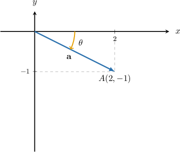

# Calculating the Direction of Cartesian Vectors in 2D

Source: https://www.mathacademy.com/topics/241?courseId=101
Topic ID: 241

## Prerequisites

- [Addition and Scalar Multiplication of Cartesian Vectors in 2D](./244-addition-and-scalar-multiplication-of-cartesian-vectors-in-2d.md)
- [General Solutions of Elementary Trigonometric Equations](./1258-general-solutions-of-elementary-trigonometric-equations.md)

## Lesson

### Introduction

Consider the vector $\mathbf{a}=\langle 3,2 \rangle$ shown below.

The angle ${\color{blue}\theta}$ is the angle that the vector $\mathbf{a}$ makes with the **positive $x$-axis**.

Now, from $\triangle OXA,$ we have that

$$

\begin{aligned}tan⁡𝜃 & =\frac{|𝑋𝐴|}{|𝑂𝑋|} \\ & =\frac{𝑎_{𝑦}}{𝑎_{𝑥}} \\ & =\frac{2}{3}.\end{aligned}

$$

### Finding the Angle Between a Vector in the First Quadrant and the Positive x-Axis

In general, for any vector $\mathbf{a} = \left< a_x, a_y \right>,$ the angle $\theta$ that the vector makes with the positive $x$-axis satisfies the equation

$$

\tan \theta = \dfrac{a_y}{a_x}.

$$

When the vector $\mathbf{a}$ lies in the $1$st quadrant, the desired solution to the above equation is just the principal value:

$$

\theta = \arctan\left(\dfrac{a_y}{a_x}\right)

$$

### Example: Finding the Angle Between a Vector in the First Quadrant and the Positive x-Axis

#### Question

Find the angle that the vector $\mathbf{a}=\langle 1,3 \rangle$ makes with the positive $x$-axis. Round your answer to $1$ decimal place.

#### Explanation

The angle $\theta$ that the vector makes with the positive $x$-axis satisfies the equation

$$

\begin{aligned}tan⁡𝜃 & =\frac{𝑎_{𝑦}}{𝑎_{𝑥}} \\ & =\frac{3}{1} \\ & =3.\end{aligned}

$$

Since the vector lies in the $1$st quadrant, the desired solution to the above equation is just the principal value:

$$

\begin{aligned}𝜃 & =arctan⁡(3) \\ & ≈71.6^{∘}\end{aligned}

$$

### The Angle Between a Vector in the Second, Third, or Fourth Quadrant and the Positive x-Axis

We know that for any vector $\mathbf{a} = \left< a_x, a_y \right>,$ the angle $\theta$ that the vector makes with the positive $x$-axis satisfies the equation

$$

\tan \theta = \dfrac{a_y}{a_x}.

$$

When the vector $\mathbf{a}$ lies in a quadrant other than the $1$st quadrant, we have to find a solution to the above equation that is in the desired range of values.

The general solution to the above equation is

$$

\theta = \arctan \left( \dfrac{a_y}{a_x} \right) + n \cdot 180^\circ,

$$

where $n$ is any integer.

- If $\mathbf{a}$ is in the $2$nd or $3$rd quadrant, then the angle between $\mathbf{a}$ and the positive $x$-axis is

- If $\mathbf{a}$ is in the $4$th quadrant, then the angle between $\mathbf{a}$ and the positive $x$-axis is

### Example: Finding the Angle Between a Vector in the Second or Third Quadrant and the Positive x-Axis

#### Question

Find the angle that the vector $\mathbf{a}=\langle -2, 3 \rangle$ makes with the positive $x$-axis. Round your answer to $1$ decimal place.

#### Explanation

We want the angle $\theta$, as shown below. Note that the vector lies in the $2$nd quadrant.

Applying the formula for the angle that a vector makes with the positive $x$-axis, we have the equation

$$

\begin{aligned}tan⁡𝜃 & =\frac{𝑎_{𝑦}}{𝑎_{𝑥}} \\ & =\frac{3}{−2} \\ & =−\frac{3}{2}.\end{aligned}

$$

The solutions of this equation are

$$

\begin{aligned}𝜃 & =arctan⁡(−\frac{3}{2})+𝑛⋅180^{∘} \\ & ≈−56.3^{∘}+𝑛⋅180^{∘},\end{aligned}

$$

where $n$ is any integer.

In this case, our vector is located in the $2$nd quadrant, so we want a solution $90^\circ < \theta < 180^\circ.$

To get a solution in the desired range, we choose $n=1$ and get

$$

\begin{aligned}𝜃 & ≈−56.3^{∘}+180^{∘} \\ & =123.7^{∘}.\end{aligned}

$$

### Example: Finding the Angle Between a Vector in the Fourth Quadrant and the Positive x-Axis

#### Question

Find the angle that the vector $\mathbf{a} = \left< 1, -\sqrt{3} \right>$ makes with the positive $x$-axis.

#### Explanation

We want the angle $\theta$, as shown below. Note that the vector lies in the $4$th quadrant.

Applying the formula for the angle that a vector makes with the positive $x$-axis, we have the equation

$$

\begin{aligned}tan⁡𝜃 & =\frac{𝑎_{𝑦}}{𝑎_{𝑥}} \\ & =\frac{−\sqrt{√3}}{1} \\ & =−\sqrt{√3}.\end{aligned}

$$

The solutions of this equation are

$$

\begin{aligned}𝜃 & =arctan⁡(−\sqrt{√3})+𝑛⋅180^{∘} \\ & ≈−60^{∘}+𝑛⋅180^{∘},\end{aligned}

$$

where $n$ is any integer.

In this case, our vector is located in the $4$th quadrant, so we want a solution $270^\circ < \theta < 360^\circ.$

To get a solution in the desired range, we choose $n=2$ and get

$$

\begin{aligned}𝜃 & ≈−60^{∘}+360^{∘} \\ & =300^{∘}.\end{aligned}

$$

### Example: Finding the Smallest Angle Between a Vector and the Positive y-Axis

#### Question

Find the smallest angle that the vector $\mathbf{a}=\langle 2, -1 \rangle$ makes with the ****. Round your answer to $1$ decimal place.

#### Explanation

First, we need to find the angle $\theta$ that the vector $\mathbf{a}$ makes with the positive $x$-axis. Applying the usual formula, we obtain the equation

$$

\tan\theta = \dfrac{a_y}{a_x} = \dfrac{-1}{2} = -\dfrac{1}{2}.

$$

The solutions of this equation are

$$

\begin{aligned}𝜃 & =arctan⁡(−\frac{1}{2})+𝑛⋅180^{∘} \\ & ≈−26.6^{∘}+𝑛⋅180^{∘},\end{aligned}

$$

where $n$ is any integer.

In this case, our vector is located in the $4$th quadrant. Choosing $n=0$, we get

$$

\begin{aligned}𝜃 & ≈−26.6^{∘}.\end{aligned}

$$

Finally, to find the angle $\theta'$ that the vector $\mathbf{a}$ makes with the positive $y$-axis, we add $90^\circ$ to the absolute value of the angle. This gives

$$

\begin{aligned}𝜃^{′} & =|𝜃|+90^{∘} \\ & =26.6^{∘}+90^{∘} \\ & =116.6^{∘}.\end{aligned}

$$
