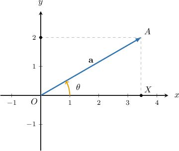
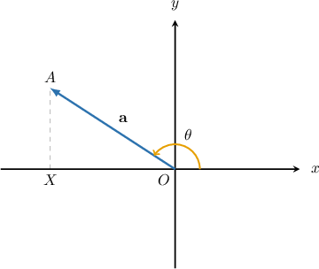

# Calculating the Components of Cartesian Vectors in 2D

Source: https://www.mathacademy.com/topics/242?courseId=101
Topic ID: 242

## Prerequisites

- [Two-Dimensional Vectors Expressed in Component Form](./1165-two-dimensional-vectors-expressed-in-component-form.md)

## Lesson

### Introduction

Let $\mathbf{a}$ be the vector shown below. Suppose we know that it makes the angle $\theta=30^\circ$ with the positive $x$-axis and has magnitude $|\mathbf{a}|=4.$ How can we find the components of $\mathbf{a}?$

The trick is to use trigonometry to solve for the legs of the right triangle $\triangle OXA.$ In this triangle, the hypotenuse is given by $|\mathbf{a}| = OA,$ and if $\mathbf{a} = a_x \mathbf{i} + a_y \mathbf{j},$ then the legs of the triangle are

$$

a_x = OX, \qquad a_y = XA.

$$

First, we compute for $a_x$ using cosine:

$$

\begin{aligned}𝑎_{𝑥} & =𝑂𝑋 \\ & =𝑂𝐴cos⁡𝜃 \\ & =|𝐚|cos⁡𝜃 \\ & =4⋅cos⁡30^{∘} \\ & =4⋅\frac{\sqrt{√3}}{2} \\ & =2\sqrt{√3}\end{aligned}

$$

Then, we compute for $a_y$ using sine:

$$

\begin{aligned}𝑎_{𝑦} & =𝑋𝐴 \\ & =𝑂𝐴sin⁡𝜃 \\ & =|𝐚|sin⁡𝜃 \\ & =4⋅sin⁡30^{∘} \\ & =4⋅\frac{1}{2} \\ & =2\end{aligned}

$$

Therefore,

$$

\begin{aligned}𝐚 & =𝑎_{𝑥}𝐢+𝑎_{𝑦}𝐣 \\ & =2\sqrt{√3}𝐢+2𝐣.\end{aligned}

$$

### Example: Finding the Magnitude of the Components of a Vector When Given Graphically

#### Question

The vector $\mathbf{a}$ makes the angle $\theta=147^\circ$ with the positive $x$-axis, as shown below. Find the length of $XO$ given that $|\mathbf{a}|=3$. Round your answer to $1$ decimal place.

#### Explanation

In $\bigtriangleup OXA$, the measure of $\angle{XOA}$ can be found as

$$

\begin{aligned}𝑚∠𝑋𝑂𝐴 & =180^{∘}−𝜃 \\ & =180^{∘}−147^{∘} \\ & =33^{∘}.\end{aligned}

$$

Therefore,

$$

\begin{aligned}𝑋𝑂 & =𝑂𝐴cos⁡(𝑚∠𝑋𝑂𝐴) \\ & =|𝐚|cos⁡(33^{∘}) \\ & ≈3⋅0.839 \\ & ≈2.5.\end{aligned}

$$

### General Formula

If a vector $\mathbf{a}$ makes the angle $\theta$ with the positive $x$-axis then

$$

\begin{aligned} & 𝑎_{𝑥}=|𝐚|cos⁡𝜃 \\ & 𝑎_{𝑦}=|𝐚|sin⁡𝜃\end{aligned}

$$

and

$$

\mathbf{a} = \langle a_x, a_y \rangle = \langle |\mathbf{a}| \cos\theta, |\mathbf{a}| \sin\theta \rangle .

$$

### Example: Finding the Components of a Vector Given Its Magnitude and Direction

#### Question

Find the components of $\mathbf{a}$ if it makes an angle $\theta=-31^\circ$ with the positive $x$-axis and $|\mathbf{a}|=12$. Round your answer to $1$ decimal place where appropriate.

#### Explanation

Note that our vector lies in the $4$th quadrant. Using basic trigonometry, we obtain:

$$

\begin{aligned}𝑎_{𝑥} & =|𝐚|cos⁡𝜃 \\ & =12cos⁡(−31^{∘}) \\ & ≈12⋅0.857 \\ & ≈10.3 \\ 𝑎_{𝑦} & =|𝐚|sin⁡𝜃 \\ & =12sin⁡(−31^{∘}) \\ & ≈12⋅(−0.515) \\ & ≈−6.2\end{aligned}

$$

Therefore, we get

$$

[\begin{aligned}10.3 \\ −6.2\end{aligned}]

$$

### Example: Finding the Components of a Vector Given Its Magnitude and Angle Made With the y-Axis

#### Question

Find the components of $\mathbf{a}$ if it makes an angle $\theta=\dfrac{\pi}{3}$ with the ** and $|\mathbf{a}|=60$.

#### Explanation

Note that our vector lies in the $2$nd quadrant.

First, to find the angle that out vector makes with the positive $x$-axis, we add $\dfrac{\pi}{2}\mathbin{:}$

$$

\theta = \dfrac{\pi}{3} + \dfrac{\pi}{2} = \dfrac{5\pi}{6}

$$

Using our formulas, we obtain:

$$

\begin{aligned}𝑎_{𝑥} & =|𝐚|cos⁡𝜃 \\ & =60cos⁡(\frac{5𝜋}{6}) \\ & =60⋅(−\frac{\sqrt{√3}}{2}) \\ & =−30\sqrt{√3} \\ 𝑎_{𝑦} & =|𝐚|sin⁡𝜃 \\ & =60sin⁡(\frac{5𝜋}{6}) \\ & =60⋅\frac{1}{2} \\ & =30\end{aligned}

$$

Therefore, we get

$$

[\begin{aligned}−30\sqrt{√3} \\ 30\end{aligned}]

$$
