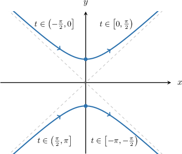
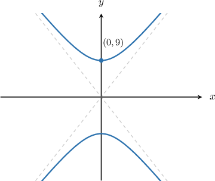
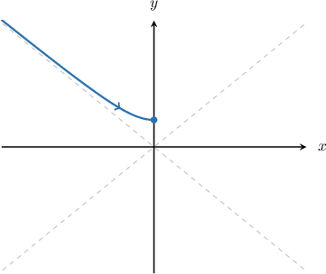
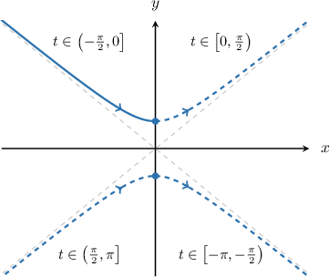

# Parametric Equations of Vertical Hyperbolas

Source: https://www.mathacademy.com/topics/2981?courseId=101
Topic ID: 2981

## Prerequisites

- [Asymptotes of Hyperbolas Centered at the Origin](./872-asymptotes-of-hyperbolas-centered-at-the-origin.md)
- [Cartesian Equations of Parametric Curves](./1255-cartesian-equations-of-parametric-curves.md)

## Lesson

### Introduction

The parametric equations of a vertical hyperbola centered at the origin with Cartesian equation

$$

\dfrac{y^2}{a^2} - \dfrac{x^2}{b^2} = 1

$$

are given by

$$

x=b\tan{t},\quad y=a\sec{t},

$$

where $a$ and $b$ are constants. The domain of the parameter $t$ is

$$

t\in[-\pi,\pi],\qquad t\neq \pm \frac{\pi}{2}.

$$

The branches corresponding to different values of $t$ are shown in the diagram below.

This parametrization contains discontinuities at $t=\pm\dfrac{\pi}{2}.$ One consequence of this is that the curve appears to "jump" between different quadrants at the singular points.

For the most part, we won't worry too much about the domain of $t.$ However, it does become important when we're parametrizing part of a hyperbola, which we'll deal with later.

**Note:** To understand where this parametrization comes from, recall the trigonometric identity

$$

1 + \tan^2 t = \sec^2 t.

$$

Rearranging, we get

$$

\sec^2 t - \tan^2 t =1,

$$

which means

$$

\begin{aligned}sec^{2}⁡𝑡 & =\frac{𝑦^{2}}{𝑎^{2}}\,⇒\,𝑦=𝑎sec⁡𝑡 \\ tan^{2}⁡𝑡 & =\frac{𝑥^{2}}{𝑏^{2}}\,⇒\,𝑥=𝑏tan⁡𝑡.\end{aligned}

$$

### Example: Finding the Parametric Equations of a Vertical Hyperbola Given Algebraically

#### Question

What are the parametric equations of the hyperbola $\dfrac{y^2}{9} - \dfrac{x^2}{25} = 1?$

#### Explanation

The parametric equations of a vertical hyperbola centered at the origin with Cartesian equation

$$

\frac{y^2}{a^2} - \frac{x^2}{b^2} = 1

$$

are given by

$$

x = b\tan{t}, \quad y = a\sec{t}.

$$

In our case, $a = \sqrt{9} = 3$ and $b = \sqrt{25} = 5.$ Therefore, the parametric equations are

$$

x = 5\tan{t}, \quad y = 3\sec{t}.

$$

### Example: Finding the Parametric Equations of a Vertical Hyperbola Given Graphically

#### Question

Find the parametric equations of the hyperbola shown above given that its asymptotes are $y=\pm 3x.$

#### Explanation

The parametric equations of a vertical hyperbola centered at the origin with Cartesian equation

$$

\dfrac{y^2}{a^2} - \dfrac{x^2}{b^2} = 1

$$

are given by

$$

x=b\tan{t},\quad y=a\sec{t},

$$

where $a$ and $b$ are positive constants.

The vertices of the hyperbola occur at $(0, \pm a).$ From the graph, we have that $(0,9)$ is a vertex of the hyperbola, so $a=9.$

The asymptotes of a vertical hyperbola are $y = \pm \dfrac{a}{b}x.$ In our case, the asymptotes are $y = \pm 3 x,$ and so we have

$$

\begin{aligned}\frac{𝑎}{𝑏} & =3 \\ \frac{9}{𝑏} & =3 \\ 𝑏 & =3.\end{aligned}

$$

Therefore, the parametric equations of the hyperbola are

$$

x=3\tan{t},\quad y=9\sec{t}.

$$

### Proof That the Parametric Equations Describe a Vertical Hyperbola

We've used the fact that the parametric equations of a vertical hyperbola centered at the origin are

$$

x=b\tan{t},\quad y=a\sec{t}.

$$

where $a$ and $b$ are positive constants. Now, we'll demonstrate why this is true.

First, let's make the trigonometric functions the subject of each equation:

$$

\begin{aligned}𝑥 & =𝑏tan⁡𝑡 & ⟹ & & tan⁡𝑡 & =\frac{𝑥}{𝑏}, \\ 𝑦 & =𝑎sec⁡𝑡 & ⟹ & & sec⁡𝑡 & =\frac{𝑦}{𝑎}.\end{aligned}

$$

Now, we recall the secant-tangent identity:

$$

\tan^2{t} + 1 = \sec^2{t}.

$$

Substituting the above into the secant-tangent identity, we get

$$

\begin{aligned}tan^{2}⁡𝑡+1 & =sec^{2}⁡𝑡 \\ (\frac{𝑥}{𝑏})^{2}+1 & =(\frac{𝑦}{𝑎})^{2} \\ \frac{𝑥^{2}}{𝑏^{2}}+1 & =\frac{𝑦^{2}}{𝑎^{2}} \\ \frac{𝑦^{2}}{𝑎^{2}}−\frac{𝑥^{2}}{𝑏^{2}} & =1.\end{aligned}

$$

This is the Cartesian equation of a vertical hyperbola centered at the origin. Therefore, the parametric equations do indeed describe a vertical hyperbola.

### Example: Finding the Cartesian Equation of a Hyperbola Given its Parametric Equations

#### Question

Find the Cartesian equation of the hyperbola $x =2\tan{t}, \, y =3\sec{t}.$

#### Explanation

To find the Cartesian equation of the hyperbola, we need to eliminate the parameter $t.$ We can do this using the secant-tangent Identity.

- Isolating the $\tan{t}$ term in the $x$-equation and squaring, we get

- Isolating the $\sec{t}$ term in the $y$-equation and squaring, we get

Substituting the two equations into the identity $\tan^2{t} + 1 = \sec^2{t}$ and rearranging, we get

$$

\begin{aligned}tan^{2}⁡𝑡+1 & =sec^{2}⁡𝑡 \\ \frac{𝑥^{2}}{4}+1 & =\frac{𝑦^{2}}{9} \\ \frac{𝑦^{2}}{9}−\frac{𝑥^{2}}{4} & =1.\end{aligned}

$$

### Example: Parametrizing Part of a Vertical Hyperbola

#### Question

The quarter-hyperbola above is defined by the parametric equations

$$

x = \sqrt3\tan{t}, \qquad y = \sqrt2\sec{t}.

$$

What is the domain of the parameter $t?$

#### Explanation

The parametric equations of the full hyperbola are

$$

x= \sqrt3 \tan{t}, \quad y = \sqrt2 \sec{t}, \quad t \in [-\pi,\pi], \quad t \neq \pm\dfrac{\pi}2.

$$

To restrict the parameterization to a quarter-hyperbola, we refer to the diagram below.

We can see that if we restrict $t$ to $\left(-\dfrac{\pi}{2}, 0\right]$ we get the required quarter-hyperbola.

Therefore, the parametric equations that describe the required quarter-hyperbola are

$$

x= \sqrt3\tan{t}, \quad y = \sqrt2\sec{t}, \quad t \in \left(-\dfrac{\pi}2,0\right].

$$
