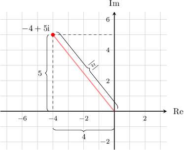

# The Magnitude of a Complex Number

Source: https://www.mathacademy.com/topics/34?courseId=101
Topic ID: 34

## Prerequisites

- [The Complex Plane](./157-the-complex-plane.md)
- [The Distance Formula](../geometry/459-the-distance-formula.md)

## Lesson

### Introduction

The **magnitude** of a complex number is its distance from the origin. It's denoted as $|z|.$

For example, consider the complex number $z=-4+5\textrm{i},$ shown in the complex plane below.

Using the Pythagorean theorem, we obtain

$$

\begin{aligned}|𝑧| & =\sqrt{√(−4)^{2}+(5)^{2}} \\ & =\sqrt{√16+25} \\ & =\sqrt{√41}.\end{aligned}

$$

In general, for a complex number $z=a+b\textrm{i},$ the magnitude of $z$ can be found as follows:

$$

|z| = \sqrt{a^2+b^2}

$$

### Example: Finding the Magnitude of a Complex Number

#### Question

Find $\left|z\right|$ if $z=3 - 4\textrm{i}.$

#### Explanation

For a complex number $z=a+b\textrm{i},$ the magnitude of $z$ is given by

$$

|z| = \sqrt{a^2+b^2} .

$$

For the complex number $z=3-4\textrm{i},$ we have $a=3$ and $b=-4.$ So, the magnitude is given by

$$

\begin{aligned}\begin{aligned}|𝑧| & =\sqrt{√(3)^{2}+(−4)^{2}} \\ & =\sqrt{√9+16} \\ & =\sqrt{√25} \\ & =5.\end{aligned}\end{aligned}

$$

### Example: Finding the Magnitude of a Complex Number With No Real Part

#### Question

What is the magnitude of the number $\textrm{i}\sqrt{2}?$

#### Explanation

The imaginary number $\textrm{i} \sqrt{2}$ is equivalent to the complex number $z = 0 + \sqrt{2} \textrm{i}.$

We know that for a complex number $z=a+b\textrm{i},$ the magnitude of $z$ is given by

$$

|z| = \sqrt{a^2+b^2} .

$$

So, its magnitude of $z=0 + \sqrt{2} \textrm{i}$ is given by

$$

\begin{aligned}|𝑧| & =\sqrt{√𝑎^{2}+𝑏^{2}} \\ & =\sqrt{√(0)^{2}+(\sqrt{√2})^{2}} \\ & =\sqrt{√0+2} \\ & =\sqrt{√2}.\end{aligned}

$$

### Example: Finding the Magnitude of a Complex Number With Variable Coefficients

#### Question

Find $\left|z\right|$ if $z=5c - 9d\textrm{i},$ where $c$ and $d$ are real numbers.

#### Explanation

For a complex number $z=a+b\textrm{i},$ the magnitude of $z$ is given by

$$

|z| = \sqrt{a^2+b^2} .

$$

For the complex number $z=5c - 9d\textrm{i},$ we have $a=5c$ and $b=-9d.$ So, the magnitude is given by

$$

\begin{aligned}\begin{aligned}|𝑧| & =\sqrt{√(5𝑐)^{2}+(−9𝑑)^{2}} \\ & =\sqrt{√25𝑐^{2}+81𝑑^{2}}.\end{aligned}\end{aligned}

$$
