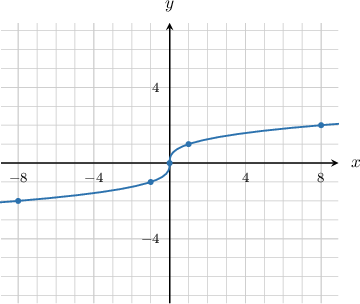
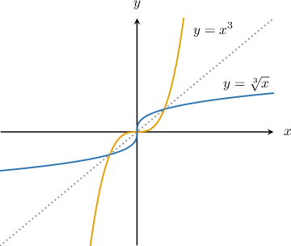
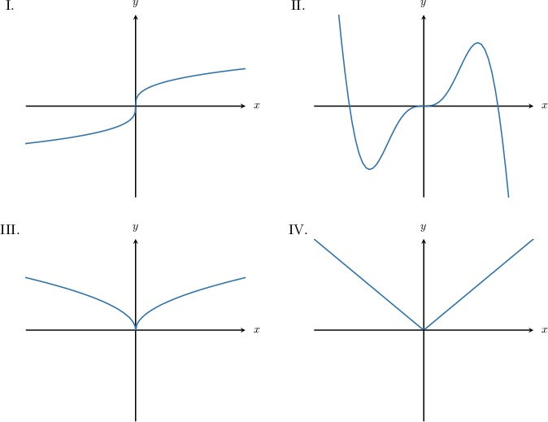
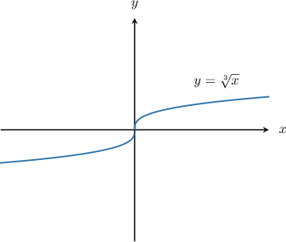

# Graphing the Cube Root Function

Source: https://www.mathacademy.com/topics/454?courseId=101
Topic ID: 454

## Prerequisites

- [Graphing Elementary Cubic Functions](./1653-graphing-elementary-cubic-functions.md)
- [Graphing the Square Root Function](./2038-graphing-the-square-root-function.md)

## Lesson

### Introduction

Suppose we wish to plot the graph of $f(x)=\sqrt[3]{x}.$ First, we create a table of values.

Notice that we included both positive and negative input values since the cube root is defined over all real numbers.

Now, we can plot the graph:

Some key points to note:

- The graph passes through the points $(0,0)$ and $(1,1).$

- Its domain is $x\in (-\infty,\infty).$

- Its range is $y \in (-\infty,\infty).$

- The function is increasing throughout its entire domain.

- As $x \rightarrow \infty,$ we have $y\rightarrow \infty,$ though the function increases more slowly as $x$ gets large.

- As $x \rightarrow -\infty,$ we have $y\rightarrow -\infty,$ though the function decreases more slowly as $x$ becomes very negative.

It is also worth noting that $f(x) =\sqrt[3]{x}$ is an invertible function, and its inverse is

$$

f^{-1}(x) = x^3, \qquad x\in (-\infty,\infty).

$$

The graph of $f(x) = \sqrt[3]{x}$ and its inverse are shown below.

### Example: Identifying the Graph of the Cube Root Function

#### Question

Which of the above could be the graph of $y=\sqrt[3]{x}?$

#### Explanation

Let's recall some of the basic properties of $y=\sqrt[3]{x}{:}$

- The point $(0,0)$ lies on the graph.

- Its domain is $x\in (-\infty,\infty).$

- Its range is $y\in (-\infty,\infty).$

- The graph lies in the first and third quadrants.

- The function is increasing throughout its entire domain.

- As $x \rightarrow \infty,$ we have $y\rightarrow \infty,$ though the function increases more slowly as $x$ gets large.

- As $x \rightarrow -\infty,$ we have $y\rightarrow -\infty,$ though the function decreases more slowly as $x$ becomes very negative.

Of the given options, only graph I has all of the above properties. Therefore, the correct answer is "I only."

### Example: Identifying Properties of the Cube Root Function

#### Question

Which of the following statements are true regarding the function $f(x) =\sqrt[3]{x}?$

1. The point $(64,4)$ lies on the graph of $y=f(x)$

2. The domain of $f(x)$ is $x\in[-1,\infty)$

3. $f(x) \rightarrow -\infty$ as $x \rightarrow -\infty$

#### Explanation

Let's start by recalling the graph of $y=\sqrt[3]{x}.$

Now, let's examine each statement in turn.

- Statement I is true. Indeed, $f(64)=\sqrt[3]{64}=4.$

- Statement II is false since $f(x) =\sqrt[3]{x}$ is defined for $x \in (-\infty, \infty).$

- Statement III is true. Indeed, $f(x) \rightarrow -\infty$ as $x \rightarrow -\infty.$

Therefore, the correct answer is "I and III only."
