# Solving Quadratic Inequalities From Graphs

Source: https://www.mathacademy.com/topics/468?courseId=101
Topic ID: 468

## Prerequisites

- [Solving Elementary Quadratic Inequalities](./1495-solving-elementary-quadratic-inequalities.md)

## Lesson

### Introduction

A **quadratic inequality** is an inequality that involves a quadratic expression. We can often solve quadratic inequalities using a graphical method.

For example, suppose we want to find the solution to the quadratic inequality

$$

x^2+2x-3 \geq 0.

$$

Let's consider the graph of the corresponding parabola $y=x^2+2x-3,$ shown below.

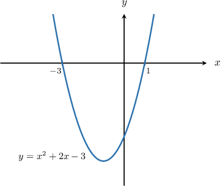

Our inequality is a "*greater than or equal to*" inequality. Therefore, we need to find the values of $x$ for which the parabola is *above* the $x$-axis or *touches* this axis

Using the graph above, we notice that our parabola has roots at $x=-3$ and $x=1.$ The parabola is above the $x$-axis to the left of $x=-3$ and the right of $x=1,$ as shown below.

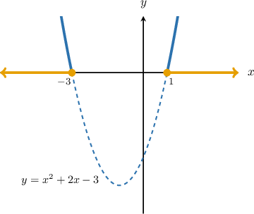

Therefore $y = x^2+2x-3 \geq 0$ when

$$

x \leq -3 \quad \text{or} \quad x \geq 1,

$$

which is our solution.

**Important:** Since we have a "greater than *or equal to*" inequality, the roots of the parabola are *included* in the solution set.

### Example: Solving a "Greater Than or Equal To" Inequality Given the Graph of the Corresponding Parabola

#### Question

Given the graph below, solve the inequality $(x+2)(1-x) \geq 0.$

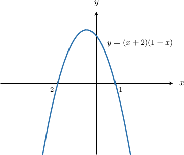

#### Explanation

Notice that our inequality

$$

(x+2)(1-x) \geq 0

$$

is a "**" inequality. Therefore, we need to find the values of $x$ for which the parabola

$$

y = (x+2)(1-x)

$$

is ** the $x$-axis or ** this axis. We mark these values of $x$ in blue in the diagram below.

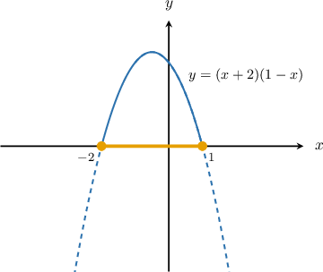

So, the solution to the inequality is $-2 \leq x \leq 1.$

### Example: Solving a "Less Than or Equal To" Inequality Given the Graph of the Corresponding Parabola

#### Question

Given the graph below, solve the inequality $-x^2+2x+3 \leq 0.$

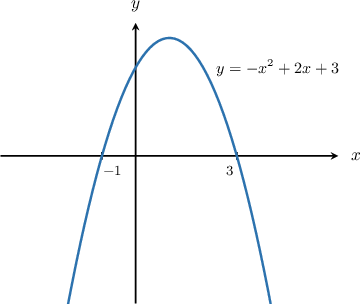

#### Explanation

Notice that our inequality

$$

-x^2+2x+3 \leq 0,

$$

is a "**" inequality. Therefore, we need to find the values of $x$ for which the parabola

$$

y =-x^2+2x+3

$$

is ** the $x$-axis or ** this axis. We mark these values of $x$ in blue in the diagram below.

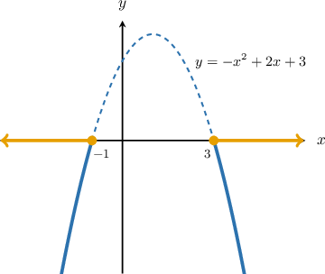

So, the solution to the inequality is $x \leq -1$ or $x \geq 3.$

### Strict Inequalities

Suppose we want to find the solution to the quadratic inequality

$$

x^2+x-6 < 0.

$$

We first plot the graph of the corresponding parabola $y=x^2+x-6,$ shown below.

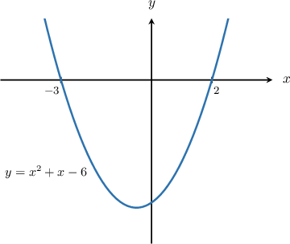

Notice that our inequality is a "*less than*" ($<$) inequality. Therefore, we need to find the values of $x$ for which the parabola is *below* the $x$-axis.

The graph above shows that our parabola has roots at $x=-3$ and $x=2.$ Moreover, the parabola lies below the $x$-axis for all values of $x$ that lie between $x=-3$ and $x=2.$

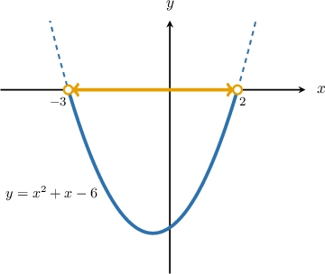

Therefore, $x^2+x-6 <0$ when

$$

-3 < x < 2,

$$

which is our solution.

**Important:** Since our inequality is a "*less than*" inequality, the roots of the parabola are *not* included in the solution set.

### Example: Solving a "Less Than" Inequality Given the Graph of the Corresponding Parabola

#### Question

Given the graph below, solve the inequality $-(x+2)(x-1) < 0.$

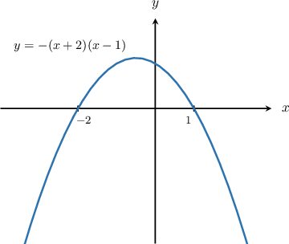

#### Explanation

Notice that our inequality

$$

-(x+2)(x-1) < 0,

$$

is a "**" inequality. Therefore, we need to find the values of $x$ for which the parabola

$$

y = -(x+2)(x-1)

$$

is ** the $x$-axis. We mark these values of $x$ in blue in the diagram below.

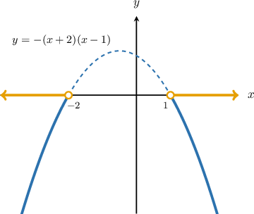

So, the solution to the inequality is $x< -2$ or $x > 1.$

### Example: Solving a "Greater Than" Inequality Given the Graph of the Corresponding Parabola

#### Question

Given the graph below, solve the inequality $x^2- 3x-10 >0.$

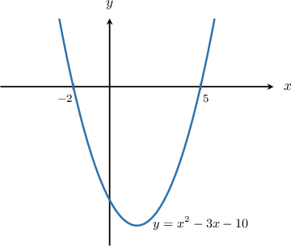

#### Explanation

Notice that our inequality

$$

x^2 -3x -10> 0,

$$

is a "**" inequality. Therefore, we need to find the values of $x$ for which the parabola

$$

y =x^2 -3x -10

$$

is ** the $x$-axis. We mark these values of $x$ in blue in the diagram below.

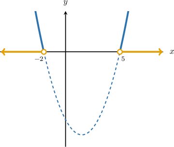

So, the solution to the inequality is $x < -2$ or $x > 5.$
