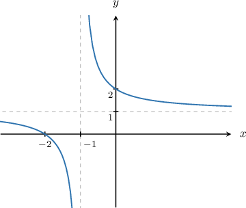
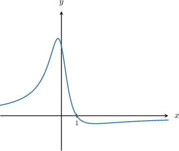
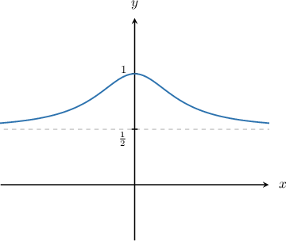
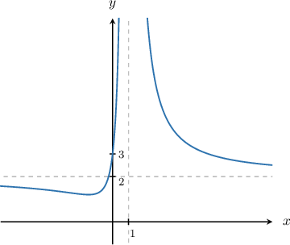
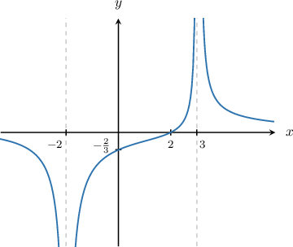

# Identifying a Rational Function From a Graph

Source: https://www.mathacademy.com/topics/738?courseId=101
Topic ID: 738

## Prerequisites

- [Roots of Rational Functions](./133-roots-of-rational-functions.md)
- [Vertical Asymptotes of Rational Functions](./807-vertical-asymptotes-of-rational-functions.md)
- [End Behavior of Rational Functions](./1720-end-behavior-of-rational-functions.md)

## Lesson

### Introduction

In this lesson, we will learn how to identify a *possible* equation of a rational function from its graph.

Consider the rational function $y=f(x)$ below. What can we figure out about $f(x)$ based on its graph?

From the graph, we deduce the following:

- The function has a vertical asymptote at $x = -1.$ Therefore, the function's denominator must be zero at $x = -1,$ but the numerator should *not* be zero at this point. So we're expecting a factor like $(x+1)$ in the denominator:

$$

f(x) = \dfrac{?}{x+1}

$$

- The function has an $x$-intercept at $x = -2.$ Therefore, the function's numerator must be zero at $x = -2,$ but the denominator should *not* be zero at this point. So we're expecting a factor like $(x+2)$ in the numerator. This suggests that the function $f(x)$ could be given by

$$

f(x) = \dfrac{x+2}{x+1}.

$$

As it turns out, this function does indeed give the above graph. However, to be sure, let's make a few additional checks:

- The $y$-intercept shown on the graph is $(0,2),$ and so we must have $f(0) = 2.$ This is indeed true of $f(x),$ since

- The horizontal asymptote shown on the graph is $y=1.$ This means that $y\to 1$ as $|x|\to\infty.$ This is indeed true of $f(x),$ since for large $|x|,$ we have

Therefore, we conclude that $f(x) = \dfrac{x+2}{x+1}$ could be the function shown in the graph.

### Example: Identifying Rational Functions With No Vertical Asymptotes

#### Question

The graph above shows a rational function. It has no vertical asymptotes, and its $x$-intercept is $(1,0).$ Which of the following could be the equation of the graph?

1. $y = \dfrac{1-x}{(x+1)^2}$

2. $y = \dfrac{2-2x}{x^2 + 1}$

3. $y =\dfrac{x+1}{2x^2 + 1}$

**

#### Explanation

We note the following:

- The function has no vertical asymptotes. This allows us to discard option I:

- The $x$-intercept of the function is at $x = 1,$ and so we must have $f(1) = 0.$ This implies that the numerator (but not the denominator) of the function must be zero at $x=1.$ This allows us to discard option III:

Therefore, only option II satisfies the above conditions:

$$

y = \dfrac{2-2x}{x^2 + 1}

$$

### Example: Identifying Rational Functions With No Vertical Asymptotes Using X and Y Intercepts

#### Question

The graph above shows a rational function. It has no vertical asymptotes, no $x$-intercepts, and its $y$-intercept is $(0,1).$ Which of the following could be the equation of the graph?

1. $y = \dfrac{3-x}{x+3}$

2. $y = \dfrac{x^2}{5x^2 + 1}$

3. $y = \dfrac{1}{x^2 + 2}$

4. $y = \dfrac{x^2 + 1}{2x^2 + 1}$

**

#### Explanation

From the graph of the function, we note the following:

- The function has no vertical asymptotes. This allows us to discard option I:

- The function has no $x$-intercepts, and so we must have $f(x) \neq 0$ for all $x.$ This allows us to discard option II:

- The $y$-intercept of the function is $1$ and so we must have $f(0) = 1.$ This allows us to discard option III:

Therefore, only option IV satisfies the above conditions:

$$

y = \dfrac{x^2 + 1}{2x^2 + 1}

$$

### Example: Rational Functions With One Vertical Asymptote

#### Question

Which of the following could be the equation of the graph shown above?

1. $y = \dfrac{3}{1-x}$

2. $y = \dfrac{x-3}{x-1}$

3. $y = \dfrac{2}{x+1}$

4. $y = \dfrac{2x^2 + 3}{(x-1)^2}$

**

#### Explanation

From the graph of the function, we note the following:

- The function has only one vertical asymptote, $x = 1.$ Therefore, the function's denominator must be zero at $x = 1,$ but the numerator should not be zero at this point. This allows us to discard the following option:

- The function has no $x$-intercept, and so we must have $f(x) \neq 0$ for all $x.$ This allows us to discard the following option: So, we're left with the following options:

- The horizontal asymptote is $y = 2.$ This means that $y \to 2$ as $|x|\to\infty.$ Note that for large $|x|,$ we have Therefore, we can discard the following option:

Therefore, among the given options, the only one that satisfies the above conditions is

$$

y = \dfrac{2x^2 + 3}{(x-1)^2}.

$$

### Example: Rational Functions With Two Vertical Asymptotes

#### Question

Which of the following could be the equation of the graph shown above?

1. $y= \dfrac{4-2x}{(x+2)(x-3)}$

2. $y=\dfrac{x-2}{(x-3)(x-1)}$

3. $y =\dfrac{x+4}{(x+2)(x-3)}$

4. $y=\dfrac{x-2}{(x+2)(x-3)}$

**

#### Explanation

From the graph of the function, we note the following:

- The function has two vertical asymptotes, $x=-2$ and $x=3.$ Therefore, the function's denominator must be zero at $x=-2$ and $x=3,$ but the numerator should not be zero at these points. This allows us to discard the following option:

- The $x$-intercept of the function is at $x=2,$ and so we must have $f(2)=0.$ This implies that the numerator (but not the denominator) of the function must be zero at $x=2.$ This allows us to discard the following option:

- The $y$-intercept of the function is $-\dfrac23,$ and so we must have $f(0) = -\dfrac23.$ This allows us to discard the following option:

Therefore, among the given options, the only one that satisfies the above conditions is

$$

y= \dfrac{4-2x}{(x+2)(x-3)}.

$$
