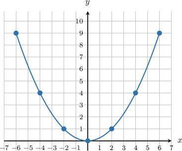
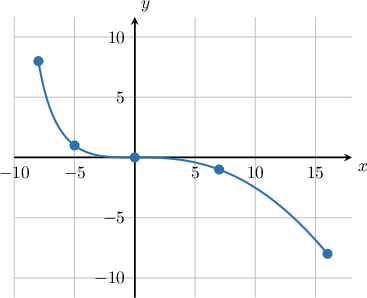

# Graphing Curves Defined Parametrically

Source: https://www.mathacademy.com/topics/803?courseId=101
Topic ID: 803

## Prerequisites

- [Properties of Transformed Square Root Functions](./1875-properties-of-transformed-square-root-functions.md)
- [Properties of Transformed Sine and Cosine Functions](../algebra-ii/2062-properties-of-transformed-sine-and-cosine-functions.md)
- [Completing the Square With Odd Linear Terms](../algebra-i/3842-completing-the-square-with-odd-linear-terms.md)

## Lesson

### Introduction

We can draw a curve by defining a relationship between $x$ and $y$ using a third parameter $t.$ For example, suppose we have

$$

x=2t, \,\,\, y=t^2, \quad -3\leq t\leq 3.

$$

These are the **parametric equations** of the curve.

First, let's create a table for some values of $t\mathbin{:}$

Plotting these points, we get the following curve:

The curve is actually a parabola. A curve defined by parametric equations is called a **parametric curve** and is said to be "defined parametrically".

### Example: Filling a Table of Values for a Parametric Curve

#### Question

For the parametric curve

$$

x=3t, \,\,\, y=t^3, \quad -3\leq t \leq 3,

$$

fill in the following table of values.

#### Explanation

First, we work out the $x$-values using the formula $x=3t.$ This gives

Now, we work out the $y$-values using $y=t^3.$ This gives

### Example: Graphing a Curve Defined Parametrically

#### Question

Plot the graph of the parametrically defined curve

$$

x=t(t-6), \,\,\, y=t^3, \quad -2\leq t \leq 2.

$$

#### Explanation

We need to create a table of values and then sketch the curve. First, we work out the $x$-values using the formula $x=t(t-6).$ This gives

Now, we work out the $y$ values using $y=t^3.$ This gives

Plotting these points, we obtain the following curve:

### Example: Determining the Range of a Parametric Equation

#### Question

Given that a curve is defined parametrically as

$$

x=t^2-6t, \,\,\, y=t^4+4, \quad t \in (-\infty , \infty),

$$

what are the ranges of $x$ and $y?$

#### Explanation

Let's consider each variable in turn.

- To find the range of $x,$ we can start by completing the square, as follows: Since $\left(t-3\right)^2 \geq 0,$ we can conclude that $x \geq -9.$

- To find the range of $y=t^4+4,$ notice that $t^4 \geq 0,$ and consequently $y \geq 4.$

Therefore, the ranges are $x \geq -9$ and $y \geq 4.$

### Defining Parametric Curves Using Other Parameters

We often see parametric curves defined in terms of the parameter $t,$ such as the parametric curve given below:

$$

x=2 \cos t, \,\,\, y=3 \sin t, \quad 0 \leq t < 2 \pi

$$

However, we can also define parametric curves in terms of other variables. Another commonly used variable is $\theta.$ So, in terms of $\theta,$ the above parametric equation is expressed as

$$

x=2 \cos \theta, \,\,\, y=3 \sin \theta, \quad 0 \leq \theta < 2 \pi .

$$

We often use $\theta$ when the bounds are $0 \leq \theta < 2\pi,$ because this implies that the parameter $\theta$ might be interpreted as an angle.

### Example: Determining the Range of a Parametric Equation Defined in Terms of Trigonometric Functions

#### Question

Given that a curve is defined parametrically as

$$

x = 4\cos\theta, \,\,\, y = 2\sin\theta, \quad 0\leq \theta < 2\pi,

$$

what are the ranges of $x$ and $y?$

#### Explanation

Let's consider each variable in turn.

- To find the range of $x,$ notice that for $0\leq\theta < 2\pi,$ we have $-1 \leq \cos{\theta} \leq 1.$ Consequently, So, we can conclude that $-4 \leq x \leq 4.$

- To find the range of $y,$ notice that for $0\leq\theta < 2\pi,$ we have $-1 \leq \sin{\theta} \leq 1.$ Consequently, So, we can conclude that $-2 \leq y \leq 2.$

Therefore, the ranges are $-4 \leq x \leq 4$ and $-2 \leq y \leq 2.$
